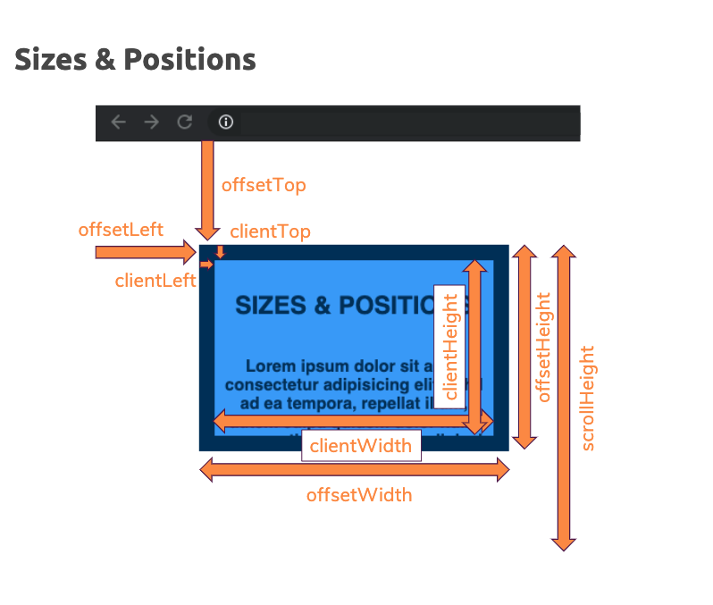

# Max's JavaScript course

## Getting started

### Prettier

Add Prettier VScode extension first and use a shortcut to make code look better:

To check the shortcut, go to `Code -> Preferences -> Shortcuts` and then type `format document`. Then check whis is the shortcut. It should be:

`option + shift + F`

### VSCode settings

under `code -> preferences -> settings`, there are `User` (applied to all projects) and `Workspace` applied to the a spesific project.

The `.editorconfig` file in the project is the one managing the workspace settings

### Using incognito mode on VSCode

it helps preventing extensions running extra code on our apps

## Basics: Variables, Data Types, Operators & Functions

how to add JS code to an `html` file?

1) ```html
   <head>
    <script>
        alert('hey, I'm an alert!)
    </script>
   </head>
   ```

the downside: the html gets long an messy with inline JS.

2) ```html
   <head>
       <script src="path-to-the-JS-file"> </script >
   </head>
   ```

⚠️ IMPORTANT: self closing `<script />` tag is not supported.

IMPORTANT: the above ways, are **BLOCKING** the loading of the HTML. In our case, the html doesnt load till we click on the alert 😯

3) Add the script to the end of the `<body>`:
   
   ```html
   <body>
       <script src="path-to-the-JS-file"> </script >
   </body>
   ```

Contact Max, on Chrome, this 3rd option still blocks the html, but it doesnt block it on Firefox.

### The order if JS imports matter

```html
<body>

// this line imports JS that define variables that are DOM elements
<script src="assets/scripts/vendor.js"></script>

// this code will use those DOM elements
<script src="assets/scripts/app.js"></script>


</body>
```

### Declaring variables

A variable can be declared, but not defined, so it becomes a **uninitialized variable**:

```js
let currentResult;
```

and the value is `undefined`.

### Naming variables:

allowed special characters:

1) number, but not at the begining. `let sprint1`, 

2) underscore: `user_name`. Snake case not recommended. Names can still start with `_`

3) `$` like, `let $posts`, like when using observables in Angular;

Don't do:

`let let`, becaus how will JS know which `let` you wanna use in the following piece of code XD.

### 

### Semicolons

are optional in JS, but required in this use case (two expressions in one line):

```js
let variableA; let variableB;
```

### Operators

styntax features that let us manipulate values

#### Mathematical operators

the not known by me are:

1) `%` that returns the remainder of dividing two numbers. 

2) `**`Exponentiation, `2**3=8`

The operators return things, e.g `+` like the SUM result of two number

#### Assign operator

it's just `=`, we use in the variable definitions, e.g.

### Data types

numbers with decimals are called `floating numbers` like this one: 3.1416

### String concatenation

adding dinamyc values to strings:

```js
let fullName = 'Esteban ' + surname + ' some extra random surname'
```


the `+` operator here doesn't SUM numbers but it joins strings into a single one. Downside? messy syntax. It's better to do **string interpolation**.
### From top to bottom

the JS code is **Parsed, compiled and executed** from **TOP to BOTTOM**

### Challenge: print string quoutes on html

target: print `'('`to print a string, **using just single quotes** at the beginning of the string inside **won't work**, i

```js
let calculationDescription = ''('' 
```

using consecutive single quites is the same as having `empty string` `(` and `empty string` , and JS doesn't know what `(` does.

The solution? combining 2 types of quotes:

```js
let calculationDescription = "'('"
```

The above does print the single quote string on the html, yes!

### Template literals or string interpolation

is the solution to string concatenation, which is ugly.


```js
let greeting = `Welcome onboard ${userName}`
```

### Writting strings into multiple lines:

#### with string interpolation:

```js
let greeting = `Hello


this is multiline string`
```

in the browser, it looks like this:

`Hello this is a multiline string`

The browser decides, for an `h2` for example, to omit the white spaces, but if we add:

```css
white-space: pre;
```

that will show the string with the white spaces on the rendered html!😯

White spaces and tab spaces ARE part of the string (and those spaces are taken out by CSS in browser by default, but they are there if CSS is not applied.)

Conclusion: be careful when splitting lines, the breakes and spaces are part of the string

#### With single or double quotes

```js
let greeting = 'Hello ' +
                'this is multiline string'
```

White spaces and tab spaces are not taking into account, because there's a calculation`+` in between. 

So, how to add line breakes and spaces then?

```js
let greeting = 'Hello \n
                this is a multiline string'
```

this `/n` can also be used for backticks, but it's not used too much because the backticks allow line splitting in the code already

The `\` character escapes the next one, that means that then next one is not treated ,e.g, as a normal `n`, but is combined with with the `\` to form a `line break`

The `print string challenge` could have also be solved by escaping:

```js
let greeting = '\'Hello\''
```

the `\'` prints a single quote :0

More escape sequences here: [String - JavaScript | MDN](https://developer.mozilla.org/en-US/docs/Web/JavaScript/Reference/Global_Objects/String#Escape_notation)

How to add a tab space? `\t`.

### Functions

functions are code on demand.

```js
function addNumbers (num1, num2) {
    //do something here
    return something
}
```

we have the function keyword, the function name, the parameters, and the body of the function inside the {}.

#### IMPORTANT: usually no `;` is added after the the funcion `}` closing curly brace, in function declarations, but it's added to function expressions (functions saved in constants)
`num1` variable is defined inside the function body of the function, which is a block, but can't be used outside the function.

There are built in functions when the JS runs on the browser, thanks to the `window` objetc:

```js
alert('Hey');
//or
window.alert('Hey')
```

Adding a return statement, makes the function more usable, because we can store the returned value on a variable:

```js
const result = addNumbers(1,2);
```

`1-2` the `-` operator returns the value which is the deduction of them. Well, that's the effect of the `return` inside the function, we can then use the returned value! wohoo!

### The order in code matters

variables and constants should be declared (not neccessarly defined, with a value, or, in other words, initialized) before using them.
```js
let greeting;

console.log(greeting); // doesn't break the code, prints undefined
```

on the other hand, having functions declared with the keyword `function` can be placed anywhere in the code, because the browser takes them to the top after parsing the JS code. This is called **hoisting**.
```js
addNumbers (1,2); //works thanks to hoisting


function addNumber(num1, num2) {
    return num1 + num2;
}
```

IMPORTANT: functions not using the above syntax are not hoisted 😬

### Pure function

```js
// a pure function
function addNumber(num1, num2) {
    return num1 + num2;
}
```

it gets inputs, returns outputs. With the same intputs, it returns the same outputs.And doesn't change global scope variables:

```js
let globalvariable;

// not a pure function, CRAP CODE
function addNumber(num1, num2) {
    globalVariable = num1 + num3
}
```

Have as fewer global variables as possible.

### Local or block scope variables

```js
function addNumber(num1, num2) {
    const result = num1 + num2;
    return result;
}

// even calling addNumber(1,2) here doesn't make the `result` variable available outside the function

console.log(result); // will throw an error "result is not defined"
```

### Shadow variables

it's a local variable, declared in a function, that has the same name as an already declared global variable.

```js
let userName = 'Max';
function greetUser(name) {
  let userName = name;
  alert(userName);
}
userName = 'Manu';
greetUser('Max'); // will still greet Max
```

the local `userName` variable inside the funtion is `shadowed`, so it doesn't overwrite the global variable, it's a different variable than the global one, named the same, inside the function block.

### The return statement:

the `return` statement finish the function execution.

```js
function getGreeting() {
    return 'Hello there!'
    // code below doesn't execute
    alert("I'll never be executed :(");
}
```

and empty `return` statement can be used to quit a function conditionally (early return);

the above code doesn't throw an error

### Functions without return statament

They're used to manipulate global variables:

```js
function add() {
    currentResult = currentResult + userInput.value;
}
```

How to escape the VSCode autocompletion? by pressing ESC

### Adding a name of a function

doesn't do anything to the code:

```js
function add() {
    ...
}

add

//the above add is ignored by JS, it's just the name
// of a function, without instructions
```

### What are parameters in functions?

are inputs for the function, that are available just inside the function, like local variables.

### Input values from forms are always strings
if you get a number from a form, the value is a string, so it's needs to be converted to a number:

```js
// many ways to do it!
let userInput = +someInput.value
let userInput = parseFloat(someInput.value);
// this parseInt only takes the integer, not the decimals of the stringified number
let userInput = parseInt(someInput.value);
```

`parseFloat` and `parseInt` are built in JS methods.

### Mixing Numbers & Strings

If we give JS a string and number in a sum, it will treat the number as a string, and create a long string:

```js
let sum = 1 + someInput.value // it will return a string 120 e.g,
//if the input is 20

3 + '3' // prints 33 as a string

3 - '3' // prints 0 as number
3 * '3' // prints 9 as number
3 / '3' // prints 1 as number
```

You saw the example with a number and a "text number" being added

`3 + '3'` => `'33'`

in JavaScript.

That happens because the `+` operator also supports strings (for string concatenation).

It's the only arithmetic operator that supports strings though. For example, this will not work:

`'hi' - 'i'` => `NaN`

`NaN` is covered a little later, the core takeaway is that you can't generate a string of 'h' with the above code. Only `+` supports both strings and numbers.

Thankfully, JavaScript is pretty smart and therefore is actually able to handle this code:

`3 * '3'` => `9`

Please note: It yields the number (!) `9`, NOT a string `'9'`!

Similarly, these operations also all work:

`3 - '3'` => `0`

`3 / '3'` => `1`

Just `3 + '3'` yields `'33'` because here JavaScript uses the *"I can combine text"* mode of the `+` operator and generates a string instead of a number.

### How to change number to string?

```js
someNumber.toString();
```

Using numbers inside a literal string, has `.toString()` applied to those numbers under the hood.

```js
const calcDescription = `${currentResult} + ${userInput.value}`

```

// it has currentResult.toString() under the hood 😮

### Comments

```
// this is a comment

/* this is a block comment
that can use multiple lines!*/
```

### More operators

```js
currentResult = currentResult + enteredNumber;

// SAME AS

currentResult += enteredNumber
// it also works for -, * and / operators
```

```js
currentResult = currentResult + 1

// SAME AS

currentResult++

// it also works for -
currentResult--

// the ++ is Increment operator
// the -- is Decrement operator

//they return the value of the value before change
```

```js
++currentResult // returns the modified value
```

### Arrays

accessing inexisting elements in an array returns `undefined`. Example:

```js
const logEntries = ['hola'];

console.log(logEntries[1]) // returns undefined
```

### Console.log(myArray)

Funny facts: the order of the keys an an object may change, to be **sorted alphabetically** in the dev tools:
```js
0:
 currentResult: 2
 enteredNumber: 2
 initialResult: 0
 operator: "ADD"
 [[Prototype]]: Object
length: 1
[[Prototype]]: Array(0)
```

### Accessing keys or properties in objects

what are objects? gruped data, structured in key-value pairs. eg 

```js
{
    user: "esteban", 
    surname: "munch jones"
}
```

```js
logEntry.operator // prints ADD
```

### Null / undefined / NaN

`null` and `undefined` are `data types` (like objects, and strings) and `values` at the same time.

#### Undefined

`undefined` is the default value `uninitialized` variables have.

```js
let someVariable; 
console.log(someVariable) // prints undefined


let someArray = [1];
console.log(someArray[3]); // prints undefined
```

⚠️ Never assign `undefined` manually to a variable!!
#### Null

is **never** assumed by default, and is assigned manually to reset a variable

```js
userName = 'Esteban'

// the form was submitted

// instead of re-assigning an empty string, null is assigned
userName = null
```

#### 💡 `undefined & null` are great for managing empty data, either because it hasn't been set, or it has been reseted.

#### NaN

is NOT a `type` (is of type `number`) and can be used in calculations, is kind of an error code we get from a calculation (e.g multiplication of strings);

```
console.log(1/'a'); // prints NaN
```

### Checking types: `typeof`

 wanna check the `type` of a variable at runtime? it returns a string with the type.

```js
typeof 'hola' // prints "string"
typeof 1 // prints "number"
```

playing with `typeof`:

```js
typeof undefined; // prints "undefined""
typeof null; // prints "object"
typeof NaN // print "number"


typeof {name: "tebi"} // prints "object"
typeof [1,2] // prints "object"
```

### Async and defer: never blocks HTML parsing 😉

#### ⚠️ make sure you start downloading your scripts in the head!

Keep this word in mind: **HTML parsing**

If `JS` code depends on `HTML` (like accessing DOM elements), the `JS` files can be imported at the end of the `<body>`:

```html
   </body>
   SOME HTML HERE

    <script src="assets/scripts/vendor.js"></script>
    <script src="assets/scripts/app.js"></script>
  </body>
```

BUT, there's a performace issue, that can be checked going to `Incognito chrome tab` -> `inspect` -> `performance` -> `start recording` -> `check the timeline` -> `expand Network part in the zoom in the middle window`.

Then look at `Main` in the lower window, to see events:
The HTML is finished parsed, and then after some miliseconds, the `Scripts` are Evaluated. We could do better.

The key:

###### I'd like to `start downloading the scripts` at the same time as `Parsing the HTML`, but executing the `Scripts` after the `HTML Parsing` has been finished.

Option 1: (not recommended)

```html
<head>
  <script src="assets/scripts/vendor.js"></script>
  <script src="assets/scripts/app.js"></script>   
</head>
<body>
</body>
```

⚠️ It throws an error because the `JS` code targets DOM elements not yet parsed.
```bash
Uncaught ReferenceError: addBtn is not defined
    at app.js:59
```

The download of the `JS` files blocks (or stops) the HTML parsing.

### Defer attribute: when the JS targets the DOM

Download JS -> execute it when the HTML parsing finished.

it tells the browser to download the `JS` files straight away, no blocking the **HTML parsing**, and execute the `JS` after the HTML has been parsed.
```html
<head>
  <script src="assets/scripts/vendor.js" defer></script>
  <script src="assets/scripts/app.js" defer></script>   
</head>
<body>
</body>
```

💡The time difference between the end of the HTML parse and the `Script execution` is much shorter than when importing the scripts at the end of the `<body>`.

With `defer` the scripts execution follows the order they're listed on the HTML.

### Async attribute: when the JS doesn't target the DOM

Download JS -> execute when finished downloading

when the  `JS` doesnt target the DOM, why bothering waiting for the HTML parse to finish? it just executes the `JS` when the download finished.

```html
<head>
  <script src="assets/scripts/vendor.js" async></script>
  <script src="assets/scripts/app.js" async></script>   
</head>
<body>
</body>
```

when using `async` the order of the scripts executions depends on which one gets downloaded first.

⚠️`async & defer` doesn't have any effect when used here:
```html
//No effect!
<script defer or async>
 alert('hello world')
</script>
```

because there's no such `JS` file to download.😅
```html
// DONT combine inline JS and src
// the inline script will be ignored!
<script src="...">
 alert('hello world')
</script>
```

## Debugging and efficient development

### VSCode shorcuts.

Go to `Code` -> `Preferences` -> `Keyboard Shortcuts` and look for command names (Add selection to next bind match) and keybindings (cmd D)

### Autocompletion

if the function name autocompletion menu has been exited by pressing `ESC`, it can be re-opened with `ctrl + space`.

if the parameters hint has been escaped, it can be reopened with `Trigger Parameter Hints`, `shift + cmd + space`.

### VSCode config

If we go to `Settings` -> `Workspace`, and then change the `Tab width` to 4, we get a new hidden file created:

```json
// .vscode/settings.json

{
    "prettier.tabWidth": 4
}
```

The `User` config keeps the settings on a global file in the machine.

### Chrome debugger tools

#### Breakpoints

After hitting a `debugger` keyword in the code or `breakpoint` applied on the Chrome dev tools, there are buttons:

- Play button: Resume script execution

- Step over next function call. (kind of go the next line):
  
  ```js
   debugger;
   const enteredNumber = getUserInput();
   // will jump to this line
   currentResult += enteredNumber;
  ```

- down arrow: Step into next function call (chain of function calls)

Will get you inside this function:

```js
function getUserInput() {
  return parseInt(userInput.value); //on this line
}
```

How to get out of that function? press the up arrow

- up arrow: set out of current function

- The right arrow with the point: Step. It's a combination of `Step Over next function call` and `down arrow`.

#### Conditional breakpoints

You can right click `Edit breakpoint` and add a condition for it's triggered.

```js
getUserInput() > 100
```

#### Brekpoints on events

What if I wanna stop JS execution and debbug whenever a registered event for clicks happens in the app? e.g when clicking add, deduct, didive and multiply?
would be cumbersome to add 4 breakpoint manually.

The most efficient way is to use `Event listeners breakpoint` and select `click`.

### The callStack

Is a list of functions that are being called. You can click on the functions and jump back and forth.

The bottom funtion on the list is the most outern function on the code.

### Scope

On `Scope` we have variables values, pretty neat!

Variable values can be changed!

### Watch

You can also `Watch` variables or expression using variables, like:

`enteredNumber` + `currentResult` at all times.

### Editing source

Code can be edited in source, but it needs to be saved with `cmd + S` to be tested. Faster than opening VSCode.

## Debugging inside VSCode

1) You click next to a line of code, and the red dot is active

2) Run -> Start debugging

3) ```json
   `launch.json` is created automatically:
   ```
   
   {
   
       // Use IntelliSense to learn about possible attributes.
       // Hover to view descriptions of existing attributes.
       // For more information, visit: https://go.microsoft.com/fwlink/?linkid=830387
       "version": "0.2.0",
       "configurations": [
           {
               "type": "pwa-chrome",
               "request": "launch",
               "name": "Launch Chrome against localhost",
               "url": "http://localhost:8080",
               "webRoot": "${workspaceFolder}"
           }
       ]
   
   }

```
4) Edit the file by replacing the `url`:

```json
 "url": "file:///Users/estebanmunchjones/Documents/Coding/courses/JavaScript/calculator/basics-01-starting-project/index.html"
```

   Just copy and paste from the browser url bar where the app was running

5) On the left, there will be the same info as inside the browser (variables, etc), and next to the `Terminal` there's a `Debug Console` where variables and expressions can be run, excelent! (e.g: print the value of `currentResult`).

6) Press red square to stop debugging, that will close the Chrome window opened.

## Control structures

### if blocks

```js
if (condition1) {
    //do something
} else if (condition2) {
    // do something
} else {
    // do something else
}
```

conditions evaluate to true or false.

In order to get this booleans values, `boolean operators` are used:

1) `==` and `!=` equal and un equal operators, they check value. e.g: `3 == '3'` return `true`

2) `===` and `!===` **strict** equal and un equal operators. They **check value and type**. e.g `3 === '3'` returns `false`.

3) `> >= ` and `< <=` for numbers and strings

4) `!` not True operator

### Danger!: Comparing objects and Arrays

```javascript
{name: "Esteban"} == {name: "Esteban"} // returns false
[1,2] == [1,2] // returns false
```

event the content is the same, they're different pointers (not copies, like `strings` and `numbers`).

### Early return

it's better to have early returns, so the main logic is not nested in an `if` block:
```javascript
// early return
const someFunction() {
    if (condition I don't want) { ✅
        return
    }

//rest of the logic
}
```

```javascript
// nested main code here, bad practice ❌
const someFunction() {
    if (condition I want) {
        //rest of the logic
    }
}
```

### Operators precedence

Which operators are executed first by JS in the same line?

```javascript
3 + 2 < 7 + 20 //returns true

// + operator has precedence over < operator  (is executed first) 
```

check out the list of operators precedence here: [Operator precedence - JavaScript | MDN](https://developer.mozilla.org/en-US/docs/Web/JavaScript/Reference/Operators/Operator_Precedence)

```javascript
true && false || true // returns true.
// && has precence (executed first) over ||
```

### Falsy an truthy values

if non-bolean values are used as a condition, JS coerces ("convert without really converting") them to booleans.

```javascript
if(""){// doesn't get executed} // empty string evaluates to false
if("Hola"){// gets executed} // non-empty strings evaluate to true


if(0){//doesn't get executed}
if(-1){//gets executed} // numbers != 0 evaluate to true

if({}){// all objects are truthy} ⚠️
if([]){// all arrays are truthy} ⚠️

if(null) if(undefined) if(Nan){//all are falsy}
```

### Hardcoded values convention

```javascript
const ATTACK_VALUE = 10;
```

capital letters and underscores.

### Event listeners naming conventions

```javascript
function attackHandler() {}
// OR
function onAttack(){}

attackBtn.addEventListener('click', attackHandler);

attackBtn.addEventListener('click', onAttack);
```

### Putting re-used strings constants into variables

```js
const ATTACK = "ATTACK";

function attackHandler(){
   attack(ATTACK);
}

function attack(mode) {
    let attackMonsterValue;
    if (mode === ATTACK) {...
```

write the string once, and use the variable instead, smart 💡!
### Declaring a constant with 2 possible values

It's a great scenario for a `ternary operator`:

```js
const userName = isLoggedIn ? 'Max' : null;
```

use for simple stuff, not nesting it, because gets unreadable ⚠️.
### Expression vs Statement

```js
// expression - used on the right hand side of assignment operators
// it returns something
isLoggedIn ? 'Max' : null;

//statement. It CAN'T be used on the right hand side of assignment operators

const username = const somethingelse ❌

// an `if` STATEMENT is an example
```

### Boolean tricks with logical operators

**Double bang** `!!` to convert truthy/falsy values to true/false:

```js
!!"" // return false
```

**Default value** assigment via OR || operator:

```js
const userName = someInput || 'Max'; // the || operator will return the 
// first truthy value
```

**double &&**:

```js
const userName = isLoggedIn && 'Max' 
// will assign 'Max if isLoggedIn is truish
// and will assign the isLoggedIn value if it's falsis
```

the double && is used a lot in JSX in React to conditionally render views, is a minimalistic version of the ternary expression, that just have a return value for a truthy condition, but none for falsy.

### Switch statement

```js
if (location === 'Argentina'){
    console.log('hola')
} else if (location === 'UK'){
    console.log('hello');
} else if //
```

the above code repeats the equality expression, so `switch` statement is a more compact alternative:

```js
switch(location) { // location or and expresion that returns a value
    case 'argentina':
        console.log('hola');
    break;
    case 'UK': {
       console.log('hello');
    }
    break;
}
```

`switch` uses `===` under the hood.

add `break` keyword, because `switch` statements use `fall through` mechanism, and it doesn't stop till the end.

### For loop

```js
for (let i = 0; i < 10; i++){
    //do something
}
```

`let i = 10` is code that runs at the beginning, and `let` has been chosen in order to reassign it.

`i < 10` is a condition that gets evaluated on every iteration;

`i++` is a code that runs after every iteration.

### For of (arrays)
```js
 for (const el of log) {
    console.log(el);
 }

 // const is used because el is recreated on every iteration
```

The above syntax simplifies this loop:

```js
  for (let i = 0; i < log.length; i++) {
        console.log(log[i]);
    }
```

variables defined inside the `for` parenthesis, are scoped to the loop.

Do you want to keep track of the index as well? no problem:

```js
let i = 0;
 for (const el of log) {
    console.log(el);
    console.log(i);
    i++;
 }
```

### For in (objects)
```js
const offer = {
        price: 10,
        tag: 'perfume'
    }
    for (const key in offer) {
        console.log(offer[key]);
    }
```

`offer.key` won't work because JS will look for a property in the object called `key`.

A string must be passed to inside the brackets [];

### While loop

```js
 let i = 0;
    while (i < 10) {
        console.log(i);
        i++
    }
 // the above example should be done with a classic for loop instead

 let finished = false;
 const randomNumbers = [];
 while (!finished) {
     const rndNumber = Math.random();
     randomNumbers.push(rndNumber);
     if (rndNumber < 0.5) {
         // to exit the loop  
         finished = true;
 }
 }
```

a while loop start not knowing how many iterations it will take to complete.

### Do while loop

```js
let i = 10
do {
        console.log(i);
        i++
    }
    while (i < 10);

// will print 10, because the do block runs first
```

how does it work? first do, then check the condition

### Loop + break: good for liping iterations execution

```js
for (let i = 0; i < 5; i++) {
        //lets stops the execution if i === 3
        if (i === 3) {
            break;
        }
        console.log(i);
    }

//prints 0,1,2
```

useful for stoping the loop executions under certain conditions.

### Loop + continue:  good for skipping one iteration

```js
for (let i = 0; i < 5; i++) {
       //lets avoid printing 3
       if (i === 3) {
           continue;
       }
       console.log(i);
   }

// prints 0,1,2,4
```

### Labels: useful for breaking outer loop from inside inner loop

```js
outerLoop: for (let i = 0; i < 5; i++) {
    console.log('outer', i);
    for (let i = 0; i < 5; i++) {
        if (i === 3) {
            break outerLoop;
        }
        console.log('inner', i);
    }
}
```

### Try and catch

We can throw many things that will stop execution, like objects, strings, Error, etc

```js
throw {message: 'code below wont run'};

//it prints: app.js:155 Uncaught {message: 'code below wont run'}
//, (in red colour, indicating it's a system error);
```

maybe a `user input` or `network error` causes the code to stop exectution, not ideal, right?

```js
try {
    throw {message: 'code below wont run'};
} catch {
    console.log('there was an error, but code below will be executed :)')
}
// code below keeps being executed!
```

It's common to throw our own errors in the app, so we save up adding a lot of if statements for different types of errors.

```js
let chosenMaxLife;

function getValue() {
    const enteredValue = prompt('enter the max life value', '100');
    userInput = +enteredValue;
    if(isNaN(userInput) || userInput <= 0) {
        throw {message: 'invalid user input'}
    } else {
        return userInput;
    }
}

try {
    chosenMaxLife = getValue();

} catch (error) {
    console.log(error);
    chosenMaxLife = 100;
}
```

### Finally block

is rarely used.

```js
try {
    // some code that might fail
} catch (error) {
    // maybe store the error in a database
    // re-throw the errror
    throw(error); // not very common, very advanced
} finally {
    // runs after the try {} block;
    // do something, because the rest of the code
    // wont run if the error was thrown
}
// rest of the code
```

### ES5 &  ES6

Var vs Let & Const

1) **Better scoping**

#### Var = leaking from curly braces {}🚰 

`var` respects `global` and `function` scopes, while **`let` and `const`  respects `curly braces`** (present in for loops, if blocks, functions):

```js
if (name === 'Max') {
    var hobbies = ['coding', 'cooking'];
}


console.log(hobbies); // prints the hobbies, it was defined
// in the global scope
```

```js
if (name === 'Max') {
    let hobbies = ['coding', 'cooking'];
}

console.log(hobbies); // throws an error (not defined)
// because let saw the curly braces!
```

1. ⚠️ So, **using `var` causes variable polution**, and using `const` and `let` keeps them better scoped.


2. **Better variables and usage order declaration**
   
   ⚠️ variables with `var` can be declared at the bottom of the files, after they have been used
```js
console.log(userName);
var userName = "Max"; // returns `undefined` but not an error
```

what happens is that the JS engine does this under the hood, with `hosting`:

```js
var userName;

console.log(userName);

userName = "Max";
```

but with `let` or `const`, an error is thrown:

```js
console.log(userName);
let userName = 'Max'; // throws this error:
// Uncaught ReferenceError: userName is not defined
```

we're forced into declaring the variable first and then use it.

3. **Avoids redeclaring variables**:

```js
var userName = "Max";
var userName = "Manuel" // works!

let userName = "Max";
let userName = "Manuel" // Throws an error!
// Uncaught SyntaxError: Identifier 'userName' has already been declared
```

⚠️ var allows re-declaring variables, the perfect recipe for disaster!

4. **Strict-mode can be enabled**
   
   use `use strict` mode at the file or function level, to avoid unexpected behaviours, that browser vendors do when executing the JS code. Generally, it's not neccessary.
   
   ```js
   // behaviour no 1: assigning a non declared variable
   
   userName = 'Max' // assigning value to a non declared variable
   console.log(userName); // prints Max, wow! 
   
   
   'use strict'
    userName = 'Max'
    console.log(userName); // throws an error
   // uncaught ReferenceError: userName is not defined

​		  

```js
 // behaviour no 2: assigning a reserved name
 var undefined = 'foo' // doesnt throw an error

 'use strict'
 var undefined = 'foo' // Uncaught TypeError: Cannot assign 
 // to read only property 'undefined' of object '#<Window>'


 //using let or const, also disables this behaviour
 let undefined = 'foo';
 const undefined = 'foo'; // Uncaught SyntaxError: Identifier 
 //'undefined' has already been declared
```


## JS engines and what they do

#### Parsing and compilation

code is interpreted to `bytecode` (faster) and starts execution, but still low performance, so it's then compiled to `machine code` (OS code) that runs on the chip.

What are browser APIs? bridges between the JS code and C++ code built in the browser, like `window.document`, etc

#### Execution: inside the JS engine

1) Managing memory: `heap` is long term memory. The `stack` is the short term memory and manages which function is executing and if there's a return, to which function is returning a value to.
   
   functions code gets stored in the `heap`.
   
   The browser reaches the `heap` and the `stack`.

2) Managing execution steps


### The `stack`

the first thing to be pushed to the `stack` is all the code present in the file, and it's kind of wrapped in an `anonymous` function. Then, the function `greet()` is added to the top of the stack, so the thing on top of th stack is the thing that is currently running.
Then, `getName()` is added to the top of the stack; Then `prompt()` is added to the top of the stack.

The stack manages execution contenxt, e.g which functions are being executed, and the order of the nested calls and primitite values (cheap to re-create). The heap stores reference values, like objects, because are expensive the re-create.

One the `prompt()` function is done, by returning a value to `getName()` is being removed from the stack;

Even if a function doesn't have a `return` statement, there's an implicit return after the last line, which makes the stack to remove when done.

Once the `greet()` function is done, the `anonymous` function is also removed from the stack because there's no more things to run on the file.

```js
function getUserName() {
  return prompt('enter userName', '');
}


function greet() {
  const userName = getUserName();
  console.log('Hello' + userName);
}

greet();
```

The stack is a shortlive data structure to keep track of which functions are being executed.

#### Debugger & the stack

go to `Sources`, place a breakpoint, and the check the stack, you'll see the functions there stacked.

So to sum it up JS engine = heap + stack.

If event listeners have been set up, the `Event loop` knows them and it will reach the JS engine and push callback functions to the stack.


### Primitive vs Reference values

#### Primitives

 are shared by copy (they'r cheap to re-create! stored in the stack (short term things))

```js
let name = "Max";
let anotherName = name; // "Max" was copied, stored in the stack,
// and passed here
console.log(anotherName) // prints "Max";
name = "Manu";
console.log(anotherName) // still prints "Max";
```

name.length(), tells us that a string can be temparely be transformed to an object to access some properties.


#### Reference values:

when assigning an object to a variable, the pointer is stored in that variable, not the object itself.

they're expensive to re-create (stored in the heap)

```js
let userData = {
    name: 'tebi',
    age: 32
}; // this object is stored in the heap, and userData holds the 
// pointer (or reference) to it.

let newUserData  = userData; // the same pointer is passed here

userData.name = 'Sarah';
console.log(newUserData.name) = 'Sarah';
```

How to avoid mutating the object? cloning objects and arrays

```js
let newUserData = {...userData};
userData.name = 'Sarah'; // 
console.log(newUserData.name) = 'tebi'; // different pointer
// it's pointing to another object, a clone one
```

### Garbage collection

JS engines have garbage collectors that delete stored things in the heap.

```js
let person = {name: 'Max'};
person = null; 
// garbage collector deletes {name: 'Max'} from the heap;
// because the pointer is no longer used in the rest of the code
```

Nowadays, browsers are intelligent enough to check if `person` is being used or not, and also delete the object from the heap, without the need of having to reassign the variable to null, for example.

#### Memory leaks

when you keep having references to objects in the code, but you don't use them, so it's means keeping space in memory for nothing.

adding `click` event listeners to a button will always result on event listener replacement `if the same function pointer is passed as callback`, so a button will woun't trigger 2 callback functions.

```js
function print() {
    console.log('button clicked');
}

someHtmlElement.addEventListener('click', print);
someHtmlElement.addEventListener('click', print);

// upon click, just one console.log() will be printed


someHtmlElement.addEventListener('click', function() {console.log('button clicked')};
someHtmlElement.addEventListener('click', function() {console.log('button clicked')};

//upon click, 2 console.log() will be printed!!
// 2 functions that do the same are stored in the heap!
// that's a memory leak;
```


## More on functions

### Functions are objects

````javascript
function hello () {
    console.log('hello');
} 👈 // no semicolon to function declarations, that's the convention

console.log(typeof hello); // prints `function`

console.dir(hello) // it prints the function object!
````

The method **`console.dir()`** displays an interactive list of the properties of the specified JavaScript object.

### Function expression vs function declaration

Expression: right hand side of an `=` operator.

````javascript
// right hand side, it's an expression
const start = function 👉 ❌startGame() { // the name of the function is not needed, could be anonymous
  console.log('Game is starting...');
}; 👈 // semicolon is usually added to expressions.
startGameBtn.addEventListener('click', start);

//it's a declaration
function startGame() {}
````

```javascript
// right hand side breaks hoisting! `start` is hoisted as undefined 😕
startGameBtn.addEventListener('click', start);

const start = function() {
  console.log('Game is starting...');
};

❌ Uncaught ReferenceError: Cannot access 'start' before initialization
    at app.js:16:40
```

### Which approach to choose?

the expression approach is prefered since it forces devs to declare the function before calling it:

```javascript
✅ // prefered approach
const start = function() {
  console.log('Game is starting...');
};
```

### To be anonymous or not, that's the question 🤔

You might want to name them to get better logs in the console when that function breaks.

```javascript
// anonymous function log
startGameBtn.addEventListener('click', function() {
  console.log('Game is starting...', age);
});

app.js:19 Uncaught ReferenceError: age is not defined
    at HTMLButtonElement.<anonymous>👈 (app.js:19:38) 👈 // line number is not enough when having bundled code in prod


// named function log
    startGameBtn.addEventListener('click', function startGame() {
  console.log('Game is starting...', age);
});

app.js:4 Uncaught ReferenceError: age is not defined
    at HTMLButtonElement.startGame👈 (app.js:4:38) 
```


### Arrow functions

`=>` is a keyword made up of math symbols, it's not an operator like the `=` operator!

Predence: && have precedence over || operator, so && are executed before.

````javascript
// empty return, `undefined` is returned
const getWinner = (computerSelection, playerSelection) => {
	....some code
	return;
}

const winner = getWinner(); // winner will be `undefined`
````

````javascript
// calling functions with less arguments than expected
// there's no JS error 😮

 const winner = getWinner(computerSelection); // doesn't throw error!
````

````js
// fallback params!

const getWinner = (computerSelection, playerSelection👉 = DEFAULT_SELECTION) => {
  // only kicks in when `playerSelection` is `undefined`.
  // it doesn't work for falsy values, like null, 0, etc
  
// we can add a value depending on other argument's values!
  const getWinner = (computerSelection, playerSelection👉 = computerSelection === ROCK ? PAPER : DEFAULT_SELECTION) => {
````

### How to add breakpoints when the code stopped in one?

just go to `Source` in the dev tools and add a new breakpoint with the cursos, and press the play button! Easy!

I can also disable the selected breakpoints by going to `Source->Breakpoints` window, and uncheck them!


### Rest parameters (...someNumers)

variable amount of arguments! https://developer.mozilla.org/en-US/docs/Web/JavaScript/Reference/Functions/rest_parameters

this function it can handle any number of args:

```js
const addNumbers = (...numbers) => {
  let sum = 0;
  numbers.forEach(number => {
    sum = sum + number;
  });
  return sum;
}

console.log(addNumbers(1,2));
```

The arguments get added to an array, so we can iterate over it!

```js
// OLD way ❌

const addNumbers = function () {
  let sum = 0;
  for (number of 👉 arguments) { // arguments is magically in the scope of the fn,
    // it's not an array, an array-like object, so it doesn't have the .forEach method 😮
    sum = sum + number;
  }
  return sum;
}

console.log(addNumbers(1,2));
```


### Declaring functions inside functions

````js
const addNumbers = (...numbers) => {
  👉 const validateNumber = (number) => {
		return isNaN(number) ? 0 : number;
	}

  let sum = 0;
  numbers.forEach(number => {
    sum = sum + validateNumber(number);
  });
  return sum;
}
````

functions are objects, so we can can objects stored inside objects, right?

The `validateNumber` function is scoped to the curly braces of the parent function.

### Callbacks

````
const addNumbers = (👉 callback, ...numbers) => {
  const validateNumber = (number) => {
		return isNaN(number) ? 0 : number;
	}

  let sum = 0;
  numbers.forEach(number => {
    sum = sum + validateNumber(number);
  });
  👉callback(sum);
}

const myCallBack = (sum) => {
  alert(sum);
}

addNumbers(👉myCallBack, 1,2, 'banana', 5);
````


### Adding extra parameters on the fly: the .bind() method:

Using .bind() method returns a new function reference with some new configuration (give values to some params), so that function can be called at some point (upon an event, etc) with the pre-configured param values!

````js
const sayHello2 = (👉 greeting, name) =>{
  console.log(greeting + name);
}

// silly example calling the function right away, not done in real life
sayHello2.bind(this, 👉'Special greetings ')('tebi!'); // Special greetings, tebi!
````

💡 usually the binded function is passed as a callback fn an then exectuted at some point by the parent function

````js
someFn(sayHello2.bind(this, 'Special greetings'), someOtherParams);

const someFn = (callback, someOtherParams) => {
	callback('tebi');
}

// there could be some logic inside the someFn to pass the appropiate greeting to callback, but that could lead
// to a lot of if checks on the someOtherParams, or ternary expressions
````

````js
// bind usage in the calculator
// the callbacks are preconfigured for each button 🔥
const operators = {
  ADD: '+',
  SUBSTRACT: '-',
  MULTIPLY: '*',
  DIVIDE: '/'
}

function calculate(operation) {
  const enteredNumber = getUserNumberInput();
  const initialResult = currentResult;
  
  if (operation === 'ADD') {
    currentResult += enteredNumber;
  } else if (operation === 'SUBTRACT') {
    currentResult -= enteredNumber;
  } else if (operation === 'MULTIPLY') {
    currentResult *= enteredNumber;
  } else {
    currentResult /= enteredNumber;
  }
  createAndWriteOutput(operator.operation, initialResult, enteredNumber);
  writeToLog(operation, initialResult, enteredNumber, currentResult);
}

addBtn.addEventListener('click', calculate.bind(this, 'ADD'));
subtractBtn.addEventListener('click', calculate.bind(this, 'SUBTRACT'));
multiplyBtn.addEventListener('click', calculate.bind(this, 'MULTIPLY'));
divideBtn.addEventListener('click', calculate.bind(this, 'DIVIDE'));
````


### Interacting with the DOM

````
// console
document
// we see kind of HTML, and we can select html elements, and they get hovered on the page
// document is just a JS object (with all the methods we need), represented by Chrome in this HTML way in the console.
````

````bash
console.dir(document) // to see the full object!
````

### Why can we use `alert()` without the window.?

because the browser adds the window. to functions and variables it doesn't find in our code! 😮

### The DOM

There are 2 types of Nodes (JS objects):

- Element Nodes divs, paragraphs, etc
- Text Nodes (white spaces coming from the indentation of the HTML file)

whitespaces are Text Nodes, and not rendered in the screen 😮

#### The `$0` shortcut:

the last selected element in the `Elements` tab in the dev tools gets stored in the `$0` variable, so it can be used in the console, neat!

We can't see the text nodes in the `Elements` tab.

### Targeting elements

there are 2 camps of methods:

- return the fisrt match (getElementById, querySelector)
- return an array-like array: NodeList (it might not have .forEach and other methods) (e.g querySelectorAll)

💡`getElementBySomething` methods return an object that is updated if the Node changes later in time ⏺

the other ones just return a snapshot of the Nodes 📸

### Applying methods on Element Nodes

we can do `someElement.querySelector('some-selector');` that's great! we can have a more scoped search

`getElementById` is not inside Element Nodes, only in the document.

```js
const h1 = document.querySelector('h1');
h1.textContent = 'Lalala'; // deletes and creates a new Text Node
```

Use mdn to look for the Element Node documentation, e.g h1. Under `DOM interface`, we have, eg. https://developer.mozilla.org/en-US/docs/Web/API/HTMLHeadingElement.

Some props are read only ⚠️

### Attributes vs Properties

- Attributes: what's inside the HTML tag, e.g `id`
- Properties: the browsers configures some props, like the `id` based what is was passed in the HTML as attributes

Some attributes, like <input value="some text here">, can't be changes with input.value method.

````
<input value="some text here">
input.value = 'other random text'

// we check Elements tab
<input value="some text here"> // still the same, one way data binding


input.id = 'some-id';
<input value="some text here" 👉 id="some-id"> // updates the HTML! 2 way data binding
````

So, when the user types, the value of `value` is updated in the JS object but not on the HTML attribute read on Elements tab, so 

````
input.setAttribute('value', 'some other default text');
<input 👉 value="some other default text">

input.value = 'some previous text the user entered' // decoupled state!
````

💡value attribute and property are decouple on purpose, so we can always backtrack to the original value if we need to, after the user entered some text:

````js
input.value = input.getAttribute('value'); // reseting the value propr with the original attribute!
````

Tip: the JS object propr and the rendered UI are in sync

`input.getAttribute()` helps to read the value written in the HTML tag attribute


### Traversing the DOM: children, descendents, Parent and Ancestors

use `.children` to navigate the Node Elements (skiping the Text Nodes);

if you use `.childNodes` you get the list of all nodes (Elements and Text).

Remember: even the indentation of the HTML gets converted into text nodes. e.g: `someTextNode.data: "\n      "`

How to see the text nodes being rendered on the screen:
```css
// add this to the ol/ul or other element
element.style {
    white-space: pre;
}
```

Then, if we have the nodelist of text and element nodes in the console.dir, and we hover over the text nodes, we'll see them highlighted in the rendered page!

#### Perfomance issues:

````
document.querySelector('li:last-of-type'); // 🐌 running a query like that at the document level is expensive!

document.querySelector('ul').lastElementChild() 🚀
````

`````
someElement.closest('some-selector'); // looks for the closes parent that matches that selector
// it's kind of querySelector but for looking upstream
`````

💡 Run as fewer .querySelector queries as possible, and use parent and children navigation instead (always taking into account code readability, and future changes in the HTML order)

Deep traversing is also bad for perfomance

### Styling DOM elements

````
// inline
someElement.style.backgroundColor = 'red' // inline style -> highest specificity

// classes
someElement.className = 'banana' // add or remove classes, I can re-use styles
// cumbersome, be careful not to override previous classes added to the element ❌

someElement.classList.add('banana'); ✅
someElement.classList.remove('banana');

// ids
someElement.id = 'banana'

// some attributes (that are already targetted in the CSS file)
someElement.setAttribute('banana', 'true');
````


### Creating and inserting Elements

#### #1 HTML string

##### `innerHTML`:

````js
// innerHtml

const ol = document.querySelector('ol');

ol.innerHTML = '<li>the only element</>'; // replaces ALL original HTML content
````

Performance and lossing state issues:

````js
ol.innerHTML = ol.innerHTML + '<li>the only element</>'; // re-renders the original content, purple flashing on those elements
// on Chrome dev tools ⚠️

<div id="someId">
  <input>
</div>

const div = document.getElementById('someId')
 div.innerHTML = div.innerHTML + '<p>Something went wrong</p>'; // I loose the input value of the `value` prop
````


##### `insertAdjacentHTML`

```js
div.insertAdjacentHTML('beforeend', '<p>Something went wrong</p>'); // doesn't re-render the input field!
// more performant ✅
// but I only set the attributes ⚠️
```

 what if I want to attach and event listener to a button I've just added? 🤔
 I'd have to target it with querySelector and then add the prop, so annoying and poor perfomance ❌


#### Creating Node Element + append it

The methods to add the nodes are `append`, appendChild `prepend`, `before`, `after`, `replaceWith`.

```js
// createElement + appendChild

const div = document.getElementById('input-wrapper');

const error = document.createElement('p');

error.textContent = 'Something broke!';

div.appendChild(error);
```

These are better APIs, since I can append a list of Node Elements separated by a coma:

```js
div.append(error, otherNodeHere);
```


### Nodes are objects!

```js
div.append(error);

div.prepend(error); // moves the element up, it's the same object reference
```


### Cloning elements = cloning objects

Remember to deep clone nodes to, e.g get the textContent cloned as well:

````js
div.append(error);

const errorClone = error.cloneNode(true);

div.prepend(errorClone);
````


#### NodeList vs HTMLCollection

NodeList (querySelectorAll) is more perfomant because it's not updated when inserting **new** Elements there with JS, or deleting them.

HTMLCollection (getElementByTag) reflects new/removed items in the array when targeted with JS

````
const ol = document.querySelector('ol');

const nodeList = document.querySelectorAll('li');

const HTMLElementList = document.getElementsByTagName('li');

const newLi = document.createElement('li');

newLi.textContent = 'added item';

ol.append(newLi);


console.log('nodelist', nodeList); 👈 not updated in terms of new/removed elements

console.log('HTMLElementList', HTMLElementList); 👈 updated! ✅
````

Having a non live array it's maybe not an issue.


### Removing elements from the DOM

```js
someElement.remove()
```


### Favourite movies app

`getElementById` is faster than `querySelector(#someId)`

Don't use `.classList.add('someClass')` and  `.classList.remove('someClass') 

#### checking input values

````js
const addButtonHandler = () => {

    const titleValue = titleInput.value;
    const imageUrlValue = imageUrlInput.value;
    const ratingValue = ratingInput.value

    //conditions I don't want + early return
    if (
      // 👇 get rid of white spaces
        titleValue.trim() === '' ||
        imageUrlValue === '' ||
        ratingValue === '' ||
      👇// strings are coherced to numbers when checking with tese operators
        ratingValue < 1 ||
        ratingValue > 5
    ) {
        alert('invalid input');
        // early return
        return;
    }

}
````

If I don't have the `.trim` method, adding white spaces in the title field makes it valid.


App architecture:

~~using global variables, like `movies`, or `selectedMovie` make the code less dependant on event targets, and attaching event listeners to do things on those specific  targets (a movie) . And adding and removing event listerners that are target specific is a pain. So, trying to keep the movies state in the HTML and not in JS is a bad decision.~~ 

~~Max's approach re-renders the whole ul list, but doesn't mess with event targets, so it's cleaner code.~~


How to pass the movie id to the `yes` delete button handler?

First, clicking on the li element opens up the modal, that has the `Yes` button:

````js
liItemElement.addEventListener('click', liItemHandler.bind(this, movie.id));
````

Then, `liItemHandler` can also add an binded event listener to the `Yes` button, but that will need to be added an removed each time the modal opens and closes, OR, as Max did, clone, remove and re-add the buttons to the DOM, so the event listeners are cleared

```js
yesDeleteButton.replaceWith(yesDeleteButton.cloneNode(true));
```

The most elegant solution is to read the `event.target` value inside the event handler, instead of binding the event handler.


#### My version of the app:

keep the movies array state in the HTML instead.

The `delete` button from the li element is binded so it can pass the liElement and then, if clicked, update the global variable `selectedMovie`.

have a global variable `selectedMovie` that helps me avoid needing to remove event listeners

Success! ✅


#### Automatic event listeners clearance

The browser deletes event listeners when an element is removed from the DOM, no memory leak at all 😁

(read from While loop 📚)


## More on arrays and iterables

### what are iterable objects?

objects that can be looped using a `for of` loop.

````js
const name = 'Max';

for (letter of myString) { 
	console.log(letter); // prints 'M', 'a', 'x'
}
````


E.g: `NodeList` and `String`.

### what are array-like objects?

E.g: `NodeList` and `String`.

We can access items indexes, and they have a .length property

```js
const name = 'Max';

console.log(name.length); // outputs '3'

console.log(name[0]); outputs 'M'
```


### Creating arrays

```js
const numbers = [1,2,3]; 🚀 best performance

const numbers = Array(1,2,3); // ❓is Array a function here?

const numbers = new Array(1,2,3);

// unexpected behaviour

const numbers = Array(5); // [empty x5]

const numbers = new Array(5); // [empty x5 ] // numbers[0] outputs undefined

```

### Converting iterables and array-like objects into arrays

```js
// NodeList example
const divsNodeList = document.querySelectorAll('div');
const divArray = Array.from(divsNodeList);

//String example
const name = 'Max';
const nameArray = Array.from(name); // ['M', 'a', 'x'];


```

That way, we could use, e.g .splice() on the converted array.

### Adding and removing elements in arrays

```
.push(element) // 🚀fastest perfomance
.pop() // removes last element // 🚀 fastest perfomance
.shift() // removes the first element => shiftes elements to the left // 🐌 bad performance
.unshift(element) // adds to the begining of the array => // 🐌 shiftes elements to the right
```

```js
// how not to mutate elements ❌

const countries = ['Argentina']
countries[5] = 'Brazil';

console.log(countries); // ['Argentina', empty × 4, 'Brazil']
```


### Splice method: powerful

```js
  const animals = ['bear', 'parrot', 'fish']

// remove
animals.splice(1,1) // ['bear','fish']

// add
animals.splice(1,0, 'donkey');  // ['bear', 'donkey', parrot', 'fish']

// replace
  animals.splice(0,1, 'wale'); // ['wale', 'parrot', 'fish']

// delete all items (1 arg)
animals.splice(1); // ['bear']


// start from the end of array (negative indexes)
animals.splice(-2, 1); // ['bear', 'fish']
```

it returns the deleted elements and mutate the array.

### Slice method

Shallow copies! ⚠️:

`slice() , Array. from() , Object. assign() , and Object. create() ) **do not create deep copies** (instead, they create shallow copies).`

```js
const users = [{name: 'John'}, {name: 'Paul'}];

const shallowUsersClone = users.slice(); // ⚠️ shallow copy created

users[0].name = 'Matthew';

console.log(users, shallowUsersClone); 
// outputs [{name: 👉'Matthew'}, {name: 'Paul'}] [{name: 👉'Matthew'}, {name: 'Paul'}]
```


```js
const animals = ['bear', 'parrot', 'fish']

const fullSlice = animals.slice(); // shallow copy ['bear', 'parrot', 'fish'] 


const smallSlice = animals.slice(0,2); ['bear', 'parrot']

const fromNegativeSlice = animals.slice(-2,2); // always slices to the right! ['parrot', 'fish']]
```

it returns a shallow copy of the slice.

 

### Concat method

useful for combining to arrays into a **brand new one**! (shallow copy)

```
const wild = ['bison'];

const domestic = ['cat'];

const animals = wild.concat(domestic); // ['bison', 'cat']
```

### IndexOf method

finds the first index of an occurrance.

```
const wildAnimals = ['bison', 'lion'];

const lionIndex = wildAnimals.indexOf('lion');

if (lionIndex !== -1) {
    // and the cat becomes a wild animal!
    wildAnimals[lionIndex] = 'cat';
}
```


Gotcha here: it works fine for primite values, but not for references.

```
const people = [{name: 'Max'}, {name: 'Manu'}];

console.log(people.indexOf({name: 'Max'})); // -1, not found!

// use .find() instead
console.log(people.findIndex(element => element.name === 'Max')); // 0
```


### LastIndexOf method

similar to the above, but starts looking from the end of the array


### Find method

it accepts a callback that is executed for each element.

it returns the first element that matches the returned condition.

⚠️ It doesn't create a copy of objects returned in the array, they're the same references! 😮

````
const people = [{name: 'Max'}, {name: 'Manu'}];

const max = people.find(element=> element.name === 'Max');

max.name = "Rob";

console.log(people); // [{name: 'Rob'}, {name: 'Manu'}]
````


### FindIndex method

```
console.log(people.findIndex(element => element.name === 'Max')); // 0, found
```


### .includes

It's case sensitive

````
console.log(wildAnimals.includes('bison')); //
````

Doesn't work to find object and arrays (reference values)

Works well for primitive values


### .forEach

doesn't return anything

````js
const prices = [1, 2];

const tax = 0.20;

const updatedPrices = [];

prices.forEach(element => updatedPrices.push(element*(1 + tax)));
````


### .map

return a new array (shallow copy!)⚠️

````js
// primitive values
const prices = [1, 2];

const tax = 0.20;

const updatedPrices = prices.map(element => element*(1 + tax));

// reference values
const people = [{name: 'Max'}, {name: 'Manu'}];
const updatedPeople = people.map(element => element.name = 'Banana');
console.log (people, updatedPeople); // [{name: 'banana'}, {name: 'banana'}];, [{name: 'banana'}, {name: 'banana'}];

// clone deep, to avoid pushing references to the new array
const updatedPeople = people.map(element => { 
    return {...element, name: 'Banana'};
});


````


### .sort

it mutates the array, and returns the mutate one (psss, don't do use that returned value, footgun);

````
// how not to use it ❌

//footgun here 🔫
const sortedAnimals = wildAnimals.sort(); // it returns the same array reference ⚠️

wildAnimals[0] = 'banana';

console.log(sortedAnimals); // ['banana', etc] 🤦‍♂️


// how to use it
wildAnimals.sort();
console.log(wildAnimals) // sorted wild animals

````

it sorts strings alphabetically.

⚠️ If numbers are on the array, they'r converted to a string, and the first string character is used for sorting:

```js
const prices = [10.99, 1.50, 3.75, 5.80];

prices.sort(); // [1.5, 10.99, 3.75, 5.8] 😮


// let's do it properly
prices.sort((a,b) => {
    if (a < b) {
        return -1;
    } else if (a === b) {
        return 0;
    } else {
        return 1
    }
});

// [1.5, 3.75, 5.8, 10.99] ✅
```


### .filter

returns shallow copy array ⚠️

Callback function return true to keep it, false to discard it in the new array

```js
// primitive values
const prices = [10.99, 1.50, 3.75, 5.80];

const filteredPrices = prices.filter(element => element < 10); // [1.5, 3.75, 5.8]
```

```js
 // reference values
// how not to do it ❌
 const people = [{name: 'Max'}, {name: 'Manu'}];

const filteredPeople = people.filter(element => element.name === 'Max');

filteredPeople[0].name = 'banana';

console.log(people); // [{name: 'banana'}, {name: 'Manu'}];
```

````
✅ use a .forEach and push a cloned object to an array insted OR .map and return a cloned object
````


### .reduce

reduce an array into a single value! e.g sum numbers in an array:


````js
const numbers = [1,2,3];

const sum = numbers.reduce((prevValue, currentValue) => prevValue + currentValue, 0);
````

easier than initializing variable and using .forEach to add numbers!

prevValue is `undefined` in the first iteration of not specified.

### The power of chainging methods

```js
const originalArray = [{price: 10.99}, {price: 5.99}, {price: 29.99}];
const sum = originalArray.map(obj => obj.price)
    .reduce((sumVal, curVal) => sumVal + curVal, 0); // => 46.97
```

### .split and .join

````js
const data = 'edinburgh;10';

const dataArray = data.split(';'); // ['edinburgh', '10']

const joinedData = dataArray.join(':'); // 'edinburgh:10'
````

.join will convert everything into a string.

if the `let` or `const` is missing:
````js
joinedData = dataArray.join(':'); // 'edinburgh:10' // window.joinedData is created!
````


### ...operator

example of Math.min()

```
const numbers = [1,2,3];
const min = Math.min(...numbers);// same as (1,2,3)
```

```
how not to use it! ❌
const numbersClone = ...numbers
```

⚠️ only deep clone things you plan to change on the newly created array.


### array restructuring

````js
const data = ['max', `schwarz`];

const [name, surname] = data; // name = 'max', surname = 'schwarz', rest = [ "germany", "34" ]
````


### Arrays, sets and maps

Sets have no guaranteed order and there can't be repeated values. Useful for storing unique things. Things can't be accessed with the index, but I can check if things are present. It has some array protoype methods available. It's iterable

Maps have the order guaranteed, and key value pairs are stored; keys can be anything (even objects). There can't be duplication of key 's values. Values are accessed with the key. Some methods are available. It's iterable.


### Sets: great for uniqueness

```js
const mySet = new Set(['hi', 'there']);

mySet.add('man'); // Set(3) [ "hi", "there", "man" ]

mySet.add('man'); // Set(3) [ "hi", "there", "man" ] // it doesn't throw error

mySet.delete('man'); // Set [ "hi", "there" ]

mySet.delete('inexistant'); // Set [ "hi", "there" ] // it doesn't throw error

const isHiPresent = mySet.has('hi'); // true

for (entrie of mySet.entries()) {
    console.log(entrie); // Array [ "hi", "hi" ] Array [ "there", "there" ]
}

// entries not very handy, they're more built for maps

// let's use .values() for looping instead
for (value of mySet.values()) {
    console.log(value); // hi there
}
```


### Maps: great for not bloating objects used heavily in the app

```js
const animal1 = {name: 'negrito'};
const animal2 = {name: 'toto'}

const myMap = new Map([[animal1, {favouriteFood: 'fish'}]]); // Map { {…} → {…} }

myMap.set(animal2, {favouriteFood: 'meat'}); // Map { {…} → {…}, {…} → {…} }

const animal1Food = myMap.get(animal1); //Object { favouriteFood: "fish" }

for (entrie of myMap.entries()) {
    console.log(entrie); // Array [ {…}, {…} ] Array [ {…}, {…} ]
}

for (key of myMap.keys()) {
    console.log(key); // Object { name: "negrito" } Object { name: "negrito" }
}

for (value of myMap.values()) {
    console.log(value); // { favouriteFood: "fish" } { favouriteFood: "meat" }
}
```


### Weak Set and Weak Map: memory management!

only objects and arrays can be stored there! (no primitive values)

they let **garbage collection** of objects that points to null objects. Very efficient! 

No need to delete those object pointers from arrays when making the object values null somewhere else in the app!

```js
let user1 = {name: 'Max'}
let user2 = {name: 'Manu'}

const users = new WeakSet([user1, user2]);

user1 = null; // the browser at some point will remove this item from the users WeakSet
```

WeakMap doesn't have .size prop or entries method, because the gargage collection can happen anytime and affect the size and hence, the number of items to be iterated over.

````js
let animal1 = {name: 'negrito'};

const myMap = new Map([[animal1, {favouriteFood: 'fish'}]]); // this item will garbage collected at some point after animal1 is set to null

animal1 = null;
````


### Short syntax for returning an object

Use parenteshis to indicate that the return is there otherwise, the body of the functions becomes `number: element`, not very useful!

````
const numbersInObjects = numbers.map(element => 👉( {number: element}));
````


## More on objects

### Adding/overriding new props after object creation

````js
const animal = {
    name: 'negrito'
}

console.log(animal.age); // undefined, doesn't throw an error

animal.age = 20; // {name: 'negrito', age: 30};
````

### Deleting props

````js
delete animal.age;
````

### Resetting props

````js
animal.age = undefined // ❌ bad practice! age will still be an active prop though (logged in the console)

animal.age = null ✅// to reset it's value, cleaner, age will still be an active prop though (logged in the console)
````


### Key naming

anything that is used as a variable name can be used as a variable key + strings + positive numbers

Key values are coherced into strings when the object is created.

```js
const first-name = 'tebi'; // Uncaught SyntaxError: Missing initializer in const declaration
```

```js
  const person = {
    'first-name': 'tebi',
    age: 33,
    1: 'positive numbers work'
  }

person['first-name']; // 'tebi'
person.first name; // Uncaught SyntaxError: Unexpected identifier 'name'

person.age; // 33
person['age']; 
person[age]; ❌ // Uncaught ReferenceError: age is not defined at <anonymous>:1:8

person.1; // Uncaught SyntaxError: Unexpected number
person[1]; // 'positive numbers work'
person['1'] // 'positive numbers work'
```


### Order of keys:

If there are only numbers, the order is changed to `ascending`.

If there are at least one string, then the order numbers come first, and then the non numbers order is kept.

````js
// strange example, only for demo purposes
const numbers = {
	5: 'number 5!',
  1: 'number 1'
} // {1: 'number 1', 5: 'number 5!'}

const numbersAndOthers = {
  'hello': 'hello there!',
  'aaa': 'aaaaaaa',
  1: 'number 1'
} // {1: 'number 1', hello: 'hello there!', aaa: 'aaaaaaa'}
````


⚠️ Remember that the console.log when we **expand objects**, always sort things alpabetically. 


### Interacting with the DOM

The DOM Nodes offer both keys!

````js
li.style['background-color'] = 'red'; // ✅
// OR
li.style.backgroundColor = 'red'; // ✅
````


### Dynamically accessing key value pairs

````js
  const person = {
    'first-name': 'tebi',
    age: 33,
    1: 'positive numbers work'
  }

for (const key in person) {
	console.log(person.key) // ❌ undefined x 3, there's no such `key` key
}

for (const key in person) {
	console.log(person[key]) // ✅ // 'tebi', 33, 'positive numbers work'
}
````


### Dynamically defining key value pairs

```js
 const userSelectedKey1 = 'someKey';

const animal = {
    name: 'negrito',
  	[userSelectedKey1]: 'someValue'
}

const userSelectedKey2 = 'customKey';

animal[userSelectedKey2] = 'someOtherValue';

console.log(animal); // {name: 'negrito', someKey: 'someValue', customKey: 'someOtherValue'}
```


### Rendering Elements based on objects project

`renderMovies` clears the `ul` children. It's not ideal. It would be better to keep each movie `li` , and append the new one using the function `addMovie`, but it's done this way to save up some time.

The downside is that each time a renderMovies is called, the entire children are wipped out.

the `renderMovies()` function takes a parameter called filter. `renderMovies(filter = '')`

That was smart, because I didn't need to arrays in the global scope: `movies` and `filteredMovies` ❌, instead, the filtered array was just in the scope of the renderMovies function.

### Chaining methods

````js
Math.random().toString()
````

everything has that .toString() method in JS


### Cloning objects

only do a deep clone if you need to, it's expensive. Loadash has a .deepClone() method.

````js
// #1 spread operator ... (the recommended way, can be transpiled to ES5, no worries)

const person = { name: 'esteban', surname: 'munch'};

const person1 = { ...person, surname: 'munch jones'}; // I can shallow clone and override values


#2 Object.assign (has support in really old browsers)

const person = { name: 'esteban', surname: 'munch'};
const person1 = Object.assign({}, person, {surname: 'munch jones'}); // the 2nd and subsequent objects are merged alltogether into the first one.
````

### Object destructuring

Imagine you reference `person.name` a lot of times in your code. Wouldn't be better to create a variable for that?
````js
const person = {name: 'tebi', surname: 'munch', hobbies: ['fishing', 'coding']};

// const name = person.name OR
const {name} = person; //✅

// const customName = person.name OR
const { name: customName } = person; //✅

// const hobbies = person.hobbies; OR
const {hobbies} = person; //✅ d oesn't deep clone

hobbies.push('cooking');

console.log(person); // Object { name: "tebi", surname: "munch", hobbies: (3) […] }
````


### Check for property existance

When assigning variables (checks on the right hand side of the equal operator)

````js
const person = {name: 'tebi', surname: 'munch', hobbies: ['fishing', 'coding']};

onst unexistingKey = person.places[0]; // ❌throws error, stops code execution
// Uncaught TypeError: person.places is undefined

const unexistingkey1  = person?.places?.[0]; // ✅undefined

const firstHobbie = person?.hobbies?.[0]; // fishing
````


when we need to run blocks of code conditionally

```js
const person = {name: 'tebi', surname: 'munch', hobbies: ['fishing', 'coding']};

if ('name' in person) {
  console.log(`person has a 'name' key!`);
}

if (person.name !== undefined) {
  console.log(`person has a 'name' key!`);
}
```

### This keyword

When using `this` inside functions, `this` refers to the thing calling that function.

Don't use arrow functions when using `this`!

````js
const person = {
  name: 'tebi', 
  getFormattedName: function () { // ✅ function keyword
    return this.name.toLocaleUpperCase();
  }
};

// OR

const person = {
  name: 'tebi', 
  getFormattedName() {  // it doesn use the function keyword, more in the next modules!
    return this.name.toLocaleUpperCase() 
  } 
};


console.log(person.getFormattedName()); // `TEBI`
````

who is calling `getFormattedName`? `person`, because it's in front of the function call: `person.` 

### This became the window object!!

```js
const person = {
  name: 'tebi', 
  getFormattedName () { 
    debugger;
    return this.name.toLocaleUpperCase() } 
};

const { getFormattedName } = person;

// here the this keyword inside the object refers to the 👉 window object!!
console.log(getFormattedName()); 
```

Who called the function? no one! (well, the global execution context to be precise) there wasn't anything before `getFormattedName()` when calling it. So the window object is what the `this` keyword will default to, when using `non-strict` mode. 

If we use `strict` mode:
```js
👉 "use strict"
const person = {
  name: 'tebi', 
  getFormattedName () { 
    debugger;
    return this.name.toLocaleUpperCase() } 
};

// same as const getFormattedName = person.getFormattedName;
const { getFormattedName } = person;

// here the this keyword is 👉 `undefined`
console.log(getFormattedName()); 
```

### Let's restructure + bind the function

````js
const person = {
  name: 'tebi', 
  getFormattedName () { 
    debugger;
    return this.name.toLocaleUpperCase() } 
};

let { getFormattedName } = person;

// I can't do getFormattedName.bind(person)(), I need to do in 2 steps ❌
getFormattedName = getFormattedName.bind(person);

// here the this keyword inside the object refers to the 👉 window object!!
console.log(getFormattedName()); // throws error
````

I had to bind and call the function in two steps, because I can't inmediately execute the function.

.bind() is helpful for telling the function what the `this` keyword refers to inside it, when that function is executed in the future upon an event.

The best option to configure the context when we're executing the function straight away is `.call`

```js
.bind // prepares the function
.call OR .apply // prepares the function + executes it straight away
```

```js
const person = {
  name: 'tebi', 
  getFormattedName () { 
    debugger;
    return this.name.toLocaleUpperCase() } 
};

const { getFormattedName } = person;

// shorter than the previous example
// prepare + call on one line! ✅
console.log(getFormattedName.call(person)); 
```

Difference between .**bind** and .**apply**? .bind takes the prepended args separated with **commas**, whilst .apply takes them as an **array**


### Event listners and the this value

````js
const li = document.querySelector('li');

// using the function keyword
// the browser binds the function to the Element that has the event listener attached.
li.addEventListener('click', function () {
  console.log(this); // li element
});
````


### Arrow function and the this keyword

````js
const li = document.querySelector('li');

// using arrow function
li.addEventListener('click', () => {
  console.log(this); // Window
});
````

Arrow functions don't know this! 😅

the `this` value is the same as the one outside the function. An object is not a place where you can write the `this` keyword, so that doesn't count. See example below:

````js
this // window object

// using arrow function
li.addEventListener('click', () => {
  console.log(this); // Window object
});


// next place here
this

const person = {
  name: 'tebi',
  this ❌
  getFormattedName: () => {
    console.log(this); // Window // I can't type `this` inside an object, doesn;t count
    // the next place would be outside the object 😮
    return this.name.toLocaleUpperCase()
  }
};

const { getFormattedName } = person;

console.log(getFormattedName()); // it doesn't work!❌

````

Conclusion: using arrow functions makes the `what thing called the function` rule invalid, same with `use strict` mode. We can get rid of unpleasant side effects!

In other words, using arrow functions doesn't let JS to bind it when called.

Remember React, when using methods defined with arrow functions, I didn;t need to bind the methods before the constructor! ❓

It will be useful to use arrow functions when creating objects with Classes.

If "use strict" is used, then `this` is not `undefined` is still the window object


### When an arrow function can be useful

```js
// arrow function callback
const member = {
  teamName: 'Blue rays',
  memberNames: ['Max', 'Manu'],
  printNames(){
    this.memberNames.forEach(person => console.log(`${person}--${this.teamName}`)); // arrow function as the forEach callback. `this` is the same as the one inside the printNames method, which refers to the `member` object
  }
}

member.printNames(); // Max--Blue rays Manu--Blue rays ✅
```

````js
// function keyword callback
const member = {
  teamName: 'Blue rays',
  memberNames: ['Max', 'Manu'],
  printNames(){
    this.memberNames.forEach(function(person){ 
      console.log(this); // window object, no one's calling the callback function (well, the browser)
      // is called by forEach function in our behalf, we don't call it () ourselves
      console.log(`${person}--${this.teamName}`)
    });
  }
}

member.printNames(); // Max--undefined Manu--undefined ❌
````


### Quiz

what's the purpose of using `this` inside non-arrow methods? To provide access to the thing that called the method


### How to change props with what I know so far

````js
const member = {
  teamName: 'Blue rays',
  changeTeamName(newName){
    this.teamName =  newName;
  }
}

member.changeTeamName('Sparks');

console.log(member);
````


### Getter and setters

we can run some logic (e.g perform checks) before adding/changing/reading a prop of an object.

Kind of security guards to enter, do things inside and exit the object

we can have a propr with no setter, so it's a read only prop! that's neat

````js
const member = {
  _teamName: 'Blue rays', // props with _ are not supposed to be accessed directly
  get teamName(){
    return this._teamName.toUpperCase();
  },
  set teamName(value){
    if(value.includes('p')){
      console.log('sorry, letter p is not allowed')
    } else {
      this._teamName = value;
    }
  }
  
}


console.log(member._teamName); // Blue rays ❌ bad practice
// ❌ member._teamName = 'something' bad practice
console.log(member.teamName); // getter fired, prints BLUE RAYS

member.teamName = 'pepe'; // setter fired , prints `sorry, letter p is not allowed`

member.teamName = 'Argentina'; // setter fired

console.log(member.teamName); // ARGENTINA

console.log(Object.keys(member)); // ['_teamName', 'teamName']
````


### OOP programming

so far, to render a list of products into a page with **functional programming**, we'd do:
````js
// function to fetch an API
// function to iterate over the products and append it as a children
````

Simplified **functional programming** approach

````js
const productList = [{},{}];

const renderProductList = () => {
	// create a ul element
	// iterate over products and append one by one the the ul element
	// append the ul element to another element already in the HTML
}

renderProductList();
````

OOP approach

````js
const ProductList = {
	products: [{},{}],
	render() {
		// create a ul element
		// iterate over products 👉(this.products) and append one by one the the ul element
		// append the ul element to another element already in the HTML
	}
}

ProductList.render();
````


With OOP, we can have a class `Products`  that when instantiated, return  objects that have the list of products, a method to render it. Same for a class `Product` that holds props of the products and a method to render it (so that can be used inside the Products class when interating over the array of products).


### Classes

```
class 👉Dog = {
	sound 👉= 'wooof';👈
}
```

The convention is to use first letter capitalized.

equal signs and commas are used

````js
class Product {
  constructor(title, price, description) {
    this.title = title;
    this.price = price;
    this.description = description;
  }
}

const product1 = new Product('Computer', 1000, 'a really nice computer');

console.log(product1);// Product {title: 'Computer', price: 1000, description: 'a really nice computer'}
// Prototype -> constructor: class Product


// TS sugar
class Product {
  title;
  price;
  description;
  constructor( private title, private, private description){}
}  
````

the `constructor` method is autmatically called by JS when using the `new` keyword.

We use classes to create objects that have logic (methods in it).

We wouldn't use a class to create objects that just hold props , e.g { sound: 'woof'}

In Max's example, Product can hold some props and a method to render it (e.g under /product?id=xx page);

In the end Macx decided to use a class **Product** to just hold props, and then **ProductItem** that has the props + a render method

Off topic example using an object from an API:

````js
class Product {
  title = 'Default'; // ❌ Doesn't make sense in this case. We can define fields before the constructor
  constructor(title, price, description) { 
    this.title = title; // overrides default value
    this.price = price;
    this.description = description;
  }
  reducePrice(){
    this.price = this.price * 0.8;
  }
}


const productFromApi = {
  title: 'computer',
  price: 1000,
  description: 'a nice computer'
}

const product = new Product(...Object.values(productFromApi)); 

console.log(product); // Product {title: 'computer', price: 1000, description: 'a nice computer'}
````

```js
class ProductV2 {
  constructor(product){ // accepts the object, much more easier
    this.title = product.title;
    this.price = product.price
    this.description = product.description
  }
  reducePrice(){
    this.price = this.price * 0.8;
  }
  render(){ //return li node}
}
  
const product = new Product(productFromApi);
```


The order of classes doesn't matter.

You can use classes into another classes even if the class is defined after it

````js
class ProductList { products = [new Product(someArgs)]}
class Product{} // ✅ defined before executing the parent class
const products  = new ProductList();

````


### Max's classes

````js
class Products {} // holds the products
class ProductItem {} // holds the props + a render method that returns a li node element
class ProductList {} // holds the products list + a render method that appens ul to the DOM
````

he separated Products + ProductItem into 2 lists. I'd just merge them. I like holding data and methods to render that to the DOM altogether.

### How to update the cart UI when an item is added to it?

```js
class Cart {
	items = [];
	
	addItem(product){
		items.push(product); // I could use a setter instead, and assign a new array
    // let's update the DOM
		👉dynamicMarkupNode.innerHTML = <<div>Total: 1<div>;
	}
	
	render(){
		some external markup
    // let's keep the Node as a prop
		const 👉this.dynamicMarkupNode = // some Node with <div>Total: 0<div>;
		return all the markup // used by a parent class Shop that renders all parts of the app
	}
}
```

### Static props, fields and methods

A way to encapsulate all code on classes:

```js
// this was the only code of the app outside a class
const shop = new Shop();
shop.render
```

````js
// let's put inside a box! 📦
class App {
	static init(){
		const shop = new Shop();
		shop.render();
	}
}

App.init();
````

### How to add products to the cart?

⚠️ **I need just one instance of the Cart class**, and then using all over the app. But where do I store that instance?

In a class!!

So the idea is that there is no global variables outside classes holding that, as I'd have with functional programming.

```js
//FP way of thinking ❌
const 👉cart = new Cart();

// then reuse that cart instance in classes
class Product {
	constructor(👉cart){}
	// some methods that pushed to the 👉cart instance
}
```

```js
// OOP what of thinking ✅

class Product {
  App.cart.addItem(product);
}

class App {
  static cart = new Cart // OR
  
  static someMethod(){
    //some logic
    this.cart = new Cart
  }
}
```

So a static field is really usefull for sharing a class instance!

````js
// FP concrete example ❌
class Cart {
  items = [];  
  addItem(product) { 
    this.items.push(product);
  }  
}

class ProductList {
    products = ['banana', 'bread', 'butter'];

    constructor (cartInstance) { ❌
        this.cartInstance = cartInstance;
    }
    pushRandomItem() {
        this.cartInstance.addItem(this.products[Math.round(Math.random())]);
    }
}

const cart = new Cart;

const productList = new ProductList(cart);
````

The above way is not very helpful ❌. I don't want to use constructors 🤔

I can keep those classes instances as static fields in a class, and access them everywhere without constructors!


````js
// OOP concrete example ✅

class Cart {
    items = [];  
    addItem(product) { 
      this.items.push(product);
    }  
  }
  
  class ProductList {
      products = ['banana', 'bread', 'butter'];
      pushRandomItem() {
          👉 App.cart.addItem(this.products[Math.round(Math.random())]); // I could turn this into a static method as well?
      }
  }
  
  class Shop {
      render(){
        this.cart = new Cart;
        // some more logic here
      }
  }
  
  class App {
      // static cart; // 💡this can be ommitted

      static init(){
              const shop = new Shop(); 
              this.cart = shop.cart; // 💡😮 it creates a static field, because we're inside a static method
              shop.render();
      }

      static playWithClasses(){
          const productList = new ProductList;
          productList.pushRandomItem();
          productList.pushRandomItem();
          console.log(App.cart.items);
      }
  }

  App.init();
  App.playWithClasses();
````


To recap, static methods and props are good for sharing things across the app.

Remember! class instances are objects, so I can do object destructuring for example:

```js
class Person {
	constructor(age){
		this.age = age;
	}
}

const { age } = new Person(35);

console.log(age); // logs 35
```

### When to use classes?

when we plan to create the same object holding props and logic multiple times.

When we have some methods(logic)

### When to use object literals?

when there's no logic, and we need to have the object create once or so. It performs better than using classes to create it, but that perfomance difference can be seen if we create thousands/millions of objects

### Setters and getters

we don't use them like this: ❌

````js
class Cart {
	items = []; // naming colision here 💥!!
	set items(newArray){ //❌
		debugger; //never runs
        this.items = newArray;
	}
}

class App {
	static playWithCart(){
		this.cart = new Cart;
		this.cart.items = ['banana', 'bread']; // ⚠️doesn't trigger the setter, it just re-assigns the prop directly
	}
}
````


They can be syntactic sugar to run some logic:

````js
class Cart {
    items = [];
      👉set cartItems(itemsArray){
          this.items = itemsArray // reassigns the prop to a new array
      // more logic here! like updating the DOM Node displaying the total price
      console.log('running the setter!')
      }
  }
  
  class App {
      static playWithCart(){
          this.cart = new Cart;
          this.cart.👉cartItems = ['banana', 'bread']; // ✅ triggers the setter
      console.log(this.cart.items)
      }
  }

  App.playWithCart();
````

Please note there's no such cartItems prop at all inside the class, but calling the setter syntax is like assigning that prop.

**Without** a setter:

```js
class Cart {
    items = [];
      👉setCartItems(itemsArray){
          this.items = itemsArray // reassigns the prop to a new array
      // more logic here! like updating the DOM Node displaying the total price
      console.log('running the setter!')
      }
  }
  
  class App {
      static playWithCart(){
          this.cart = new Cart;
          this.cart.👉setCartItems(['banana', 'bread']); // parenthesis syntax
      console.log(this.cart.items)
      }
  }

  App.playWithCart();
```

An example of getters:

```js
class Cart {
    items = [];
      set cartItems(itemsArray){
          this.items = itemsArray // reassigns the prop to a new array
      this.someNode.innerHTML = `<div>Total${this.👉total}</div>`; // 💡triggers the `total` getter
      console.log('running the setter!')
      }
  
  		👉get total(){
        return items.reduce((prevValue, currValue) => prevVal + currValue.price, 0);
      }
  }
  
  class App {
      static playWithCart(){
          this.cart = new Cart;
          this.cart.cartItems = [{ name: 'banana', price: 10} , { name: 'bread', price: 20 }];
      console.log(this.cart.items);
      console.log(this.cart.total);  
      }
  }

  App.playWithCart();
```

So, as we can see, OOP does't use much `const` and `let`, but uses `this` to store values, and they'r scoped to the objects, so that's really neat, we'r not polluting the global space.


### Event listeners

Two options to fix it: `.bind` the reference, or use arrow syntax

```js
class ProductItem {
  constructor(product){
    this.product = product;
  }
  someFunction() {
    console.log(this.product) // ❌ undefined. This refers to the event object! who called the event listener? JS
    console.log(this); // document object
  }
	render() {
    document.addEventListener('click', this.someFunction);
  }
}

Option #1: Bind the listener
class ProductItem {
  constructor(product){
    this.product = product;
  }
  someFunction() {
    console.log(this.product) // logs 'banana' !
    console.log(this); // logs ProductItem
  }
	render() {
    document.addEventListener('click', this.someFunction.👉bind(this)); // it works as longs as `render` is called as product1.render()
  }
}


// Option 2#: use arrow syntax to define the listener
class ProductItem {
  constructor(product){
    this.product = product;
  }
  // `this` (I can type it at the class level, so that's why arrow function works well here)
  someFunction 👉= () => {
    console.log(this.product) // logs 'banana' !
    console.log(this); // logs ProductItem
  }
	render() {
    document.addEventListener('click', this.someFunction);
  }
}


const product1 = new ProductItem('banana');

product1.render();
```


### Inheritance

what if two classes have a method that does more or less the same?

````js
class someClass {
	render(){
		// creates Node // shared code ✅
		// appends some stuff to it (differs from class to class) ❌
    // appends node to an anchor ✅
		// return Node // shared code ✅
	}
}
````

Example:

````js
class Component {
  constructor(anchorElementId){
    this.anchorElementId = anchorElementId;
  }
  
  createNode(tag, classes, attributes){
		...
    return someNode;
  }
}
````

```js
class Cart extends Component {
	render(){
		const node = this.createNode('section', 'cart');
		// add some content to the node
		return node;
	}
}
```


Extended example:
````js
class Component {
  constructor(renderHookId) {
    this.hookId = renderHookId;
  }

  createRootElement(tag, cssClasses, attributes) {
    // 1- Node creation
    const rootElement = document.createElement(tag);
    if (cssClasses) {
      rootElement.className = cssClasses;
    }
    if (attributes && attributes.length > 0) {
      for (const attr of attributes) {
        rootElement.setAttribute(attr.name, attr.value);
      }
    }
    // 2 - Node appended
    document.getElementById(this.hookId).append(rootElement);
    
    //3-  Node returned
    return rootElement; // it returns the node to append things to it later on
  }
}


class ShoppingCart extends Component {
  ...
  render() {
    // get the node using the inherited parent method
    const cartEl = this.createRootElement('section', 'cart');
    // add some content to the node
    cartEl.innerHTML = `
      <h2>Total: \$${0}</h2>
      <button>Order Now!</button>
    `;
    // store some of the Node displaying the total, to be updated when a new item is added to the cart
    this.totalOutput = cartEl.querySelector('h2');
  }
}
````


### Constructors of parent and the extended class

```js
class Parent {
	constructor(someArgs){} // get's called ✅
}

class Child extends Parent {
  // no constructor here
}

const newChild = new Child(someArgs);
```

```js
class Parent {
	constructor(someArgs){} // doesn't get called! ❌
}

class Child extends Parent {
  	constructor(someArgs){} // get's called ✅
}

const newChild = new Child(someArgs);
```

How to solve this problem?

````js
class Parent {
	constructor(someArgs){} // doesn't get called second! ✅
}

class Child extends Parent {
  	constructor(someArgs){ // get's called first ✅
  		👉 super(someArgs);
      // I can now access this, as the object has been initialized
      this.something = something;
      //etc
  	} 
}

const newChild = new Child(someArgs);
````


An example:

```js
class Parent {
    constructor(sound){ // gets called ✅
        this.sound = sound;
    }
    makeSound(){
        console.log(this.sound);
    }
}

class Child extends Parent { // no contructor here
}

const newChild = new Child('wohoo!');
newChild.makeSound(); // prints wohoo! 
```

if I add a contructor to `Child`, I get this error:
````js
// app.js:12 Uncaught ReferenceError: Must call super constructor in derived class before accessing 'this' or returning from derived constructor
````

```js
class Parent {
    constructor(sound){
        this.sound = sound;
    }
    makeSound(){
        console.log(this.sound);
    }
}

class Child extends Parent { 
	 constructor(sound, a, b, c,etc){
        super(sound);
        // some other logic here, assigning new props using a,b,c
    }
}

const newChild = new Child('wohoo!', a,b,c ,etc);
newChild.makeSound(); // prints wohoo!🎉
```

When not using TS, a way to ensure a function get objects of the expected shape in a method, is to generate objects using a class for it and pass it to the method.

TS is much better, as we'll find the error before the JS runs in the browser.


### Refactoring rendering methods

classes with the render method can now extend the Component class, and use that logic

`ProductList` and `Cart` are appended to and Node element with id `app`, so they'r the app's top 2 level components.

ProductList needs to be rendered before ProductItem, because ProductItems needs the `ul` element to be added to DOM when in renders.

the original render methods used to return the Node element in order to be appended by the code calling the .render() method. But now, the parent .render() method appends it, so no need to return it anymore.


### Let's add some code in the parent constructors

```js
class Shop {
  render() {
    this.cart = new ShoppingCart('app');
    this.cart.render(); ❌ // let's move both calls to the sub-class constructor
    this.productList = new ProductList('app');
    this.productList.render(); ❌
  }
}

class ProductList extends Component {
    // add content to the node
    for (const prod of this.products) {
      const productItem = new ProductItem(prod, 'product-list');
      productItem.render(); ❌
    }
  }
}

```

```js
// how not to do it ❌
class ShoppingCart extends Component {
	  constructor(renderHookId) {
    super(renderHookId);
    this.render();
  }
}
```

```js
// how to do it ✅

 class Component {
  constructor(renderHookId) {
    this.hookId = renderHookId;
    this.render(); // who called the constructor of this function? the sub-class when instantiated with the `new` keyword. 1 object is being created, and that's an object based on the sub-class (+parent).
  }
   
   // I can ommit having a render method in this class
   // or add it as an empty method, like this: render(){}
   // then, it get's 👉overriden by the render method of the sub-class

  createRootElement(tag, cssClasses, attributes) {
    const rootElement = document.createElement(tag);
    if (cssClasses) {
      rootElement.className = cssClasses;
    }
    if (attributes && attributes.length > 0) {
      for (const attr of attributes) {
        rootElement.setAttribute(attr.name, attr.value);
      }
    }
    document.getElementById(this.hookId).append(rootElement);
    return rootElement;
  }
}
  }
}
```


```js
// much more simpler than before
class Shop extends Component{
  constructor(){
    super();
  }
  render() {
    this.cart = new ShoppingCart('app');
    new ProductList('app');
  }
}

//OR
class Shop { // it's an overkill to extend Component here, for just self-rendering functionality
  constructor(){
    this.render()
  }
  render() {
    this.cart = new ShoppingCart('app');
    new ProductList('app');
  }
}
```

now, classes rendered themselves when instantiated, that's neat!

#### Golden rule: `this` inside the parent constructor referes to the created object from the sub-class

Till Boolean tricks with logical operators!

### Constructor execution, Order & this

````js
// I get the error: this.products is not iterable

class ProductList extends Component {

  products = [
    new Product(
      'A Pillow',
      'https://www.maxpixel.net/static/photo/2x/Soft-Pillow-Green-Decoration-Deco-Snuggle-1241878.jpg',
      'A soft pillow!',
      19.99
    ),
    new Product(
      'A Carpet',
      'https://upload.wikimedia.org/wikipedia/commons/thumb/7/71/Ardabil_Carpet.jpg/397px-Ardabil_Carpet.jpg',
      'A carpet which you might like - or not.',
      89.99
    )
  ];

  constructor(renderHookId) {
    super(renderHookId);
  }

  render() {
    // create the node element and append it
    const prodListdEl = this.createRootElement('ul', 'product-list', [new ElementAttribute('id', 'product-list')]);

    // add content to the node
    for (const prod of this.products) { // `this` only has the parent class props at this point
      const productItem = new ProductItem(prod, 'product-list');
    }
  }
}
````


````js
class Component {
  constructor(renderHookId) {
    this.hookId = renderHookId;
    this.render(); // get's called before the sub-class constructor finishes running, so the fields to be converted to props in the sub-class are not ready yet (not initialized), e.g products
  }

  createRootElement(tag, cssClasses, attributes) {
    const rootElement = document.createElement(tag);
    if (cssClasses) {
      rootElement.className = cssClasses;
    }
    if (attributes && attributes.length > 0) {
      for (const attr of attributes) {
        rootElement.setAttribute(attr.name, attr.value);
      }
    }
    document.getElementById(this.hookId).append(rootElement);
    return rootElement;
  }
}
````


2 approaches to fix this:

1. fetch products, and after they're set, render them + add some if check to only render them if set

```js
class ProductList extends Component {

  constructor(renderHookId) {
    super(renderHookId);
    👉this.fetchProducts();
  }

  fetchProducts(){
    // some call to an API
    this.products = [
      new Product(
        'A Pillow',
        'https://www.maxpixel.net/static/photo/2x/Soft-Pillow-Green-Decoration-Deco-Snuggle-1241878.jpg',
        'A soft pillow!',
        19.99
      ),
      new Product(
        'A Carpet',
        'https://upload.wikimedia.org/wikipedia/commons/thumb/7/71/Ardabil_Carpet.jpg/397px-Ardabil_Carpet.jpg',
        'A carpet which you might like - or not.',
        89.99
      )
    ];

    👉this.renderProducts()

  }

  👉renderProducts(){
     // add content to the node
     for (const prod of this.products) {
      const productItem = new ProductItem(prod, 'product-list');
    }
  }

  render() {
    // create the node element and append it
    const prodListdEl = this.createRootElement('ul', 'product-list', [new ElementAttribute('id', 'product-list')]);
    👉if (this.products && this.products.length > 0) {
      this.renderProducts();
    }
  }
}
```


2. Modify the parent class to accept a boolean to decide to render or not when instantiated, and call this.render manually inside the sub-class constructor.

   ````js
   class Component {
     constructor(renderHookId, 👉shouldRender = true) {
       this.hookId = renderHookId;
       👉if (shouldRender){
         this.render();
       }
     }
     //etc
   }
   
   
   
   class ProductItem extends Component{
     constructor(product, renderHookId) {
       👉super(renderHookId, false);
       👉this.product = product;
       👉this.render();
     }
   
     render() {
       const prodEl = this.createRootElement('li', 'product-item');
     
       prodEl.innerHTML = `
           <div>
             
             <div class="product-item__content">
               <h2>${this.product.title}</h2>
               <h3>\$${this.product.price}</h3>
               <p>${this.product.description}</p>
               <button>Add to Cart</button>
             </div>
           </div>
         `;
   
       const addCartButton = prodEl.querySelector('button');
       addCartButton.addEventListener('click', this.addToCart.bind(this));
     }
   }
   ````

   

### Adding event listeners

option 1: bind the method passed a as a listener:

````js
class someClass {
	someListener(){
		console.log(this);
	}
  
  render(){
    someNode.addEventListener('click', this.someListener);
  }
}
````

option 2:

````js
class someClass {
	someListener(){
		console.log(this);
	}
  
  render(){
    someNode.addEventListener('click', 👉() => this.someListener()👈); // arrow functions don't know `this`
  }
}
````

option 3:

````js
class someClass {
	someListener = () => {
		console.log(this);
	}
	
	render(){
		someNode.addEventListener('click', this.someListener); ❌ // this doesn't have that propr when render is called, so it attaches `undefined`;It works for other scenarios
	}
}
````


### Private fields, properties and methods

````js
class ProductList {
	products = [];
  
  fetchProducts(){
    //API call
		this.products = something;
    render();
  }
}
````

I don't want other devs setting products externally, because that wouldn't be reflected in the UI. (plus, I don't have setters in the class that would update the UI when the setter is called);

So let's make `product` field and the fetchProducts method private 🚫

````js
class ProductList extends Component {

  👉#products = []; 

  constructor(renderHookId) {
    super(renderHookId, 👉false);
    👉this.render();
    this.#fetchProducts();
  }

	👉#fetchProducts(){}
  
  //replace this.products by this.#products in all instances
}

const productList = new ProductList();
productList.#products // throws this error: // Uncaught SyntaxError: Private field '#age' must be declared in an enclosing class (at app.js:195:19)
````

At this point, having the parent class Component with the selfcalled render() method doesn't make much sense because it's almost always not run because the parent constructor is passed false as a `shouldRender` , but it made sense at the time.

### OOP exercise

````js
class TheoreticalCourse extends Course {
    // constructor(title, length, price){ 👈 not needed! in the abscence of it, the parent one will run
    //     super(title,length, price);
    // }
    publish(){
        console.log('published!');
    }
}
````

getters and setters

```js
class Course {
    #price;
    set price(price){
        if(price < 0){
            throw Error('invalid value!');
        }
        this.#price = price;
    }

    get price(){
        return `$${this.#price}`;
    }
    constructor(title, length, price){
        this.title = title;
        this.length = length;
        this.price = price; // triggers the setter
    }

    calculateRatio(){
        return this.length/this.#price;
    }

    printSummary(){
        console.log(`title: ${this.title}, length: ${this.length}, price: ${this.price}`); // triggers the getter
    }
}
```

I could use `_price` or the newly `#price` syntax

The disadvantage of using `_price` as a prop is that devs can call it from outside the class or inside, and mess things up.

the `#price` really prevents that by throwing an error if tried to use outiside the class.

### Instanceof

it's an operator, like <, >, etc

````
const numbers = [1,2,3]; 
console.log(numbers);// 👉Array(3) [ 1, 2, 3 ]
numbers instanceof Array; // true

````

using [] instantiates an Array class under the hood (maybe not with the new keyword exactly??, because it has slower performance than using the literal notation []);

```js
const numbers = new Array(1,2,3);
console.log(numbers);// 👉Array(3) [ 1, 2, 3 ], same result as above
```


### Object descriptors

it's just some metadata about object props

````js
const person = {
    name: 'tebi',
    printName(){
        console.log(this.name)
    }
}

console.log(Object.getOwnPropertyDescriptors(person));

Object { name: {…}, printName: {…} }
  name: Object { value: "tebi", writable: true, enumerable: true, … }
  configurable: true  // the object can be deleted
  enumerable: true // it can be used in a for loop (useful for skipping methods while looping, and get props, or it can useful for excluding some props)
  value: "tebi"
  writable: true // props can be changed
  etc
}  
````

let's lock the name prop! 🔒

```js
Object.defineProperties(person, {
    name: {
        configurable: true,
        enumerable: true,
        value: person.name,
        writable: false
    }
});

person.name = 'new name'; // it doesn't throw an error though
console.log(person.name); // old prop value kept
```


### Who is Object?

it's constructor function with some static methods, like `assign` method

````js
const person = new Object(); 
console.log(person); // {}

console.log(Object); // function Object(){ getOwnPropertyDescriptor: function(){}, etc, etc}
// there are some static methods inside the object, no need to run the Object function with `new` keyword to access them.
````


### Life before the `class` keyword

#### constructor functions

⚠️capital leters are used to indicate that constructor functions should be called with the `new`  keyword, not just as a normal function call

the magic to create the object is given by the usage of the `new` keyword.

```js
// class Person {
//     name = "Max";

//     constructor(){
//         this.age = 30;
//     }

//     printGreeting(){
//         console.log(`Hi I'm ${this.name}`);
//     }
// }

// ⚠️ the function below doesn't really represent the class, TBD
function Person (){
    this.name = 'Max'; 
    this.age = 30;
    this.printGreeting = function(){ // ⚠️this is not technically the same as the printGreeting(){} in the class above, tbd"
        console.log(`Hi I'm ${this.name}`);
    }
 // there's no return! it returns an object just because was called with the 👉 `new` keyword
}

const person = new Person();

console.log(person); // Object { name: "Max", age: 30, printGreeting: printGreeting() }
```


### what does the new keyword does to the called function??

```js
function person (){
    this = {};
    this.name = 'Max'
    // etc
    return this;
}
```


### the class keyword and how it calls a constructor function under the hood

the class keyword is syntactic sugar 🍭, that runs a constructor function under the hood, providing a better dev experience syntax wise

### What are prototypes?

It's a prop of all JS objects, that is used to share code from other objects, which are  👉 **fallback objects** 👈.

If JS doesn't found a propr in an object, it will look for it in the prototype.

JS is a prototype + constructor functions based language!

the prototype is a **prop** of the constructor **function pointer**:

```
const Person = (){//some code};
Person.prototype; //prints Object { … } 
```

All objects in JS have this `Object.prototype`  as the most parent prototype.

````js
function Human(){
    this.breathes = true;
    this.printAge = function() {
        console.log(this.age);
    }
}

function Person (){
    this.name = 'Max'; // this is not technically the same as the name = "Max in the class above, tbd"
    this.age = 30;
    this.printGreeting = function(){
        console.log(`Hi I'm ${this.name}`);
    }

}

// extends keyword does this for me under the hood!
Person.prototype = new Human(); // there are more ways to assing the prototype, see below

const person = new Person();


console.log(person); // Object { name: "Max", age: 30, printGreeting: printGreeting() }
console.log(person.breathes);
person.printAge(); //prints 30 // the `this` inside printAge refers to what called printAge, which is person in this case, it works!

console.log(Person.prototype === person.__proto__); // true! is the very same object in memory, not copies 😮
````

When a propr or method is called, JS checks the chain up one by one:

````js
const person = new Person();
person.breathes; 
// JS will check first in the person object, then in the person.__proto__, if not, person.__proto__.__proto__
````

double underscore AKA dunderscore 😅

`__proto__` is a prop  in every JS object, but `prototype` only on function objects (pointers);

### Ways to assign the prototype

````js
// extends keyword does this for me under the hood!
Person.prototype = new Human();
//OR
Person.prototype = {
    breathes: true,
    printAge: function(){
        console.log(this.age);
    }
}
// OR
Person.prototype.breathes = true;
Person.prototype.printAge = function(){
    console.log(this.age);
}
````


### How to prevent overriding the default prototype of a function?

````
Person.prototype.someNewMethod = function(){}
````

### What is the `__proto__.constructor`? 

is the reference of the constructor function used to create the object:

````js
function Person (){
    this.name = 'Max'; // this is not technically the same as the name = "Max in the class above, tbd"
    this.age = 30;
    this.printGreeting = function(){
        console.log(`Hi I'm ${this.name}`);
    }

}

Person.prototype.breathes = true;
Person.prototype.printAge = function(){
    console.log(this.age);
}


const person = new Person();

const person2 = new person.__proto__.constructor();

console.log(person2); // same as person
````


### the static keyword under the hood

```js
class Person {
	static sayHello(){
		console.log('hello');
	}
}

// is translated to this under the hood
function Person(){} // a constructor function is create

//then a prop is added
Person.sayhello = function(){
  console.log('hello');
}
```


#### 👉 All objects in JS have this `Object.prototype`  as the most parent prototype.👈

What's inside there? Some prop which are like static methods of classes:
`````js
console.log(Object.prototype);
{
	apply: function apply()
  arguments: 
  bind: function bind()
  call: function call()
  caller: 
  constructor: function Function()
  length: 0
  name: ""
  toString: function toString()
  Symbol(Symbol.hasInstance): function Symbol.hasInstance()
}	
`````

#### All objects in JS can use this methods 👆

that' is why I can call `person.toString() ` without getting an error:

```
person.toString();
"[object Object]" 
```

What other things are inside the Object function: (⚠️Firefox browser).
````
assign: function assign()
create: function create()
defineProperties: function defineProperties()
defineProperty: function defineProperty()
entries: function entries()
freeze: function freeze()
fromEntries: function fromEntries()
getOwnPropertyDescriptor: function getOwnPropertyDescriptor()
getOwnPropertyDescriptors: function getOwnPropertyDescriptors()
getOwnPropertyNames: function getOwnPropertyNames()
getOwnPropertySymbols: function getOwnPropertySymbols()
getPrototypeOf: function getPrototypeOf()
hasOwn: function hasOwn()
is: function is()
isExtensible: function isExtensible()
isFrozen: function isFrozen()
isSealed: function isSealed()
keys: function keys()
length: 1
name: "Object"
preventExtensions: function preventExtensions()
prototype: Object { … }
seal: function seal()
setPrototypeOf: function setPrototypeOf()
values: function values()
<prototype> (or ⚠️__proto__ in chrome): function ()
````

That is why we can't call `isFrozen` in person:
````
person.isFrozen(); //❌ Uncaught TypeError: person.isFrozen is not a function
````

static methods OR, under the hood, properties of constructor functions, can only be called without executing the function/instantianting the class:
````js
Object.isFrozen(); // true
````

```js
class Dog {
    static bark(){
        console.log('woof');
    }
}

const dog = new Dog();
dog.bark(); // Uncaught TypeError: dog.bark is not a function
Dog.bark(); // work fine
```

### Where does the chain of prototypes end then?

````js
console.log(Object.prototype.__proto__); // null 
````

the fallback object of the objects created wuth Object function don't have a further fallback than the prototype.

### `.__proto__` vs  `.prototype` props: 

__proto__ is the assigned fallback object. Only present on functions.

**prototype** is the to be assigned fallback object. Present on all objects


### How classes are really translated behind the scenes 

methods are instantiated in a different way, let's start seeing where it has been added: really nested!

````js
class Human {
  	👉breathes = true; 
    👉greet(){
        console.log('hello');
    }
}

class Person extends Human {
    name = 'Max';
  	sayBye(){
      console.log('bye!');
    }
}


const person = new Person();
console.log(person);

//{
	name: 'Max',
  breathes: true, // 👈 was added to the top level 😮
  __proto__: { // ⚠️ extra proto added automatically when instanting the class
    constructor: class Person{},
    sayBye: function sayBye() // nested inside __proto__ 😮, not a top level prop 
    __proto__: class Human {
      prototype: {
        constructor: class Human {},
        👉greet: function greet(){} 👈 // not part of the top level object 😮
      }
    }
  }  
}
````

I have 2 `__protos__`, and I was expencting only one, (to be the pooped object from the Human class). It seems that using `class` keyword generates the extra one.

On the other hand, fields are added like this:


````js
class Person extends Human {
    👉name = 'Max'; // under the hood, this is added to the object after calling super
    
    constructor(){
      super();
      this.age = 30;
      // this happens under the hood, added AFTER the super() call
      🔎 this.name = 'Max';
    }
}
````

Everything that is included in the constructor of a class, can me replicated by adding that code to the body a constructor function, and the result will be the same.

### The extra `__proto__`

````js
class Person extends Human {
    name = 'Max';
  	sayBye(){
      console.log('bye!');
    }
}


const person = new Person();
console.log(person);

//{
	name: 'Max', // this might be assigned other value after object creation
  breathes: true, 
  __proto__: { 👈
    constructor: class Person{},
    sayBye: function sayBye() // popped objects aren't gonna change the function logic...so
````

the function is added to the extra photo because all objects created refer to just a single object, which is the `__proto__`, which is very efficient.

Let's prove that 2 objects are using the same `__proto__` object reference!

```js
class Person extends Human { 
  name = 'Max';
  sayBye(){
    console.log('bye!');
  }
}


const person1 = new Person();
const person2 = new Person();

console.log(person1.__proto__.sayBye === person2.__proto__.sayBye); // true!
```

The same behaviour would be achieved by this:

````js
function Person(){
	this.name = 'Max';
}

Person.prototype = function sayBye(){
	console.log('bye!');
}
````


### How not to write methods ❌

```js
class Person extends Human { 
  name = 'Max';
  constructor(){
  	sayBye(){
  		console.log('bye!'); ❌
  	}
  }
  this.sayBye = function(){ // ❌
    console.log('bye!');
  }
  
  sayBye = ()=> { // ✅ only acceptable as an event listener, to avoid using .bind()
  	console.log();
  }
}
```

`.bind` is less readable than having arrow functions (even though is less performant).

### Prototypes are everywhere!

let's override `.forEach` method of an Array:

```js
(2) ['messi', 'martinez']
0 "messi"
1"martinez"
length: 2
[[Prototype]]:  // console representation of `__proto__`
	forEach: ƒ forEach()
```


### Hijacking .forEach

```js
const players = ['messi', 'martinez'];

// just do this when developing ⚠️
players.__proto__.forEach = function(){
    console.log('forEach has been hacked!');
}

// the official way ✅
Object.setPrototypeOf(players, {
    ...Object.getPrototypeOf(players),
    forEach(){
        console.log('forEach has been hacked!');
    }
});

players.forEach(); // 'forEach has been hacked!'
```

that is why we see the MDN docs as Array.prototype.forEach, because it's added to the Array constructor function in with that syntax, added that way to the function pointer.

In objects, it's not neccessary to spread the prototype:

````js
const player = {
    isRightHanded: false
}

// player.__proto__ is Object

Object.setPrototypeOf(players, {
    // ...Object.getPrototypeOf(players)// no need to spread Object, because it will be the protype of the object I'm writing this from
    forEach(){
        console.log('forEach has been hacked!');
    }
});
````


### A new way to create objects

````js
const player = {};
const player = new Object();
const player = Object.create(prototypeHere); // 👈
````

````js
const player = Object.create({ 
    shoutGoal(){
        console.log('goooooool');
    }
}, someOptionalDescriptorHere);

console.log(player);

// {}
//     [[Prototype]]: Object
//     	shoutGoal: ƒ shoutGoal()
//     	[[Prototype]]: Object
//         constructor: ƒ Object()
//         hasOwnProperty: ƒ hasOwnProperty()

player.isRightHanded = false;

// Or I could use
Object.defineProperty('isRightHanded', false, someOptionalDescriptorHere);
````

Side note: to keep all the default descriptors an modify one, I could do:

````js
Object.defineProperty('isRightHanded', false, {
	...Object.getOwnPropertyDescriptor(player),
	...writable: false
});
````

### Differences between constructor functions vs classes

````
constructor functions:
- can be called with new
- all props and METHODS are enumarable
- not in strict mode by default

classes:
- must be called with new
- METHODS are not enumerable (out of the top level object)
- always strict mode

````


Practice OOP classes:

Max's approach

- each part of the UI is a class
- the state is in the DOM (pre-rendered from the backend)

- classes shouldn't have if blocks. Instead, they should accept a parameter in the constructor that drives specific behaviour

- Approach 1: each button should remove the item from the parent ProjectList class, and add it to the other instance, and render it, of course. As we know, instances can be stored in App class. Best approach!✅ 

- Approach 2: using a callback function passing the class instances to both classes ProjectList. Really complex code🤔

- No need to remove element from the DOM, just moving to another position in the DOM removes it from the original position! 😮

- After moving the item in the DOM, it needs to have a new event listener attached (and the old removed!);

- There were 2 instances of ProjectList (active and finished) holding an array the respectives projects instances.

- binded functions to update each others class instance state are passed, such a mess (it's far better to store the instances as static props of App).

- there's no need to keep all the data of the projects as part of the ProjectList instances, as the DOM elements are being moved around by cloning (to delete event listeners) and appending them to the other list

  

hot tip to remove items! 🔥

````
// remove a project
const filteredProjects = this.projects.filter(project => project.id === someId); 🔥

const index = this.projects.findIndex(project => project.id === someId); // also good ✅
this.projects.splice(index, 1);

````

hot tip to remove event listeners!🔥

intead of holding a reference to the function attached, it's easier to clone the element!

````
const element = document.querySelector(someElementSelector);
const clonedElement = element.clone(); // it doesn't clone the event listeners!
element.replaceWith(clonedElement); 🔥 
````


My approach:

- it was more client side, by querying data from API and rendering it, all client side.
- Initially, one instance of Projects was used, and upon change on Projects `projects` propr, a massive re-render happens, not very efficient re-adding every project to the DOM. 
- The single instance of Projects But it represents 2 pieces of UI, so it's better to instantiate the class twice and split the state. see below.

My second approach:

- have to instances of Projects and keep the instances as static methods of App

My third approach:

Lift state from HTML to JS, and then remove the elements + re-render after the first element has been moved 💡

### Using `dataset`: HTML metadata!

In Max's example, the description of the Project is not kept as state in JS, so it needs to be picked up from the template using

````html
<li id="p1" data-tooltip-content="hello world"></li>
````

I can pick up that data by:

````js
document.getElementById('p1').dataset.tootipContent; // "hello world"
// alternatevily
document.getElementById('p1').dataset['tootipContent']; // "hello world"
````

The advantage is that data doesn't need to be stored in JS, but stored in the DOM, not affecting the UI

properties are camelCased! Dashes are stripped out

`dataSet` is DOMStringMap, an object

We can change the `data-tooltip-content` dynamically (changing the markup) by:

````js
document.getElementById('p1').dataset.tootipContent = 'some other value here'
````


### Getting element dimensions and relative coordinates in JS

````js
$0.getBoundingClientRect();
// DOMRect {x: 266, y: 205, width: 606, height: 169.8125, top: 205, …}
// bottom: 374.8125
// height: 169.8125
// left: 266
// right: 872
// top: 205
// width: 606
// x: 266
// y: 205
````

When there's a negative width, x and left, and y and top can differ

Top and left are the to left part of the box

Bottom and right are the bottom right part of the box

The values CHANGE upon scrolling, because they'r relative to the viewport

### Getting document abosolute coordinates

They don't change when scrolling, they'r relative to the html document, not the viewport

```
$0.offsetTop
$0.offsetLeft
```

### Internal coordinates (or inner positioning of the content)

```js
$0.clientTop
$0.clientLeft
```

position of the content (content doesn't count borders or scrollbars) and top left point relative to the outer top left edge of the box's border (usual point for meassuring x, y, etc)

### Getting the box dimentions INCLUDING borders and scrollbars

```js
// same as getBoundingClientRect(); -> width
$0.offsetWidth
```

### Getting the box dimentions WITHOUT borders and scrollbars

```js
$0.clientWidth
```

### How to know about scrolling boxes

```
$0.scrollHeight; // includes not yet visible part
$0.scrollTop// pixeles the user scrolled already
```


### How to get the width and height without scrolling bars

````js
// scrollbar is included in the values ❌
window.innerWith;
window.innerHeight;

// scrollbar is NOT included in the values ✅
document.documentElement.clientWidth;
document.documentElement.clientHeight;
````

documentElement includes the head and body of the HTML (head is not rendered in the UI)

Here is the summary:



### Exercise: positioning the tooltip better

```
// #1: get coordinates from the host element
// #2: use coordinates to change the `style.something` prop of the tooltip
```

````js
const clientRects = this.hostElement.getClientRects();
const x = clientRects[0].x;
const y = clientRects[0].y + clientRects[0].height - 10;

tooltipElement.style.position = 'absolute';
tooltipElement.style.top = y + 'px'; // we must pass the units when setting it
tooltipElement.style.left = x + 'px';
````

if I had used `offsetLeft` and `offsetTop` props of the host, all relative to the html element, not the viewport

Max's approach (more complex to show more features)

````js
const hostPosLeft = this.hostElement.offsetLeft;
const hostPosTop = this.hostElement.offsetTop;
const height = this.hostElement.clientHeight; // without borders
const scrolledHeight = this.hostElement.parentElement.scrollTop

const x = hostPosLeft + 20;
const y = hostPosTop -10 + height - scrolledHeight;

tooltipElement.style.position = 'absolute';
tooltipElement.style.top = y + 'px'; // we must pass the units when setting it
tooltipElement.style.left = x + 'px';
````

`offsetTop` doesn't care if the element is not visible or not in the scroll box, it returns the top from the document, not the viewport

Something scrollable has the same relative postition to the html before and after it has been scrolled, that's why the scrollTop prop of the parent was used to correct that. My approach was easier, because it was relative to the viewport!

To have a sticky Tooltip, I'd need event listeners to listen to the scroll event, and grab the scrollTop prop, and adjust the top prop of the tolltip

### Let's scroll users to a part of the doc!

```js
element.scrollIntoView({behavior: 'smooth'});
```


### Avoid mixing JS and HTML as strings

```js
element.innerHTML = `<h2>More info</h2><p>${this.someContent}</p>`; ❌
```

We can store the HTML template in the markup

````html
<body>
    <template id="tooltip">
      <h2>More info</h2>
      <p></p>
    </template>
````

No dynamic values in the template 😕

Max's way:

```js
const templateElement = document.getElementById('tooltip');
// deep clone the content, keeping props
const tooltipBody = document.importNode(templateElement.content, true);
tooltipElement.append(tooltipBody);
tooltipElement.querySelector('p').textContent = content;
```

.content is only a prop of a  HTMLTemplateElement: https://developer.mozilla.org/en-US/docs/Web/API/HTMLTemplateElement/content

My first try:

```
// target the template 
// get it's innerHTML
// set the innerHTML of the the tooltip equal to the above innerHTML
```

````js
const templateContent = document.getElementById('tooltip').innerHTML;
// I loose props here, as templateContent is just a string ⚠️
tooltipElement.innerHTML = templateContent;
tooltipElement.querySelector('p').textContent = content;
````


### Importing and executing JS files programatically

```js
// let's import secondary.js and run it when I want (maybe after a really intensive task), e.g here, for demo //purposes
const script = document.createElement('script');
script.src = 'assets/scripts/secondary.js'; // ⚠️ write the path as if it were added to the HTML
document.head.append(script);
```

​	Tinypass library is loaded like this!

In the Network tab, `Initiator` is set to `app.js`

For app.js, `Initiator` is set to `index.html`

⚠️ Always sanitize the JS content, in case the JS depends on some user input

### Window.setInterval & window.setTimeout

there browser APIs, it's part of the language itself. Same with window.console.log

````js
this.interval = setInterval(()=> console.log('setInterval working'), 1000); // returns an id e.g 1 

this.timeOut = setTimeout(()=> console.log('setTimeout working'), 2000); // 2

function clear(){
debugger;
clearInterval(this.interval); // let's use the id. e.g hey, stop interval 1!
clearTimeout(this.timeOut);
}

document.getElementById('stop').addEventListener('click', clear.bind(this));
````


### Location

```js
location.href = 'https://google.com'; // I can go back to the previous page
location.replace('https://google.com'); // I CAN'T go back
```

### History

```js
history.length; // 24 pages visited in the same tab
history.back();
history.forward();
history.go(5);
```

It's not a good UX to move users from page to page ⚠️

### Navigator

````js
navigator.userAgent;
// 'Mozilla/5.0 (Macintosh; Intel Mac OS X 10_15_7) AppleWebKit/537.36 (KHTML, like Gecko) Chrome/108.0.0.0 // Safari/537.36'
````

What?? Chrome is pretending to be all browser, so it gets all the features that old apps use to restrict to some browsers

Give me all baby!

The most reliable way to know which browser it is, is to check if some features are available.

````js
navigator.geolocation.getCurrentPosition((data) => console.log(data));
````

````js
const getMacBattery = async () => {
    const data = await navigator.getBattery();
    console.log(data);
};
getMacBattery();
// BatteryManager{}
````


### Date object

Really handy to perform calculations:

````js
const today = new Date;
const birthday = new Date('07/23/1989');
(today - birthday) / 1000 / 60 / 60 / 24
12212.483495393519
````


### Error

you can throw anything in JS

````js
throw 'something went wrong'; // string;
VM2962:1 Uncaught something went wrong // NO stacktrace ❌
(anonymous) @ VM2962:1

throw new Error('something went wrong'); // an Error object
VM3013:1 Uncaught Error: something went wrong // stacktrace ✅
    at <anonymous>:1:7
````

````js
const customError = new Error('something went wrong');
customError.code = 404; // code is a new prop added to the object
console.dir(customError);

Error: something went wrong
    at <anonymous>:1:21
code: 404
message: "something went wrong"
stack: "Error: something went wrong\n    at <anonymous>:1:21"
[[Prototype]]: Object
````

Error object is good for custom error handling (checking codes, etc)

### Events

https://developer.mozilla.org/en-US/docs/Web/API/Event

How to add them?

```tex
buttonElement.addEventlistener('click', printHello); ✅ // passes the pointer
pros: separation of concerns HTML and JS + add and remove multiple event listeners to/from and element

<button onclick="printHello()👈;">Click me</button> // ❌ // ⚠️executes the function with parenthesis
// everything inside the strings is JS, so I could write inline JS there

buttonElement.onclick = printHello; // pass a named function ❌ drawback: we can only add 1 event handler per element, booo!
buttonElement.onclick = function(){ console.log('hello')} // anonymous function

```


### Remove event listeners

````js
buttonElement.addEventListener('click', printHello); // printHello needs to be the exact same pointer

buttonElement.removeEventListener('click', printHello);
````

example of pitfall:

````js
buttonElement.addEventListener('click', () => console.log('clicked!'));
buttonElement.removeEventListener('click', () => console.log('clicked!')); // different pointer! 🚨 doesn't get removed


buttonElement.addEventListener('click', printHello.bind(this)); // ⚠️.bind return a new function pointer
buttonElement.removeEventListener('click', printHello.bind(this)); // different pointer! 🚨  doesn't get removed
````

Workaround to add binded functions:

```js
const boundPrintHello = printHello.bind(this);

buttonElement.addEventListener('click', boundPrintHello);
buttonElement.removeEventListener('click', boundPrintHello); // same pointer ✅
```


### Event object

````js
const clickHandler = (event) => {
    event.target.style.backgroundColor = 'yellow'; // event.target has the node element!🎉
}

const buttonElement = document.querySelector('button');

buttonElement.addEventListener('click', clickHandler);
````

when event listeners run, they can get all the info about the event 🔥


### preventDefault()

a submit button inside a form sends a POST request if clicked

We might want to validate the data with JS, and send a request programatically from the browser, avoiding a page reload, giving a better user experience.

````js
formElement.addEventListener('submit', (event) => {
    event.preventDefault();
    console.log(event)
})

<form method="post">
	<button>Submit form</button>
</form>
````


### Capturing and bubbling

#### Capturing:

the browser checks, from outside to the inside (event.target) , if there's a `capture` event listener registered 

when an event happens, the browser goes from the outisde to the inside of the event target, checking if there are event listeners registered.

#### Bubbling:

Each event listener is executed, from the inside (target) to the outside.

````js
const clickHandler = (event) => { // 1️⃣
    debugger;
    event.target.style.backgroundColor = 'yellow';
}

const clickHandlerBody = () => { // 2️⃣
    debugger;
}

const buttonElement = document.querySelector('button');

buttonElement.addEventListener('click', clickHandler);

document.body.addEventListener('click', clickHandlerBody);
````

### Let's run the listeners in different order than above!

````js

buttonElement.addEventListener('click', clickHandler); // 2️⃣

document.body.addEventListener('click', clickHandlerBody, true); // 👈 1️⃣
````

That way, on the trip from the outside to the inside, the browser executes the functions that have the capture option set to `true`.

### Stop propagation (bubbling)! 🛑

```js
const clickHandler = (event) => {
    debugger;
    event.stopPropagation(); 👈 // events on the same element will still run, but not on parents
    event.target.style.backgroundColor = 'yellow';
}

const clickHandlerBody = () => { // never runs!😮
    debugger;
}

const buttonElement = document.querySelector('button');

buttonElement.addEventListener('click', clickHandler);

document.body.addEventListener('click', clickHandlerBody);
```

we can stop the event propagating up.

### How to prevent executing other listeners of the element?

```js
event.stopImmediatePropagation();
```

### How to quickly find out if event propagates (bubbles) up?

````js
event.bubbles; // true or false
````

### Event delegation pattern

let's change the background colour of items:

```js
document.querySelectorAll('li').forEach(li => {
    li.addEventListener('click', event => { // ❌ performance issues, a lot of listeners!
        event.target.classList.toggle('highlight')}
    );
});
```

let's use the delegation pattern instead:

````js
document.querySelector('ul').addEventListener('click', event => event.target.classList.toggle('highlight')); // ✅
````

It get's messy when the <li> has nested structures, and I want to colour the whole <li>, not what was clicked (e.g button):

````html
<li>
	<h2>Some title</h2>
  <button>Click me</button>
</li>
````

so, when I click on the button, h2, or li, I want the whole li item to have the color changed.

Workaround: DOM traversal

````js
document.querySelector('ul').addEventListener('click', event => event.target.👉closest('li').classList.toggle('highlight'));
````

closes returns the 'li' element if it was clicked, so that's neat!

### CurrentTarget

is the element **which registered the event listener** that is running ATM

Remember: target is the element where the event happened


### Clicking elements and submitting forms programatically

we can simulate clicks and submissions by:

````js
element.click();
someForm.submit(); // ⚠️ exception here: on submit event listeners won't run!
````


### This in the event listener

it refers to the `currentTarget`:

```js
document.querySelector('ul').addEventListener('click', function (event) {
    event.target.closest('li').classList.toggle('highlight');
    console.log(this); // ul element , the currentTarget! (not the target, aka, the element that triggered the event)
});
```

### Dragging items!

Some notes:

drag enter (can be omitted) vs drag over(triggers in child elements)

preventDefault, because the default is to cancel the dragging

listen to the `drop` event in receiving element

dragend event is always fired in the dragged element, even if the drag was cancelled

seeing the element being dragged doesn't meant it moved in the DOM, we need to do it ourselves programatically


### Let's do it!

1. Mark elements as `dragable="true"`. ⚠️ just `draggable` is not enough, we need `="true"`

   ```html
   <li draggable="true">
   ```

2. React to the `drag` event on the dragged element (<li>)

   ````js
   this.projectItemElement.addEventListener('dragstart', function (event) {
     event.dataTransfer.setData('text/plain', this.id);
     event.dataTransfer.effectAllowed = 'move';
   });
   ````

3. Add event listeners in the drop zones (<ul>) and prevent the default, which is canceling the `drop` event

   ````js
   // 'dragenter'
   // 'dragover'
   // 'dragleave'
   
   
   const ulElement = document.querySelector(`#${this.type}-projects ul`)
   
    ulElement.addEventListener(👉'dragover', function(event){ // children elements are included
      // Here, I can only read the type, not the payload, 🤔 ( I can do it only on the drop event)
      if (event.dataTransfer.types[0] === 'text/plain'){
        // only avoid canceling the drop event when the data is the one we expect
        event.preventDefault();
      }
      // If I'm droping any other thing here than the li I expect, the drop event will be cancelled by default
   
    });
   
   ulElement.addEventListener(👉'dragenter', function(event){
     if (event.dataTransfer.types[0] === 'text/plain'){
       event.preventDefault();
       ulElement.parentElement.classList.add('droppable');
     }
   });
   
   ulElement.addEventListener(👉'dragleave', event => {
     // if dragged element is on top of the other list, then remove the class
     if (!event.relatedTarget.closest(`#${this.type}-projects ul`)) {
       ulElement.parentElement.classList.remove('droppable');
     }
   })
   ````

4. Add the an event listener for a `drop` event, in the drop zone, to move the element basically:

   Here is what it gets complex. as the methods I had to push to the projects array and move the DOM element around worked when I was calling that from the origin box. In this case, the I want to trigger that after a `drop` event from inside the reveiving box, so the class instance `project` is not available when calling :
   
   ```js
   this.switchHandler(this.projects.find(p => p.id === projectId));
   ```
   
   Max's workaround was to trigger a click programatically in the `Status` button, in the to be moved element.
   
   I'd like to refactor the code a little bit, so I do it without that workaround, using the callback pattern, works like a charm!
   
   ````js
   class ProjecList{
     connectDroppable(){
     ...
     ulElement.addEventListener('drop', event => {
       ulElement.parentElement.classList.remove('droppable');
       const droppedId = event.dataTransfer.getData('text/plain');
       if (this.projects.find(project => project.id === droppedId)){
       return;
       }
       this.selfAddProject(droppedId);
   	});
   }
   
   selfAddProject(droppedId){
     DOMHelper.moveElement(droppedId, `#${this.type}-projects ul`);
   
     // let's get the project's instance from the other list/box
     const project = this.getProjectHandler(droppedId);
   
     this.projects.push(project);
     project.update(this.switchProject.bind(this), this.type);
   }
     
   setGetProjectHandler(getProjectHandlerFunction){
     this.getProjectHandler = getProjectHandlerFunction;
    }
   
   getProject(projectId){
       return this.projects.find(p => p.id == projectId);
    }
   }
   
   
   class App {
     static init() {
       const activeProjectsList = new ProjectList('active');
       const finishedProjectsList = new ProjectList('finished');
   
       activeProjectsList.setSwitchHandlerFunction(
         finishedProjectsList.addProject.bind(finishedProjectsList)
       );
       activeProjectsList.setGetProjectHandler(finishedProjectsList.getProject.bind(finishedProjectsList));  
   
       finishedProjectsList.setSwitchHandlerFunction(
         activeProjectsList.addProject.bind(activeProjectsList)
       );
       finishedProjectsList.setGetProjectHandler(activeProjectsList.getProject.bind(activeProjectsList));
     }
   }  
   ````
   
   
   
   #### Bonus
   
   the `dragend` event can be listened to in the dragged element:
   
   ```js
    connectDrag(){
       this.projectItemElement.addEventListener('dragstart', event => {
         event.dataTransfer.setData('text/plain', this.id);
         event.dataTransfer.effectAllowed = 'move';
         // let's add a class
         this.projectItemElement.classList.add('dragging');
       });
   
       this.projectItemElement.addEventListener('dragend', () => {
         // let's remove the class
         this.projectItemElement.classList.remove('dragging'));
       }				       
     }
   ```
   
   we can also look at the `event` object and see if the drop event was fired, hence the 

`event.dataTransfer.dropEffect` is can be `none` or `move`, or maybe something else, that gives info if the item was moved after dropping. I didn't magage to have `none` as value when dropping in the same box, anyway.


### Pure functions

they return the same output for the same inputs, and they don't modify things outside it

```js
function add(a,b){
	return a + b;
}
```


### Impure function

```js
function addRandom(a) {
	return a + Math.random(); // returns different output for same inputs
}
```

````
results = [];
function add(a,b) {
	const sum = a + b;
	results.push(sum); // side effect
	return sum; // even if it returns same output for same input
}
````


````js
let acumulated = 0;

function acumulate(a){
    debugger;
	acumulated = acumulated + a;
    return acumulated; // different output for same input + side effects, the most impure function 😅
}

console.log(acumulate(1)) // 1
console.log(acumulate(3)) // 4
````

In the case above, the function reads and changes a variable of the outside

````js
const printHobbies(h) { // passing pointers to functions is a side effect!
	h.push('fishing');
	console.log(h);
}

const hobbies = ['cooking'];

printHobbies(hobbies); 

console.log(hobbies); // ['cooking', 'fishing'] something outisde the function changed!
````


### Factory functions

functions that create a function inside and return it, so it's pre-configured(with a locked-in value inside);

Imagine we wanna calculate the vat and income tax in many parts of the app

````
const calculateTax(amount, tax){
	return amount * tax;
}

const vat1 = calculateTax(100, .2);
const vat2 = calculateTax(50, .2);
const vat3 = calculateTax(20, .2); // I'm repeating the .2 a lot!! 🚨

const income1 = calculateTax(100, .4);
const income2 = calculateTax(80, .4);
const income1 = calculateTax(70, .4);
````

let's preconfigure a function with the .2 value baked in!

````js
const calculateTax = (tax) => {
    return (amount) => {
        return amount * tax; // tax got locked in ✅
    }
}

const calculateVat = calculateTax(0.2);
const calculateIncome = calculateTax(0.40);

console.log(calculateVat(100));
console.log(calculateIncome(100));
````

### Closures: snapshot of lexical environments that updates

#### 🏅golden rule: every function is a closure

When a function is registered (created, not executed), it closes the values of the sorrouning lexical env, and closes them (memorises them, take a snapshot). And it will get the updated values if they change 😁

Functions look at changes of variables of the outer scopes, and if they change they will get the updated values. In case of a factory function, the argument of the outer function never changes for that same inner function

##### Inner functions have the outer function args `locked in`, e.g remain uncheangable in it's lexical environment, with the value of when if was created (the value was closed, memorized);

In reality, the value is not locked in, it happens that it never changes 😅

Every function can access it's arguments and global variables inside the function

things created inside the function + arguments, are only accessible inside the curly braces

a nested function can access global + outer functions things + inner function things

lexical environments: function have their own lexical env, and variables are registered there:

so, an inner function env has a locked in value registered of the outer function arguments! 

Functions look at changes of variables of the outer scopes, and if they change they will get the updated values. In case of a factory function, the argument of the outer function never changes for that same inner function


### Closures in practice

```js
let userName = "Max";

function greet(){
	console.log('hi' + userName); 
}

userName = "Manuel";

greet(); // prints `hi Manuel` , as the snapshot is updatable
```

````js
let userName = "Max";

function greet(){
	const name = userName; // when the function runs, it still assigns the updated value of userName
	console.log('hi' + name); 
}

userName = "Manuel";

greet(); // prints `hi Manuel` , as the snapshot is updatable
````

````js
let userName = "Max";

function greet(){
  const userName = "Anna";
	console.log('hi' + userName); 
}

greet(); // prints `hi Anna` , as the inner lexical environment is looked up first, and if the variable doesn't exists, it goes to the parent, and so on.

// in this case, userName has been shadowed
````

````js
function greet(){
	console.log('hi' + userName); // JS can't find userName in the function lexical env, so it goes to the global one to look for it
}

const userName = 'Anna'

greet(); // prints `hi Anna`, as the variable exists in the global lexical env
````

### **IIFEs: Immediately **I**nvoked **F**unction **Expression ()()

it was a trick to keep the var variables scoped, and prevent global polution, by declaring the variables and using them right inside functions, hence having function scope, the only scope that var respected.

Nowadays, let and const are blocked (curly braces) scoped, so we could safely use 

````js
(function() { // self called anonymous function. ❌ clunky ()() syntax
    var age = 30;
    console.log(age); // 30
})()

console.log(age); // Error: "age is not defined"
````

```js
// another way to do it: I had to keep everything inside a big function and then call it, to keep things scoped to that function, and avoid var polution the global space
function printAge(){ // big function ❌
	var age = 30;
	console.log(age);
}

printAge(); ❌ // call the function

console.log(age); // Error: "age is not defined"
```

it has been relaced by `{}` and `const` and `let` usage!

```js
// let and const can be used inside curly braces (if blocks, for loops, etc) without polutiong the global namespace
{ // not clunky ()(), just scoped to {} ✅
	const age = 30; 
	console.log(age);// 30
}

console.log(age); // Error: "age is not defined"
```


### Recursion

functions that call themselves from inside.

Be sure to add an exit condition!

````js
// without recursion
const powerOf = (x,n) => {
	let result = 1;
	
	for(let i = 0; i<n; i++){
		result *= x;
	}
	
	return result;
}

console.log(powerOf(2,3)); // prints 8
````

````js
// with recursion
const powerOf = (x,n) => {
    // exit condition
    if (n === 1){
        return x;
    }

    return x * powerOf(x, n - 1); 
}

console.log(powerOf(2,3)); // prints 8
````

```js
// shorter version
const powerOf = (x,n) => {
    return n === 1 ? x : x * powerOf(x, n - 1);
}
```

There's a chain of returns 

````js
powerOf(2,3)
return // 8
	return 2* powerOf(2,2) // 2 * 4
		return 2 * powerOf(2,1) // 2 * 2 // JS starts calling the fns from here, upwards 👆
			return 2 
````

### Advanced recursion: facing unnknow object depths!

We know the shape of each object.

Best case scenario: I know the depth, but the function has a bunch of nested loops, hard to read!

worst case (usual case): the depth is unknown!

```
const getAllFriendsNamesArray = (person) => {
    let allNames = [];

    if (!person.friends){
        return [];
    }

    for(let friend of person.friends){
        // push the name of the friend and a function call to find the friend's friends!
        allNames = [...allNames, friend.name, ...getAllFriendsNamesArray(friend)];
    }

    return allNames;
}

console.log(getAllFriendsNamesArray(mySelf));// [ "Chris", "Caroline", "tomy", "flor", "pao" ] 😮
```


### Numbers in JS

every number is a float

```js
const age = 5; // stored as 5.0
```

Let's find JS number limits

````js
Number.MAX_SAFE_INTEGER; // a really big number
````

Sidenote: reminders of static props in constructor functions:

```js
// constructor function reminder

function NumberCons(){
    // some interesting props and methods here
}

NumberCons.MAX_SAFE_INTEGER = 'big number here';

console.log(NumberCons.MAX_SAFE_INTEGER);
```


### Undertanding unexpected decimals

```js
.2 + .4; // 0.6000000000000001 🤔
```

```js
.2 + .4 === 0.6; // false 
```

it's because the binary system (numbers stored as 1 and 0s)

```
1️⃣  .2 + .4 decimal numbers are transformed to the binary system to perform the calculation
2️⃣ converting .2 to binary is something imperfect 🚨, like when doing 1/3 in the decimal (yields 1.3 periodic)
2️⃣ the calculation is then transformed back to decimal, carrying out that imperfection
```

let's see the .2 conversion to binary in action:

````js
0.2.toString(2)' //0.001100110011001100110011001100110011001100110011001101' periodic! 🚨
(2) is the base (binary)
````

that's why, when converted back it doesn't yield a number with a single decimal

````
1/3 + 1/3 + 1/3; // 1, so there's some automatic rounding done by JS
````

### How to prevent presenting weird numbers to users (as a string)?

```js
(.2 + .4).toFixed(1); '0.6' (string)
```

### How to prevent this binary imperfection?

Charging million of users:

````js
0.6000000000000001 
//instead of 0.6 could mean a lot of money!
````


1) Using integers, by multiplying by *100, and using cents instead of dollars, etc

```js
0.6 * 100; // 600 I can work with this number
```

2. Libraries

### BigInt: a primite value

manages big numbers (bigger than the JS limit `Number.MAX_SAFE_INTEGER`) as strings, so we can surpass that limit!

```js
// Max JS integer
Number.MAX_SAFE_INTEGER ;//9007199254740991

// let's work with a number bigger than that
const mySuperNumber = 90071992547409911000000n;

typeof mySuperNumber; // "bigint"

10n + 4; //Error: Uncaught TypeError: can't convert BigInt to number

// we nee to convert it ourselves
parseInt(10n) + 4; // 14


10n + BigInt(4); // 14n

10n/3n; // 3n no decimals in the bigint world, it's for big boys
```

it doesn't support decimal places.

I can only be used in operations with another bigInts


### Number and Math objects

They are constructor functions, with some static methods as well.

```js
// static prop
Number.Infinity
// or the same static prop in the windows object
window.Infinity
// is a new value!

1/0; //Infinity

Number.isFinite(Infinity); // false

// try this in the console
// for an insantiated number from Number
const two = 2;
two.toFixec(2); //10, in the binary system
```

### String

strings have a lot of methods:

```js
String.toUpperrCase(); 
etc


'hello'.toUpperCase(); // 'HELLO'
```


### Template literals + tagged templates

```js
`My name is ${name}`
// any expression, (not if statements ⚠️)
`my name is ${getName()}`
```

#### this is what styled components use!!! 😮

useful to alter the returned template literal, checking some variables values, and then altering the text:

#### Useful for altering strings before they reach the user!

```js
`this is ${adjective}`

// I want to add another part that says that I'm enjoying it if it's cool

if adjective === cool => I want to add `and I'm enjoying it!`
```

let's not reveal expensive prices!!

````js
const productDescription = (strings, prodName, prodPrice) => { // string array has variables + 1 elements
  debugger;
  if (prodPrice > 10){
    return `${strings[0]}${prodName}, but it's reallty expensive!${strings[2]}`;
  }
  return `${strings[0]}${prodName}${strings[1]}${prodPrice}${strings[2]}`;
  
  // I could also create an object here, and not return a string
  return {
    prodName,
    prodPrice
  }
  
  // OR convert it to CSS somehow! like styled components
  
}

const productName = 'Salami';
const productPrice = 100;

const productOutput = () => productDescription`This product is named: ${productName} and it costs ${productPrice}`;

console.log(productOutput());
````


### Regex

````js
const regex = /^\S+@\S+\.\S+$/; // sugar syntax `//`, same as [] when creating arrays

console.log(regex.test('test@test.com')); // true
````

just google for `email regex JS`

Done

```js
const regex = /hello/;

regex.exec('hello there'); // array with info about where the match happened, etc
// []'hello', index: 👉0, input: 'hello there', groups: undefined]
```

or use the .match method on strings:

````js
const regex = /hello/;
console.log('hello there'.match(regex));// ['hello', index: 0, input: 'hello there', groups: undefined]
````

### Asynchronous code

JS in single threaded:
task A , B, C, D, happen one after the other one, like selection a button, creating a function, attaching that function as an event listener.

What about long tasks (reaching to a server!)? do I wanna block the code below from running like PHP does? surely not!

The browser listens to DOM events and registers timeouts,and the pushed the callback funtions to the stack via the message queue and the event loop.

The same with timeouts: the browser makes the countdown and pushes the callback to the stack

### Event loop

recap: heap and stack are part of the JS engine

The event loop is part of the browser (not the JS engine). It's an ongoing process that:

#### The event loop coordinates the message queue and the stack. When the stack is free, it pushes the things from the queue to the stack.

the browser uses the `message queue` to push things to the stack in order.


### Geolocation

is a task handled to the browser, hence, it needs to use the message queue to push the callbacks into the stack

```js
document.querySelector('li').addEventListener('click', () => {
  navigator.geolocation.getCurrentPosition((data) => {
    debugger;
    console.log(data)
  }, error => console.log(error) );
  console.log('getCurrentPosition spinning wheels, it will return soon!');// gets printed first
});
```

when offloading things to the browser, even a timeout with 0ms, that needs to go through the message queue:

```js
setTimeout(() => console.log('this was through the message queue'), 0);
console.log('this prints first');
```

The browser is multi-threaded, to handle setTimeout, for example

### Promises

they avoid nested callbacks (callback hell), so there's one level of nesting
```js
someLongTask((data) = > {
  // do something
  return (modifiedData) => {
  	// do something
  	return (modifiedData) => {
  			// callback hell!
		}
	} 
})


someLongTask()
// chain of callbacks, instead of nesting them
.then(data => {
  // do something
  return modifiedData
})
.then(data => {
  // do something
  return modifiedData
})
.then(data => {
  // do something
  return modifiedData
}) 


```


promises are objects. When creating it with the word `new`, it takes an argument, which is a fn that runs straigth away:

the resolve and reject functions can return anything (strings, objects, etc);

we can call .then methid on the object, that will run when the status of the objects is marked as fulfilled 

the object state can pending, fulfilled, rejected

````js
// we have a top level function that return the promise object
// object is created and instructions on how to update the state of the object are set up
// the resolve or the reject functions are called in another thread (browser)
// resolve and reject change the state of the object, and
// the object is returned

// we can add .then and .catch methods to the top level fn call to react to the change of the object state
````

```js
const fetch = (url) => {
  // resolve and reject are functions that updates the state of the object and can return data.
  // callback fn (executor) runs straigh away in the Stack
	const promise = new Promise((resolve, reject) => {
    // make http request to the url, a long process
    resolve({res: 'the response here'})
    // reject('Im a promise that always rejects!');
  });
  debugger;
	return promise;
}

fetch()
.then(res => console.log(res))
.catch(error => console.log(error));
```

The resolve function comes from the JS engine.

#### 👉 The browser executes the resolve and reject functions. 

#### It's the same as the timeOut. We will never see setTimeOut fn in the Stack

#### We will never see `reject` or `resolve` in the Stack👈

```js
const fetch = (url) => {

	const promise = new Promise((resolve, reject) => {
    debugger; // 👉 appears as (anonymous) in the stack, because it's an anonymous fn
    resolve({res: 'the response here'})
  });
	return promise;
}

fetch()
.then(res => {
  debugger; // ⚠️ appears as `(anonymous) Promise.then async` in the stack
  console.log(res)
})
```

#### 👉async code is pushed to the stack via the message queue (same as event listeners callbacks)👈


### let's promisify setTimeout(), so we can use .then

```js
const SetTimeOutPromsified = (duration) => {
  const promise = new Promise((resolve, reject) => {
    // I need the timeout to have the countdown
    setTimeout(() => resolve(), duration);
  });

  return promise;
}

SetTimeOutPromsified(1000).then(() => console.log('1000ms passed'));
```


### Let's promisify getCurrentLocation

````js
const getCurrentPositionPromisified = (options) => {
  const promise = new Promise((resolve, reject) => {
    navigator.geolocation.getCurrentPosition(resolve, reject, options);
  });

  return promise;
}

getCurrentPositionPromisified().then(data => console.log(data)).catch(error => console.log(error));
````

above, we get resolve(GeolocationPosition) and reject(GeolocationPosition) called under the hood, and that way I can use .then(data => etc);


### Promise chaining

I want to do one async thing after the other, always waiting for the previous thing to finish

````js
let position; // I use this to have the variable accessible throughout the .then chain

getCurrentPositionPromisified() 
.then(data => {
  position = data; // async task1
  return SetTimeOutPromsified(1000); //return a promise
})
.then(() => {
  console.log('the position is: ', position); // async task 2
})
.catch(error => console.log(error));
````

if things other than promises are returned inside a .then block, the it gets automatically promisified and resolved immediately:
```js
getCurrentPositionPromisified()
.then(data => {
  return 'someString'; // 👈 get's promisified and resolves inmediately
})
.then((data) => {
  console.log(data); // 'someString'
})
.catch(error => console.log(error));

```

#### 👉The outer promise state: Pending -> Fulfilled -> Pending -> Fullfilled👈

TODO: replicate currentposition with async await, I wasn't able to catch the error

### Error handling

.catch method is fired when any of the outer promise changes the state to `rejected`.

it can be added anywhere, but it makes more sense to add it the end, so it's a catch all strategy.

```
// long chain of async stuff
.catch(error => console.log(error));
```

2 nd argument of .then, not the best approach

````js
.then
.then(successCallback, error => console.log(error)); // catches the error here, but not on the next promise
.then // this will run
````

````js
// same result as above
.then
.then
.catch
.then // this will run 😮
````

````js
const alwaysResolves = () => {
  const promise = new Promise((resolve, reject) => {
    resolve('success!');
  });
  return promise;
}

const alwaysRejects = () => {
  const promise = new Promise((resolve, reject) => {
    reject('error!');
  });
  return promise;
}

alwaysResolves()
.then(data => console.log(data))
.then(data => alwaysRejects())
.catch(error => console.log(error)) // it doesn't stop other .then methods from beeing called
.then(data => console.log('this runs!')); 👈
````

we can return values in this middle catch methods, so the value is picked up in the next .then method

````js
.then
.then
.catch(error => 'someValueHere');
.then(data => //do something) // this will run, and can picked `someValueHere` as the `data` argument
````

we can also have multiple catch

````js
.then
.then
.catch(error => 'someValueHere');
.then // this will run
.catch(error => console.log(error));
````


### Async await

👉it can only used in functions👈

adding the keyword `async` in the fn declaration, makes it return a promise, even though there's no `return` keyword.

````js
const example = async () => { // const example: () => Promise<void>
}
````

it replicates the .then method chainging in the end, under the hood

#### Danger: don't be confused! it could look like async code blocks JS from going to the next line, but it's not like that, it's just the way it looks.

in the end, like inside a .then block, we wait for the promise to change state to fire the next .then method.

#### Await = await changes in the promise state, to move to the next line, inside an async fn


### Downside of async await

#1: async tasks can be fired one after the other

````js
const example = () => {
	longTask1() // fired straight away
	.then
	catch
	
	longTask2() // fired straight away
	.then
	.catch
}
````


````js
const example = async () => {
	try {
			const data1 = await longTask1()
	
			const data2 = await longTask2(); // ❌ I need to wait for the promise above to resolve
	} catch (error) {
		console.log(error);
	}
  
	// code that runs even after getting an error
	console.log('this always runs after waiting for the async stuff');
}
````


The workaround? just move `longTask2` call to a different fn, and call it right after calling `example`

2# Only available inside fns

````js
// top level in a JS file
await setTimer(1000).then(() => console.log('1 second passed')); // ❌ await is only valid in async functions and the top level bodies of modules
````

Workaround? use an IIFE

````js
(async () => {
  await SetTimeOutPromsified(1000);
  console.log('1 second passed');  
})();
````


### Promise.race: 

#### Let's play! Races!

I just want to react to the fastest promise of two, or more
```js
const example = async () => {
  const data = await Promise.race([getCurrentPositionPromisified(), alwaysResolves()]);
  console.log(data); // 'success'
}

example();
```

the looser promise was resolved, but we don't care about it's result


### Promise.all

#### Let's get the result of more than one promise in an array, after they'r all done

````js
const example = async () => {
  const combinedData = await Promise.all([getCurrentPositionPromisified(), alwaysResolves()]);
  console.log(combinedData); // [GeolocationPosition, 'success']
}

example();
````

if one promises fails, then we just go to the catch block

### Promise.allSettled

returns an array with promises states and returned values!

````js
const example = async () => {
  const combinedData = await Promise.allSettled([getCurrentPositionPromisified(), alwaysRejects()]);
  console.log(combinedData); // [GeolocationPosition, 'success']
}

example(); //[{status: 'fulfilled', value: GeolocationPosition}, {status: 'rejected', reason: 'error!'}]
````

we wait for things that might not succed, and I wanna do things afterwards checking that array's values

TODO: check the middle catch blocks results

````js
const myPromise = new Promise((resolve, reject) => {
    setTimeout(() => {
        resolve('Timer completed!');
    }, 1000);
})
    .then((text) => { throw new Error('Failed!') }); // this didn't stop code execution
    .catch(err => console.log(err)) // this caught the thrown error, same as catch block on try catch syntax
		// catch resolves, as resolve(undefined);
    .then((data) => console.log('Does that execute?', data)); // 'Does that execute?', undefined
````

catch method returns a promise that resolves immediately (if a value other than a promise is returned or no value is returned at all?)


### Http requests

XML way:

````js
const xhr = new XMLHttpRequest();

xhr.open('GET', 'someUrl');

xhr.send();
````

Default request headers are added by the browser

Fun fact: it's called XMLHttpRequest because it was originally used to fetch XML data

Let's use the data!

we need to run a function after the `load` event. And the data needs to be converted from JSON to JS (an array of objects);

`addEventListener` was not supported in all browser when Max recorded the video

````js
const xhr = new XMLHttpRequest();

xhr.open('GET', 'https://jsonplaceholder.typicode.com/posts');

xhr.addEventListener('load', function(){ // 💡 OR xrh.onload = function(){}
  console.log(xhr.response); // prints the JSON (text (string type) that looks like JS)
})

xhr.send();
````

the JSON object has 2 methods:

1. Parse: to convert json to JS
2. Stringify: to convert JS to json

If we wanna avoid calling JSON.parse() ourselves, there's a trick:

```js
xhr.responseType = 'json'; 👈

xhr.addEventListener('load', function(){
  console.log(xhr.response); // 👈converted to JSON behind the scenes for us
})
```


### Let's promisify an xhr request

```js
const xhrPromisified = (method, url) => {

  const promise = new Promise((resolve, reject) => {

    const xhr = new XMLHttpRequest();
  
    xhr.open(method, url);    
  
    xhr.responseType = 'json';

    // debugger;

    xhr.addEventListener('load', function(){
      debugger;
      resolve(xhr.response);
    });

    xhr.send();
  });

  return promise;
}
```

let's use that fn

```js
xhrPromisified('GET', 'https://jsonplaceholder.typicode.com/posts')
.then(res => {
  const tenPosts = res.slice(0,10);
  tenPosts.forEach(post => {
    const postNode = document.importNode(postTemplate.content, true);
    postNode.querySelector('h2').innerText = post.title;
    postNode.querySelector('p').innerText = post.body;
    listElement.append(postNode);
  });
});


// OR

const fetchPosts = async () => {
  const posts = await xhrPromisified('GET', 'https://jsonplaceholder.typicode.com/posts');
  const tenPosts = posts.slice(0,10);
  tenPosts.forEach(post => {
    const postNode = document.importNode(postTemplate.content, true);
    postNode.querySelector('h2').innerText = post.title;
    postNode.querySelector('p').innerText = post.body;
    listElement.append(postNode);
  });
}

fetchPosts();
```

the method can also be `get` in lower case, but the convention is to use uppercase `GET`

### Wiring up buttons to functions

````js
addButton.addEventListener('click', function(event){
  event.preventDefault();
  const title = titleInput.value.trim();
  const content = contentInput.value.trim();

  if (title && content){
    createPost(title, content);
  } else {
    alert('title and content can not be empty');
  }
}); 

//OR 
// there's a button <button type="submit" inside the form
form.addEventListener('submit', function(event){
  event.preventDefault();
  const title = event.currentTarget.getElementById('title').trim();
  const content = event.currentTarget.getElementById('content').trim();

  if (title && content){
    createPost(title, content);
  } else {
    alert('title and content can not be empty');
  }
}); 


fetchPostsButton.addEventListener('click', fetchPosts);
````

### Reacting to `Delete` button clicks

option 1: add an event listener to every li element

````js
  tenPosts.forEach(post => {
    const postNode = document.importNode(postTemplate.content, true);
    postNode.querySelector('h2').innerText = post.title;
    postNode.querySelector('p').innerText = post.body;
    postNode.querySelector('li').id = post.id;
    👉postNode.querySelector('button').addEventListener('click', deletePost.bind(null, post.id));
    listElement.append(postNode);
  });
````

option 2: use event delegation

```js
ulElement.addEventListener('click', function(event){
  debugger;
  const target = event.target;
  if (target.tagName !== 'BUTTON'){
    return;
  }
  const id = target.parentNode.id; // target.closest(li); better, in case button is nested deeper in the future
  deletePost(id);
})
```

### Handling errors

#### 👉Our code needs to throw (or reject, in promises) errors when things we don't control don't follow the happy path, so we can react in our and run some alternative one after we catch them down the line!👈

let's see why we need to throw (and catch) errors:

```js
xhr.addEventListener('load', function(){
	resolve(xhr.response);    
});
```

````js
const fetchPosts = async () => {
  const posts = await xhrPromisified('GET', 'https://jsonplaceholder.typicode.com/postsss'👈);
  const tenPosts = posts.slice(0,10); // 🚨 Uncaught (in promise) TypeError: posts.slice is not a function
    // at HTMLButtonElement.fetchPosts
  console.log('this wont run');
  //some more code here
}
````

our app broke, bravo!

#### 👉Xhr and fetch don't throw errors when the the reponse has a status out of the 200 range, so we need to do it ourselves👈

side note: 

````js
// we'll see a red line in the console:
// 🚨 GET https://jsonplaceholder.typicode.com/postsss 404 (anonymous) 

// that didn't seem prevent the code from runnning
````


Let's now reject some errors when we know we didn't send the request, or the request wasn't what we were expecting.

👉our xhrPromisified executor fn needs to reject 👈 when either:

- the request wasn't sent
- the response came with a code outside 200 and 299

````js
 ⚠️ // it only handles Network errors, but not 404 errors, like when hitting wrong url
 // happens when the request is not sent
xhr.addEventListener('error', function(){
  debugger;
  reject();
})
````

final solution

```js
xhr.addEventListener('load', function(){
  // 200 to 299 range, success reponse!
  if (xhr.status >= 200 && xhr.status < 300) {
    resolve(xhr.response);
  } else {
    // I just throw an error with a message because the API sends empty responses {}
    reject(new Error('something went wrong'));
  }
});


xhr.addEventListener('error', function(){
  // triggered when, e.g there's no internet
  reject(new Error('failed to send request!'));
})
```

How to handle the error then?

````js
const fetchPosts = async () => {
  // we can declare some variables with let before the try block and change their values inside the try and catch blocks
  try {👈
    const posts = await xhrPromisified('GET', 'https://jsonplaceholder.typicode.com/posts');
    const tenPosts = posts.slice(0,10);
    tenPosts.forEach(post => {
      const postNode = document.importNode(postTemplateElement.content, true);
      postNode.querySelector('h2').innerText = post.title;
      postNode.querySelector('p').innerText = post.body;
      postNode.querySelector('li').id = post.id;
      // postNode.querySelector('button').addEventListener('click', deletePost.bind(null, post.id));
      ulElement.append(postNode);
    });
  } catch (error){👈
    console.log(error.message);
  }
  // here more code that will always run ✅, react depending on the values of variables declares with let before the try and catch blocks
}
````

disabling the internet console.log `failed to send request!`

sending request to wrong url console.log `something went wrong'`

#### 👉 test http request error handling by changing the network to `offline` and hitting the wrong url👈


### Fetch API

what does the API return?
```js
Response
	body: ReadableStream
```

That can't be converted with JSON.parse(), that converts the stream in JSON into a snapshot in JS

But the .json() method does that, just by calling it on the response (not the body)

```js
const sendHttpRequest = (method, url, body) => {
	return fetch(url, options)
  .then(res => res.json());
}
```

Remember, use these two together:

#### 👉 fetch() + reponse.json()👈

```
reponse.text(); // just converts the stream to a snapshot
response.blob(); // gets me a file after downloading it
```


To recap, let's just compare the two ways:

```js
const sendHttpRequest = (method, url, body) => {

  // const promise = new Promise((resolve, reject) => {

  //   // const xhr = new XMLHttpRequest();
  
  //   // xhr.open(method, url);    
  
  //   // xhr.responseType = 'json';

  //   // xhr.setRequestHeader('Content-type', 'application/json; charset=UTF-8');

  //   // xhr.addEventListener('load', function(){
  //   //   debugger;
  //   //   if (xhr.status >= 200 && xhr.status < 300) {
  //   //     resolve(xhr.response);
  //   //   } else {
  //   //     // I just throw an error with a message because the API sends empty responses {}
  //   //     reject(new Error('something went wrong'));
  //   //   }
  //   // });

  //   // xhr.addEventListener('error', function(){
  //   //   debugger;
  //   //   reject(new Error('failed to send request!'));
  //   // })

  //   // xhr.send(JSON.stringify(body)); // it's ok to send undefined
  // });

  // return promise;


  const options = {
    method,
    headers: {
      'Content-Type': 'application/json; charset=UTF-8'
    },
    body: JSON.stringify(body); // other data type is supported, apart from JSON
  }

  return fetch(url, options)
  .then(res => res.json());
}
```


### Headers: metadata

we can tell the server which type of data we're sending in the body of the request, or an authentication token, for example.

Hey server, my request has JSON data in the body:

```js
 headers: {
   'Content-Type': 'application/json; charset=UTF-8'
 },
```


### Browser support

Fetch not supported by Opera Mini, but it could be polyfilled


### Error handling when using fetch

same as using XmlHttpRequest approach: we need to throw the error ourselves, in the case the request was sent, but the status is not in the 200 range:

Challenge: if the request came with status not in 200 range, I wanna console.log(snapshoted res body) and throw an error saying that there was a problem server side)

the problem is that:

1. if I do res.json early in the code, I loose the status!

2. and if I wanna do console.log(res.json()); it prints a Promise!

it can be solved by using nested .then blocks 🪺

```js
  let hasErrorBeenThrown = false; 

  return fetch(url, options)
  .then(res => {
    // I can still access the save Response object
    if (res.status >= 200 && res.status < 300){
      return res.json(); // returns the response body in JS format
    } else {
      return res.json()
        .then(data => { // nested .then blocks will run and then the result will be returned the outer .then block
        // being promisified automatically
          console.log(data);// I wanna console log the res body! ✅
          hasErrorBeenThrown = true;
          throw new Error('oops, there was an error server side, status not in the 200 range');
        })
    }
  })  
  .catch(error => {
    if (hasErrorBeenThrown){
      throw error; // just forward the error
    } else {
      debugger;
      console.log(error)
      throw new Error('oops, the request didnt leave the browser'); // throw a new Error
    }
  })
}
```

#### 👉Consider using a library (like Axios!) that has the error handling logic baked in a fn that wraps the fetch API👈


### Working with FormData

we can send JSON to ther server as a req body, but we can also send FormData

the fetch API will add the right headers to tell the server that it's a FormData body,  not JSON

the advantage over JSON? 

1. we can append a file

2. We can map the input values to the object FormData object created (mimiquing what the browser does by default when submiting forms)

   Make sure you add the name attribute to the form inputs!!

   

````html
<form>
        <div class="form-control">
          <label for="title">Title</label>
          <input type="text" id="title" name="title"👈/>
        </div>
        <div class="form-control">
          <label for="content">Content</label>
          <textarea rows="3" id="content" name="body" 👈></textarea>
        </div>
        <button type="submit">ADD</button>
      </form>
````


````js
const formElement = document.getElementsByTagName('form')[0];


const sendHttpRequest = (method, url, body) => {
	const options = { // the headers are added by the fetch API automatically when it detects that the body is FormData
    method,
    body
  }
  
  let hasErrorBeenThrown = false;

  return fetch(url, options)
  // more code here for error handling and converting response to JSON
}

const createPost = async (title, content) => {
  const userId = Math.round(Math.random()*100);
  // const post = {
  //   title,
  //   body: content,
  //   userId
  // }
  const post = new FormData(formElement); // I pass the form Node here
  post.append('userId', userId);
  // I can append files, etc ✅

  try {
    const response = await sendHttpRequest('POST', 'https://jsonplaceholder.typicode.com/posts', post);
    // more code here
  }   
````


We can see under Network -> Fetch/XHR -> Payload:

```js
Form Data
  title: hey
  body: ho
  userId: 94
```


### Let's use Axios!

it's a breeze to handle error, so much detail in them!

```js
const fetchPosts = async () => {
  try {
		// it automatically converts response body to JSON
    const {data: posts} = await axios.get('https://jsonplaceholder.typicode.com/postss');
    debugger;
    const tenPosts = posts.slice(0,10);
    tenPosts.forEach(post => {
      const postNode = document.importNode(postTemplateElement.content, true);
      postNode.querySelector('h2').innerText = post.title;
      postNode.querySelector('p').innerText = post.body;
      postNode.querySelector('li').id = post.id;
      // postNode.querySelector('button').addEventListener('click', deletePost.bind(null, post.id));
      ulElement.append(postNode);
    });
  } catch (error){
    debugger;
    console.log(error.message);
  }
}
```


Wrong url error:

```json
{
    "message": "Request failed with status code 404",
    "name": "AxiosError",
    "stack": "AxiosError: Request failed with status code 404\n    at https://cdn.jsdelivr.net/npm/axios/dist/axios.min.js:1:21092\n    at XMLHttpRequest.d (https://cdn.jsdelivr.net/npm/axios/dist/axios.min.js:1:21237)",
    "config": {
        "transitional": {
            "silentJSONParsing": true,
            "forcedJSONParsing": true,
            "clarifyTimeoutError": false
        },
        "adapter": [
            "xhr",
            "http"
        ],
        "transformRequest": [
            null
        ],
        "transformResponse": [
            null
        ],
        "timeout": 0,
        "xsrfCookieName": "XSRF-TOKEN",
        "xsrfHeaderName": "X-XSRF-TOKEN",
        "maxContentLength": -1,
        "maxBodyLength": -1,
        "env": {},
        "headers": {
            "Accept": "application/json, text/plain, */*"
        },
        "responseType": "json",
        "method": "get",
        "url": "https://jsonplaceholder.typicode.com/postss"
    },
    "code": "ERR_BAD_REQUEST",
    "status": 404
}
```

Offline (Network) error:

```json
{
    "message": "Network Error",
    "name": "AxiosError",
    "stack": "AxiosError: Network Error\n    at u.onerror (https://cdn.jsdelivr.net/npm/axios/dist/axios.min.js:1:21782)",
    "config": {
        "transitional": {
            "silentJSONParsing": true,
            "forcedJSONParsing": true,
            "clarifyTimeoutError": false
        },
        "adapter": [
            "xhr",
            "http"
        ],
        "transformRequest": [
            null
        ],
        "transformResponse": [
            null
        ],
        "timeout": 0,
        "xsrfCookieName": "XSRF-TOKEN",
        "xsrfHeaderName": "X-XSRF-TOKEN",
        "maxContentLength": -1,
        "maxBodyLength": -1,
        "env": {},
        "headers": {
            "Accept": "application/json, text/plain, */*"
        },
        "responseType": "json",
        "method": "get",
        "url": "https://jsonplaceholder.typicode.com/postss"
    },
    "code": "ERR_NETWORK",
    "status": null
}
```

Wow! 

Let's POST some data!

I don't need to add headers, telling the server which type of data I'm sending. It's added automatically!

I don't need to convert the JS object to JSON!

```javascript
const createPost = async (title, content) => {
  const userId = Math.round(Math.random()*100);
  const post = {
    title,
    body: content,
    userId
  }
  try {
    const response = await axios.post('https://jsonplaceholder.typicode.com/posts', post);
    console.log('post created with this data: ', response);
  } catch (error) {
    console.log(error.message);
  }
}
```

I can also pass a FormData object as `post` and that will be also have the headers automatically added!

### CDN and their downside

we import the whole library and we might be using just one or two functions, so not really optimised.

It's better to have a buid process, install the library with npm and import the fns we need with require and so on


### Modules

How not to split the code:

we could split the code into multiple files and add them to the html

```js
<script src='file1.js'>
<script src="file2.js">
```

Downsides:

1. to many concurrent script downloads in the browser

2. if file2.js uses things from file1.js and I change the order of the scripts, I get an error of x is not defined

3. every new file created needs to be added to the HTML

4. #### 👉all the variables are in the global scope🤭 (e.g any other files can use them, provided the right file was imported before)👈


#### How to switch to modules?

1. add the word `export` before the things you want to reuse in files

2. add:
   ````js
   <script src="someFile" type="module"
   ````

it tells the browser: hey! that script, and any scripts referenced by it will use modules

But I get this error! 🚨

````js
Access to script at 'file:///Users/estebanmunchjones/Documents/Coding/javascript-the-complete-guide-code/arrays-04-splice/app.js' from origin 'null' has been blocked by CORS policy: Cross origin requests are only supported for protocol schemes: http, data, isolated-app, chrome-extension, chrome, https, chrome-untrusted.
````

As scripts can import scripts (maybe from other domains!), the browser needs to be careful

#### 👉The problem is that we'r serving the html file with the `File protocol`, different that how to browser receives an html page from a web server👈

### We need a development server!

````bash
$ npm i -g serve
````

then serve the project with that, and the error should be gone at `http://localhost:3000/` 🎉

### How to change the global node version?

````bash
$ node -v // 10.0.0 (I don't like it)

$ nvm install 18.13.0

$ node -v //18.13.0
````


Let's import things!

```js
<script src="app.js" defer type="module"></script>
```

````js
// component.js
export const Button = () => {
    const buttonElement = document.createElement('button');
    buttonElement.textContent = 'click me';
    document.body.append(buttonElement);
}
````

Using just `export` , means we could be exporting multiple things in the file by using that keyword multiple times

```js
// component.js // named exports, the best approach! ✅
export fn1(){}
export fn2(){}
```

````js
//app.js // the entry point file or root
import {fn1, fn2} from './component.js';
````

If I wanna export just one thing, I can use `export default` and then `import Button from '/.path.js'`, but has the downside of wild-west naming when using it ❌, more about it in the coming blocks

````js
// app.js
// let's pick one of the things exported from that module
import { Button} from './component.js'; //👈 .js or some people will use .mjs (stands for `module`)

import {} from './component';

Button();
````

Autocompletion trick:

```
import { // ctrl + space wil pop up Button} from './component';
```

please check for referenced things in a module that are referenced at run time!

````js
//e.g
someElement.addEventListener('click', () => {
	someImportedFn();
})
````

make sure you run the code in the browser to find those missing imports!!


### Named exports syntax variations

**Bundling multiple exports**

what if I want to import all things exported from a file?

```js
import * as Components from './components.js'; // we bundle all exports in a Module object

Components.Button();
Components.Paragraph();

console.log(Components);

// Module
Button: (...)
Paragraph: (...)
Symbol(Symbol.toStringTag): "Module"
get Button: ƒ ()
set Button: ƒ ()
get Paragraph: ƒ ()
set Paragraph: ƒ ()
```

**Renaming imports**

by asigning an alias

````js
import { Button as RenamedButton }
````

**Export default**

````js
export const Button = function(){}

export const Paragraph = function(){}

// we can have just one default export per file
export default function(){alert('boooo')} // ❌ wild west naming! 🤠
````

````js
import 👉booFunction, {Button as RenamedButton, Paragraph}from './components.js';

// debugger;

RenamedButton();
Paragraph();

booFunction();
````

I just imported outside the brackets and name it whatever, wild west mess 🤠❌

### Network tab

the network tab has `app.js` and `components.js` files requested. That's not ideal, I want bundled JS, otherwise it's consuming the max concurrent number of files that the browser can download, latency of requests, parsing the JS, etc, etc, there a lot of "dead time"

### Dynamic imports (load modules conditionally)

Static imports will request the files when the importer file executes e.g app.js

```js
// static imports, statically defines the dependancy of a file
// at the top of the file
import {Button, Paragraph} from './components.js';
```

Dynamic imports will only be loaded when when something that we don't control happens (e.g click event)

Lazy loading uses this feature (maybe when the user scrolls down or we load certain routes?)

```js
import {Button} from './components.js';

const buttonElement = Button();

buttonElement.addEventListener('click', async () => {
  const module = await 👉import('./more-components.js');
  module.Card();
});
```

```js
// more-components.js
export const Card = () => {
    // fake card here XD
    alert('card component rendered!');
}

console.log('this will run once, even if the file is imported in many places, e.g the button clicked many times'); // 😦
```

so, non exported code also runs (once), because the file is executed in the browser

When it's imported for the first time in the code, then the network request happens

It wouldn't make sense to have a lot of network requests for the same file

#### 👉Non exported code (with the keyword `export`) DOES execute👈 👆👆👆👆👆

But it's not polluting the global namespace (e.g there won't be name clashing)

### Scope

let's try declaring a variable and then try to declare it again in the root file

```js
// components.js
export const Button = () => {
    const buttonElement = document.createElement('button');
    buttonElement.textContent = 'click me';
    document.body.append(buttonElement);
    return buttonElement;
}

let tryingScope = true;
```


````js
import {Button} from './components.js';

console.log(tryingScope);// 😦
````

every module has access to the window object.

Modules run on strict mode, so `this` is `undefined`:

````js
// someFile.js
console.log(this); // undefined
````

we could share variables between modules by appending things to the window object, but use it as a last resort (not available in Node) ❌

````js
// file1.js
window.isAuth = true;
````

````js
// file2.js
console.log(window.isAuth);
````

The best option is to use `globalThis` variable, available in the browser and in Node ✅ (use this as a last resort, use exports and imports to share things accross the app).

````js
// file1.js
globalThis.isAuth = true;

// file2.js
console.log(globalThis.isAuth);
````

globalThis points to the window object in modules:

````js
console.log(globalThis); // Window(with all the props and methods)
````


### Tooling

at the moment, using modules, we have these limitations:

1.  lot of http request to download each JS file (Webpack)
2. Code not optimised (white spaces, long variable names, etc) (not minified) (Webpack Optimiser)
3. Browser support (some browsers won't understand some of my modern code) (Babel)
4. No hot reload (I need to refresh the page after changing things in my code)(I need automatic reloads!) (webpack-dev-server)
5. Code quality not checked (usage of let when not needed, super nested ternary expressions, etc)(ESLint)
6. 

what tools have we used so far?

1. Web server (serve): to avoid cors erros when importing modules

### Workflow

**Development**

- I wanna trigger the tooling process upon Save
- I wanna have 
  - Linting 
  - Bundling 
  - reloading the page

**Production**:

- I wanna trigger the tooling process upon a command
- I wanna have:
  -  Linting 
  - Bundling 
  -  Compilation 
  -  optimisation

### Settiing up an npm project

1. run `npm init`.

 It creates a package.json file

### Installing eslint package

1. at the root of your project, run `npm i --save-dev eslint`

I want it to be a dev dependancy, only used on my laptop during dev, and it's not gonna be imported when creating the production bundle

it looks like this:
````json
// package.json
{
  "devDependencies": {
    "eslint": "^8.33.0" // carret symbol means any higher version will work
  },
}
````


2. if `git init` was run before, but no `.gitignore` file wasn't created, please create one and add `node_modules` to it.

### Let's set up ESLint

1. go to VSCode
2. install the ESLint plugin
3. Close and open VSCode
4. Enable it by going the the command pallet cmd + shif + p
5. Choose `Enable ESLint` ❌ (couldn't find this option)
6. Choose `ESLint: Create ESLint Configuration`. 
7. I had to downgrade eslint `npm i --save-dev eslint@7.19.0`
8. I'll get a .eslintrc.json (or other format) file added to the project

Hot tip: how to enable seeing the ESLint output when going to the tab near Terminal called `Outputs`? just use the dropdown and select ESLint, that save my butt!

9. Use double quotes:
   ```
   // app.js
   const name = "esteban"
   ```

   close vscode and reopen it (we'll run a command later on, but needs to be defined in package.json first)

10. The error should be highlighted in red!
    ````text
    Combine this with the previous 'const' statement.eslintone-var
    Strings must use singlequote.eslintquotes
    ````

    

11. We can disable rules per line basis, by clicking on `Quick Fix`, as a last resort.

    ````
    // eslint-disable-next-line quotes
    const name = "esteban";
    ````

12. Autompletion trick: in the `.eslintrc.json` file, to see the options for the values, just type `ctrl + space`💡

13. Fix all errors at once in a file: command pallete + `ESLint: Fix all autofixable errors`

14. Loking for errors visually is a pain. Let's find errors with the ESLint CLI:
    ````bash
    // let's imagine we have /scripts/app.js and /scripts/components.js
    
    // run on all files inside a folder
    // npx will runs the file "eslint" found on the /node_modules/eslint/eslint.js? (tbc)
    $ npx eslint /scripts/**
    
    //run on a single file
    $ npx eslint app.js
    ````

15. Let's add a lint script to package.json

    ````json
    "scripts": {
    	"lint": "eslint src/**"
    }
    ````

    we can then run that with:

    ```bash
    $ npm run lint
    ```

### Let's bundle the code!

1. ````bash
   $ npm i --save-dev webpack webpack-cli
   ````

2. create this file manually: `webpack.config.js`

3. Webpack will import this file (running on Node) to bundle my code:

4. ````js
   // commonJS syntax for this backend file
   module.exports = {}
   ````

5. Reorganise the procjet folder, so we have:

   ````js
   // the input files will be inside src, or whatever folder name you prefer
   src
   	app.js
   	component.js
   
   // the output file here, nested inside some folders
   assets
   	scripts
     	bundledFileHere!
   ````

6. Add the entry point (root file) and the output

   ````js
   module.exports = {
       entry: './src/app.js',
       output: {
           // relative path to this file
           filename: 'app.js',
           // absolute path, as a new file needs to be created using the fs
           path: path.resolve(__dirname, 'assets', 'scripts')
       }
   }
   ````

7. Add a script to package.json:

   ````
   ````

8. Run the command:

9. We might get an error when building it, for really new js code, like fields:

   ```js
   class {
   	someField = 'tebi', // ❌ webpack build will fail, webpack doesn't understand this syntax
       // this can be fixed ✅ using a LOADER (check out the section `Browser support` in the course)
   	constructor(){}
   }
   ```

10. Let's run the build script:

    ````bash
    $ npm run build
    ````

    I got an error because I was using node v.10.0.0. how to change that default version of node nvm uses on every project?

    ````bash
    $ node -v // v.10.0.0
    $ nvm alias default //v.10.0.0
    
    $nvm ls // to print all version downloaded
    $ nvm alias default v18.13.0
    $ nvm use default
    $ node -v // 18.13.0 ✅
    ````

11. We can get rid off the `.js` file extensions on every file, as webpack is smar enough!

    ````js
    import {Button} from './component.js'; ✅
    import {Button} from './component'; ✅
    ````

12. Let's look at the output!

    ````js
    assets
    	scripts
    		app.js // static imports
    		207.app.js // dynamic imports
    ````

    a quick recap of my /src/app.js

    ```js
    import {Button, Paragraph} from './components.js'; // static imports
    
    const buttonElement = Button();
    
    buttonElement.addEventListener('click', async () => {
      const module = await import('./more-components.js'); // dynamic import
      module.Card();
    });
    
    Paragraph();
    ```

After I click the button, then the 207.app.js file will be requested to the server. Wow!!!😮🎉


### Let's not optimise too much: setting up the development mode

```js
//webpack.config.js
module.exports = {
  mode: 'development'
}
```

Then, the files generated are not optimised, but still hard to debug maybe.

If the dynamic bundle wasn't found, check on which url it was requested to, e.g `localhost:3000/0.app.js` ❌, so you might need to add this to the webpack config:
````js
//webpack.config.js
module.exports = {
  publicPath: 'assets/scripts/'
}
````


### let's get some hot reload

```bash
$ npm i --save-dev webpack-dev-server
// OR
$npm i webpack-dev-server -D
```

I had to add this to the config, telling webpack where is my html file (root of the project in this case):

```js
// webpack.config.js
module.exports = {
  devServer: {
        static: {
            directory: path.resolve(__dirname)
        }
    }
}
```

we need to add a script:

````json
// package.json
"scripts": {
  "build:dev": "webpack-dev-server"
}
````


then we run:

````bash
$ npm run build:dev
````

and that will spin up a dev server that will be restarted after changes on js files 

Please fix the connecting and disconnecting issues in the console ❌

The logs in the terminal saying `Compiled` after I make changes, doesn't mean that the build is happening!

The new bundle is stored in memory (it's a JS file)

We need to tell webpack-dev-server to serve that file in memory, by passing the path of where the original (built) files  live!

````js
 output: {
        // relative path to this file
        filename: 'app.js',
        // absolute path, as a new file needs to be created using the fs
        path: path.resolve(__dirname, 'assets', 'scripts'),
        👉publicPath: '/assets/scripts/' // basically, same path as above in different format
    },
````

### Let's debug by adding source maps!

I wanna see the code as I wrote it, inside Sources tab in dev tools:

I still have a webpack folder under Sources, `.` folderbut app.js is empty (now, in webpack 5, the files are inside a file named as the project, and the other files have been tweaked by webpack, so they'r not the originals.

````js
// webpack.config.js
module.exports = {
  devtool: 'eval-cheap-module-source-map'// suitable for development, not prod, too slow to be spit out
}
````


That level of source maps detail is too slow to generate for production, so I'll have a different one for prod.

### Let's set up a production workflow

we need a new webpack.config file!

````js
// webpack.config.prod.js
const path = require('path');

module.exports = {
    mode: 'production',
    entry: './src/app.js',
    output: {
        // relative path to this file
        filename: 'app.js',
        // absolute path, as a new file needs to be created using the fs
        path: path.resolve(__dirname, 'assets', 'scripts'),
        publicPath: '/assets/scripts/'
    },
    devServer: {
        static: {
            directory: path.resolve(__dirname)
        },
    },
    devtool: 'source-map'

}
````

````json
// package.json
{
  "scripts": {
		"build:prod": "webpack --config webpack.config.prod.js"    
  }
}
 
````

I can see the prod source maps after running:

```bash
$ serve
```

(it's not the script server, neither a webpack-dev-server thing, it uses the npm package `serve` installed globally)


### Optimisations

1. the `/assets/script` folder is getting messy; let's delete the content and replace it every time a build process happens.

````bash
$ clean-webpack-plugin
````

````js
// webpack.config.js
// webpack.config.prod.js
const CleanPlugin = require('clean-webpack-plugin');

module.exports = {
   plugins: [
        new CleanPlugin.CleanWebpackPlugin()
    ]
}
````

💡Side note: If we run `npm run serve` before doing any build, the `assets/scripts/` folder will be empty, because the compiled JS is served from memory.

Plugins can modify the output of webpack

2. Force cache in the FE by renaming files after every build

   This can also be fixed by sending the appropriate headers from the server (maybe the cache policy prop in the headers?)

   Browsers usually store CSS and JS and re-use them on the next visits to the page

   ````js
   // webpack.config.prod.js
   module.exports = {
       mode: 'production',
       entry: './src/app.js',
       output: {
           // relative path to this file
           filename: '👉[contenthash].app.js',
   ````

   That will generate jfunarfiuanegreia.app.js file names, that need to be referenced in the HTML <script> tag, so that's not very handy! ❌

### Using 3rd part libraries!

let's use Loadash difference function https://www.npmjs.com/package/lodash.difference:

````js 
// if we only use one thing from loadash
$ npm i  lodash.difference 
const difference = require('lodash.difference');

// if we're gonna use more than one method
$ npm i loadash
import { difference } from "lodash";
````

Here are the final files

````json
// package.json
{
  "name": "arrays-04-splice",
  "version": "1.0.0",
  "main": "app.js",
  "scripts": {
    "test": "echo \"Error: no test specified\" && exit 1",
    "build:dev": "webpack",
    "build:prod": "webpack --config webpack.config.prod.js",
    "serve": "webpack-dev-server",
    "lint": "eslint src/**"
  },
  "author": "",
  "license": "ISC",
  "devDependencies": {
    "clean-webpack-plugin": "^4.0.0",
    "eslint": "^7.32.0",
    "eslint-config-airbnb-base": "^15.0.0",
    "webpack": "^5.75.0",
    "webpack-cli": "^5.0.1",
    "webpack-dev-server": "^4.11.1"
  },
  "description": "",
  "dependencies": {
    "lodash": "^4.17.21",
    "lodash.difference": "^4.5.0"
  }
}
````

````js
// webpack.config.js
const path = require('path');
const CleanPlugin = require('clean-webpack-plugin');

module.exports = {
    mode: 'development',
    entry: './src/app.js',
    output: {
        // relative path to this file
        filename: 'app.js',
        // absolute path, as a new file needs to be created using the fs
        path: path.resolve(__dirname, 'assets', 'scripts'),
        publicPath: '/assets/scripts/'
    },
    devServer: {
        static: {
            directory: path.resolve(__dirname)
        },
    },
    devtool: 'eval-cheap-module-source-map',
    plugins: [
        new CleanPlugin.CleanWebpackPlugin()
    ]

}
````

````js
// webpack.config.prod.js
const path = require('path');
const CleanPlugin = require('clean-webpack-plugin');

module.exports = {
    mode: 'production',
    entry: './src/app.js',
    output: {
        // relative path to this file
        filename: '[contenthash].app.js',
        // absolute path, as a new file needs to be created using the fs
        path: path.resolve(__dirname, 'assets', 'scripts'),
        publicPath: '/assets/scripts/'
    },
    devtool: 'source-map',
    plugins: [
        new CleanPlugin.CleanWebpackPlugin()
    ]
}
````

### LocalStorage

store things that can be converted to strings: strings, numbers, booleans

````js
// getting an item is synchronous, no need to wait for a promise to resolve, or pass a callback

````

Important: all the frontend code + data stored in the browser (localStorage, sessionStorage, IndexedDB, Cookies) can be deleted or modified by the user!

Important: WebSQL has been deprecated
