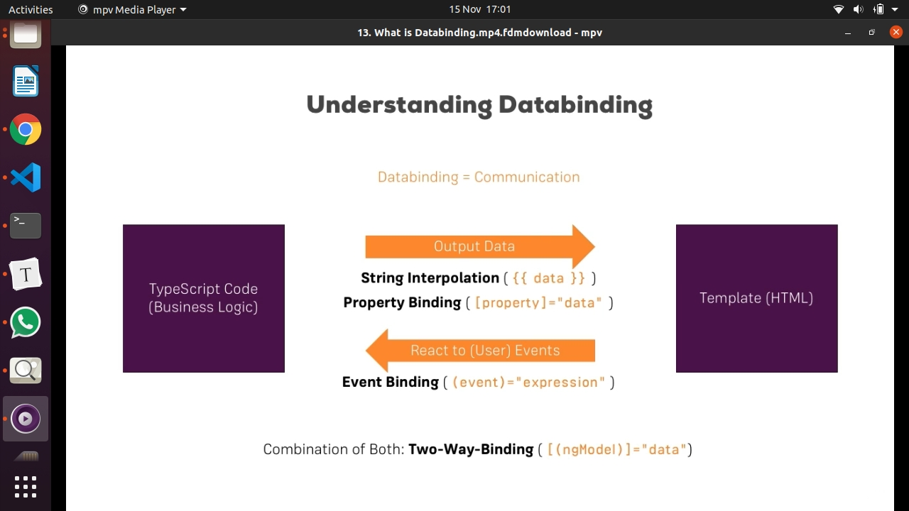
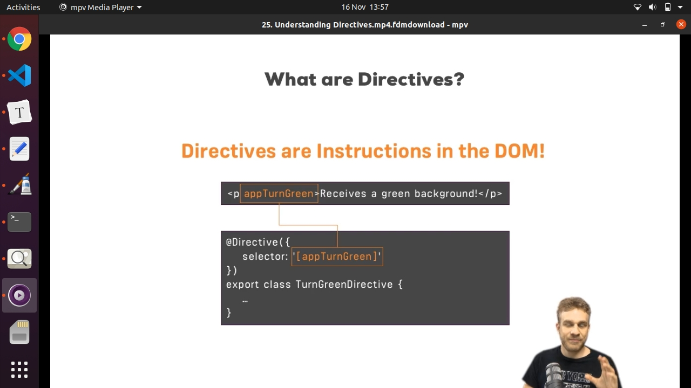
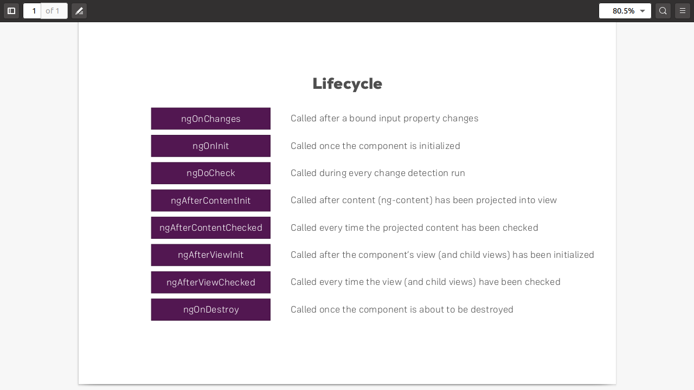
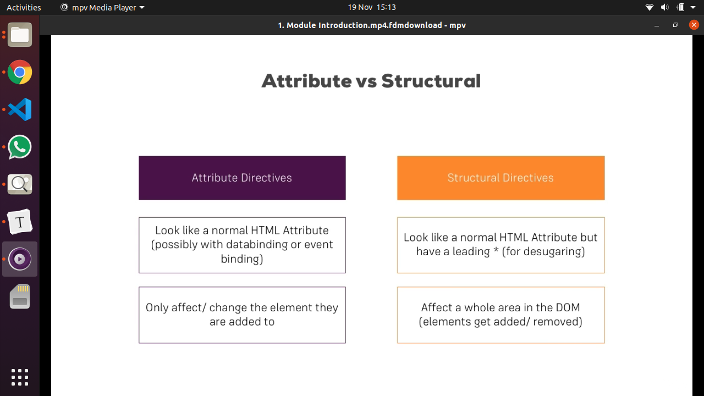
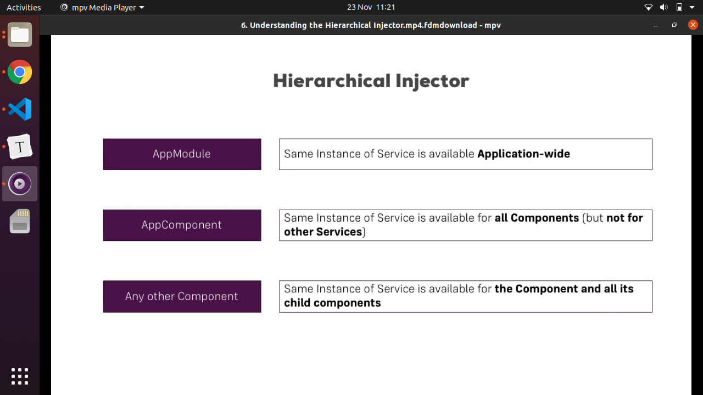
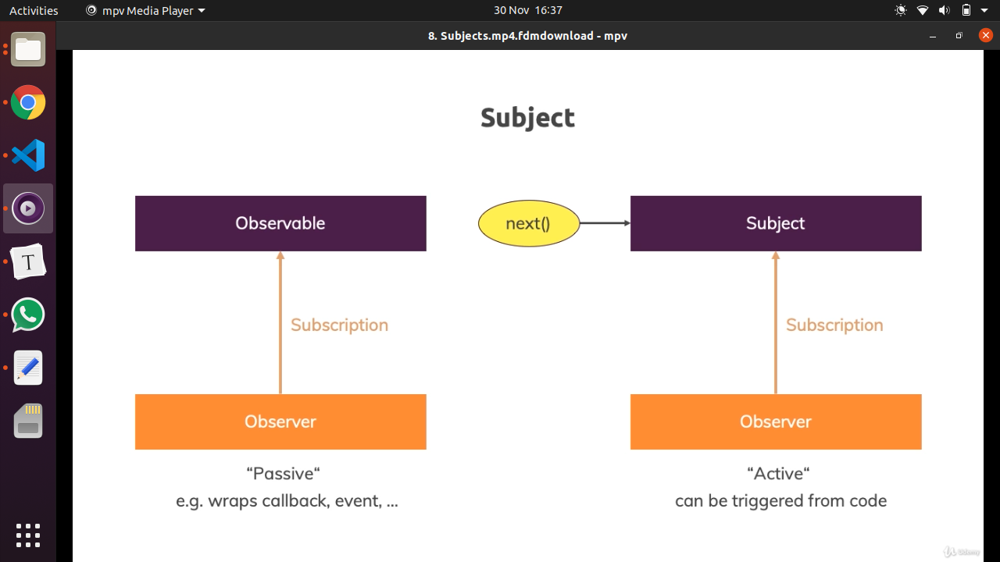

# Angular 8 Academind's course


[TOC]


## Section 2: The basics

main.ts file is the first ts file run on developement in the browser:

```typescript
//main.ts

//checks for the platform
import { enableProdMode } from '@angular/core';
import { platformBrowserDynamic } from '@angular/platform-browser-dynamic';

import { AppModule } from './app/app.module';
import { environment } from './environments/environment';

if (environment.production) {
  enableProdMode();
}

//bootstraps the app from the AppModule
platformBrowserDynamic().bootstrapModule(AppModule)
  .catch(err => console.error(err));
```

```typescript
//app.module.ts

 bootstrap: [AppComponent]
```

```typescript
app.component.ts

@Component({
    selector: 'app-root',
```

-the `bootstrap` array tells Angular what are the known components at the time the index.html is analized by Angular by the first time. Now, angular knows the `<app-root>` selector and can render the template inside.

-Angular changes the DOM at runtime

-A basic component:

```typescript
//server.component.ts

import { Component } from '@angular/core';

//decorator to enhance the class with metadata
@Component({
	//must be a unique selector, just not to override another selector, like <p>
	selector: 'app-server',
	//relative path
	templateUrl './server.component.html'
})
```

-To add a new component, just open a new terminal, don't kill the `ng serve` already running process!

-if a component is added to `app.module.ts` file in the `declarations` array, Typescript will throw an error because it doesn't know what the component is. It must be imported from the correspondent file.

```typescript
//app.module.ts

//the .ts extension is added by webpack when bundled
import { Header1Component } from './components/layouts/header1/header1.component';


@NgModule({
  declarations: [
    AppComponent,
    Header1Component,
```

-A component **must have a template**, but it can lack a `selector` and `styleUrls`.

-`styleUrls` in an array, so multiple `.css` files can be imported.

-How to do inline styling  and template in `.ts` component? replace `styleUrls` and `templateUlr` by `styles` and `template`:

```typescript
//app.component.ts

@Component({
    template: `
		<h1>Hello world</h1>
		<p>welcome</p>
	` ,
    styles: [`
		h3 {
			color: blue;
		}
	`]
})
```

a string of css rules is passed to `styles` array.

-Instead of using `selector: 'app-server'` that allows angular to recognize our component when it sees `<app-server>` in a template, a component can be selected by `attribute` or by `class` (bot rarely used):

```typescript
//server.component.ts

@Component({
    selector: '[app-server]'
})

@Component({
    selector: '.app-server'
})
```

```html
//server.component.html

//angular will recognize our server component here, by attribute
<div app-server>
</div>

//angular will recognize our server component here, by class
<div class="app-server">
</div>

```


-If a component is not declared in `app.module.ts` the error says that the `app-server` is not a known element.


#### Data binding

-what is `data-binding?`: the communication between the `.ts`  and the `.html` file: 



1) **String interpolation**:

```html
//point to variables
// or use expressions that resolves to a string or something that can be strigyfied, like numbers, booleans, etc

<p> {{ 'Hello' }} I am {{ name }}
//it's possible to call methods that returns a string
<p>{{ getName() }}</p>

//ternary expressions allowed
<p>My mood is {{ isHappy? 'happy' : 'not happy' }}</p>

```

No multiline expressions like a `for` loop or `if` blocks, but ternary expressions can be used.

Extra: difference between function syntax inside a class:

```typescript
function print () {
	//need to *bind(this)* if *this* is used inside.
}

print() => {
	//I can use *this* inside directly
}

```


2) **Property binding**:

```html
//allowClick is a boolean
//the type of variable depends on the property which is binded to

<button [disabled]="!allowClick">Do something</button>
```


use case where string interpolation can be replaced with property binding:

```html
//prints true or false:

<p>{{ allowClick }}</p> 
//or
<p [innerHtml]="allowClick"></p> (not the best practice, but possible)
```

When to use string interpolation? when wanting to output a string in the template. Don't use innerHtml for this case.


What to put inside the strings?

```typescript
[disabled]="write a typescript expression here, like, " username == '' " "
```

3) **Event binding**:

use `onSomething` to name methods that are triggered from the template.

```html
<button (click)="onButtonClicked()">Click me</button>
```

```html
//instead of calling a method, a ts expression can be placed inside the quotation marks.

<button (click)="wasClicked = true">Click me</button>
```


4) **Two way data binding**:

To use two way data binding, `FormsModule` must be imported in `app.module.ts`:

```typescript
import { FormsModule } from '@angular/forms';
```


**Lets see a use case WITHOUT two way data binding**, updating manually the `serverName` variable with every keystroke, passing the `$event` object to a method. Pretty annoying:

```html
//template

<input
(input)="onUpdatServerName($event)">
<p>{{ serverName }}</p>

```

```typescript
//.ts file
serverName = '';

onUpdateServer(event) {
	//explicit casting, because ts complaints aboute the 'value' property.
	serverName = (<HTMLInputElement>event.target).value
}

```


Now, lets see **TWO WAY DATA BINDING**:

```html
//template
//it's like the input event is listened to, and aupdates the serverName variable, and the value property is binded to the serverName variable, all aumatically done with the directive 'ngModel'.

//there's a combination of [] brakets for getting data from the .ts file, and () parenthesis, that bind an event in the template to an expression in the .ts file.

<input
[(ngModel)]="serverName">
<p>{{ serverName }}</p>
```

```typescript
//.ts file

serverName = '';
```


#### Directives

What are they? they're instructions in the DOM. When adding `<app-server>` tag in the template, that's a directive, and Angular places the component's template and business logic there.

There are directives **WITH a template**, like `<app-server>`  and **WITHOUT a template**, like `turnThisGreen`, that just applies some css.

Directives are generally added like attributes, like `turnThisGreen`: 

```html
<p turnThisGreen >
```




##### Built in directives: structural and attribute directives

###### Structural directives: *ngIf and *ngFor

***ngIf**:

1) *ngIf: it's a structural directive, because it changes the structure of the DOM.

```html
<p *ngIf="some expression that resolves to true or false">hello</>
```

this directive adds an HTML element to the DOM under certain conditions.

2) *ngIf="someVariable" and *ngIf="!somevariable" to address an `if else` logic.

```html
<p *ngIf="isLoggedIn; ">Hello random user</p>
<p *ngIf="!isLoggedIn ">Hello, logged in user</p>

```

3) *ngIf and else alternative approach, wit. A local reference `#` must be used, the tell the directive which part of the template does the else statement template must be added to the DOM, and a `ng-template` directive must be used.

```html
<p *ngIf="isLoggedIn; else personalGretting">Hello random user</p>
<ng-template #personalGreeting>
<p>Hello, logged in user</p>
</ng-template>
```


***ngFor**:

```html
<div *ngFor="let server of servers">Hello</div>
```

`server` is a dynamic variable, not defined in the `.ts` file, but `servers` does. Then, the server variable can be passed to components via `@input`. 

How to use the index while looping?

```html
<div *ngFor="let server of servers; let myIndexVariable = index">Hello</div>
```


###### Attribute directives: ngStyle & ngClass

Attribute directives don't add or remove things from the DOM, they just modify things inside the elements they're placed on.

**ngStyle**: changes the styles dynamically, at runtime, depending on variable values.

The name of the directive is `ngStyle`, and **we can also bind to a property of the directive called also ngStyle**, using  brackets []. So, in other words, property binding is used to configure the directive.

```html
<p [ngStyle]="{'backgroundColor': getColor()}">Hello dear user</p>

<p [ngStyle]="{'backgroundColor': isAuth ? 'green' : 'red'}">Hello dear user</p>
```

the property ngStyle expects to get an object with key value pairs. `getColor()` is executed in the ts file and return the appropriate color for each user. E.g: if the gender of the user changes at runtime, the getColor() method could return another color at runtime.

**ngClass**: adds a class at runtime:

```html
<p [ngClass]="{highlight: isAuth()}">Hello dear user</p>
```

for classes like `highlight-yellow` (with a hyphen), just use quotation marks to  enclose the name, like `"highlight-yellow"`.


## Section 3: Course project - The Basics-

How to add bootstrap??

```bash
npm i --save bootstrap
```

and then, change `angular.json` to add the minified version of the css file from `node_modules`:

```json
"styles": [
              "node_modules/bootstrap/dist/css/bootstrap.min.css",
```

How to avoid the `spec` file when creating components with the CLI?

```bash
ng g c --spec false
```

How to structure the folders of the project: by feature, like `recipes`, `shopping-list`

How to create a model? just create a class:

```typescript
//recipe.model.ts

import { Ingredient } from '../shared/ingredient.model';

export class Recipe {
    public name: string;
    public description: string;
    public imagePath: string;
    public ingredients: Ingredient[];

    constructor(name: string, desc: string, imagePath: string, ingredients: Ingredient[]) {
        this.name = name;
        this.description = desc;
        this.imagePath = imagePath;
        this.ingredients = ingredients;
    }
}

//ingredient.model.ts
//advanced typescript shorcut
export class Ingredient {
    constructor(public name: string, public amount: number) {}
}


```

the variables are `public` so when the object is created using the constructor, they are available (and not accessed just from a getter).

How to use the `Recipe` model for type checking?

```typescript
//recipe-list.component.ts

import { Recipe } from '../recipe.model';

recipes: Recipe[] = [];
```

so, the class `Recipe` is a type now.


How to bind add the source path to for an image? 2 options:

```html
src={{ recipe.imagePath}}

[src]="recipe.imagePath"
```


If an `<a>` element is used as a button, the `href` attribute must be deleted, to avoid unexpected behaviors. 

If a `<button>` is used to send a form, it must have `type="submit"`, otherwise it should be `type="button"`

When using `<forms>`, remove the `action` attribute, because we don't want to send a request to the server.

What is source map? it's an angular addition added by the CLI to the bundles, that allows the js files to be mapped to typescript in the browser, and place debuggers in the browser.

How to access the  `.ts` files in the browser? dev tools -> sources  -> webpack -> . (dot folder)


## Section 5: Components & data binding

#### Component communication: parent-child levels

If we don't want to use a Model to use it as a type, an alternative is:

```typescript
//we simply say that server is gonna be an object with name and id properties
server: {name: string, id: number};
```

###### Passing data from parent to child element:

By default, all variables or properties, are only accessible from within its component. To make them available to **the parent** , use `@Input` decorator.

```typescript
//a decorator is added to the variable declaration
@Input() element = "";

//in the parent component
<child-component [element]="someData"><child-component>
    
//or another name for the variable can be used in the parent
@Input('otherElement') element = "";

//in the parent component
<child-component [otherElement]="someData"><child-component>
```

The above is called **custom property binding**.


###### Passing data from child to parent component:

an EventEmiter is used in the child component, and the parent should listen to that event.

```typescript
//child component
//the constructor of the EventEmitter class is executed with `new` keyword.
@Output() serverAdded = new EventEmitter<{name: string, id: number}>
this.serverAdded.emit({name: 'server-1', id: '1'})
    
//parent component
<child-component (serverAdded)="onServerAdded($event)"></child-component>
```

`EventEmitter` is a generic type, that's why it uses `<>`.  The data emitted in the event can be picked up with `$event` argument. The event can be listened by a parent, but not a grand parent.

The css rules affect just the component they're placed on. Style encapsulation: Angular modifies the css rules and html elements, by adding attributes. If we inspect in the browsers:

```
//original css rule
p {
color: blue;
}

//compliled css rule:
p[_ngcontent-etc]{
	color: blue;
}

//compiled html element. All the <p> inside a component have this attribute added. <p> in other components have a different attribute.
<p _ngcontent-etc>Hello</p>
```

so, the specific attributes make this encapsulation work.

How to change the default encapsulation behavior?

```typescript
@Component({
	encapsulation: ViewEncapsulation.Emulate or .None or .Native
})
```

`Emulate` is the default,  `None` applies the style rules of the component to the whole app (Not a good idea), and `Native` uses the shadowDom, not supported by some browsers.


###### Local references:

Pass the actual `html element` (like `HTMLInputElement`) from the template to `.ts` file via method:

An html element, with all its properties, can be accessed in the `.ts` file, when passed via a method  from the `template` .

```typescript
//html
<input #nameInput>
<button (click)="nameEntered(nameInput)"

//ts
nameEntered(name: HTMLInputElement) {
    //do something name.value
}
```


Get the `ElementRef` from the `.ts` file using @ViewChild, without the need of a method:

```typescript
//ts
@ViewChild('nameInput', { static: true}) nameInput: ElementRef;

//do something with its value
nameInput.nativeElement.value
```

the `nativeElement` property must be accessed to get access to the `html element`.

Note: **don't change the DOM assigning a new value for the `html element` from the `.ts` file**!!

there are other tools to change the DOM: `renderer2`, and `@HostBinding()` for directives.


###### Passing html elements to a child component:

```html
<component>
	<h1>Hello</world>
</component>
```

React can access the passed html via `props.children` from a parent to a child component, and that children content can be placed inside the child component. But in Angular, **everything passed inside the opening and closing tags of a component, is lost.**

We need to tell Angular where to place the projected content:

```html
//parent component
<child-component>
	<p>Some nested html elements</p>
</child-componen>

//child component
<h1>The child componen</p>
<ng-content></ng-content>
```

the `<ng-content>` tag is a hook for Angular, to know where to put the content passed between its opening and closing tags.


#### Lifecycle Hook methods:



`ngOnChanges` is called when the component is created, and when any @Input properties or attributes, change. It receives and argument `changes: SimpleChanges`. The changes object contains the previous value of the property, and it' s useful to do something with the old value, like storing it.

`ngOnInit` the object was created, and the properties are available. (you can call `this.someProperty`). Runs after the contructor.

`ngDoCheck` runs every time a property has changed inside a component (model), and checks if the template (view) needs to be modified. I also runs after events are fired from the template, observables resolved, etc. It runs twice in development, because there are 2 cycles by default, not on production mode. It can be good to add some code to manually inform Angular to change something that it didn't pick it up.


Projecting content (html passed the opening and closing tags of the children):

`ngAfterContentInit` runs after the view of the projected content has been initialized (the view of the parent has been initialized, which contains the projected content).

`ngAfterContentChecked` runs right after the above method.

`ngAfterViewInit` runs after the content of the child element has been initialized.

 `ngAfterViewChecked` run after the above method, and after `ngAfterContentChecked` 


`ngOnDestroy` runs right before the object is destroyed, good for clean up work.


`ngOnChanges`  is fired if a new object is passed into a component via @Input. If it same object changed one of its properties or methods, it doesn' t fire the method, because objects are reference types, (are reference of the object stored in memory) . Passing a primitive like a string will trigger it.


###### Accessing the template in lifecycle hook methods:

-Inside a component, an `ElementRef` can be accessed in `ngAfterViewInit` and not on `ngOnInit` .

-Inside a child component, the `ElementRef` placed in the projected content (in the parent template) can be accessed in `ngAfterContentInit`, via `@ContentChild('localReferenceName', {static: true})`


## Section 7: Directives: deep dive:

Structural directives change the DOM around the element they're placed on.



How to filter an array in an `*ngFor` directive, in the template?

````typescript
//this DOES NOT work. Only ONE structural directive is allowed
*ngFor="let event of events"
*ngIf="event.date > today"
````

a `custom pipe` is the right tool.

#### Custom attribute directive:

The `selector` is a must, in the `@Directive` decorator: in this case, the `selector` is `[appBasicHiglight]`, to target the `appBasicHighlight` attribute place on an `html element`.  If the selector would have the square brakets, it would target , `<appBasicHighlight>` tag.

The `html element` the directive sits on, can be injected into the directive in the constructor:

Basic directive, following BAD PRACTICES, changing the DOM directly with `elementRef`:

`````typescript
//basic-highlight.directive.ts----BAD PRACTICES
@Directive({
	selector: '[appBasicHighlight]'
})
export class BasicHighlight implements OnInit{
	constructor(private elementRef: ElementRef){}
	
	ngOninit(){
		this.elementRef.nativeElement.style.backgroundColor = 'red'
	}
}

//html
<h1 appBasicHighlight>Hello world</h1>

`````

It uses the `ElementRef` but doesn't use `ViewChild`, it just injects it in the constructor.

The directive must be imported and declared in `app.module.ts` file.


Directive using GOOD PRACTICES, changing the DOM with `renderer2`:

````typescript
//basic-highlight.directive.ts----GOOD PRACTICES
@Directive({
	selector: '[appBasicHighlight]'
})
export class BasicHighlight implements OnInit{
	constructor(private elementRef: ElementRef, renderer2: Renderer2){}
	
	ngOninit(){
		this.renderer2.setStyle(this.elementRef.nativeElement, 'backgroundColor','red', flags?)
	}
}

//html
<h1 appBasicHighlight>Hello world</h1>
````

**To change the DOM = use `renderer2` API**, this runs in serviceWorkers environment and in node(?).


###### Reactive directives with `@HostListener()` 

The `renderer2` approach works, but I can't react to events, like a mouse hovering on the element.

`@HostListener()`  is a decorator that declares a DOM event to listen for, and provides a handler method to run when that event occurs.

`````typescript
//basic-highlight.directive.ts----GOOD PRACTICES
@Directive({
	selector: '[appBasicHighlight]'
})
export class BasicHighlight {
	constructor(private elementRef: ElementRef, renderer2: Renderer2){}
	
    //changes the background color to red when the element is hovered
    @HostListener('mouseenter') mouseOver() {
        this.renderer2.setStyle(this.elementRef.nativeElement, 'backgroundColor','red');   
     }
    
    //changes the background color to transparent when the element is not hovered
    @HostListener('mouseleave') mouseNotOver() {
        this.renderer2.setStyle(this.elementRef.nativeElement, 					      'backgroundColor','transparent');
     }
    
}

//html
<h1 appBasicHighlight>Hello world</h1>
`````

`mouseenter` and `mouseleave` are native events on html elements. But  `mouseOver()` and `mouseNotOver`  are just the names of the methods executed when the mentioned events are triggered.


###### Reactive directives with `@HostBinding()`      -better than `Renderer2` -

The `@HostBinding()` decorator must be provided an argument pointing an attribute of the host element. Could be the `style.backgroundColor` , `disabled`, `class`, etc. 

`@HostBinding()` binds an attribute of  the `html host element` to a property of the directive. 

`````typescript
//Using @HostBinding----GOOD PRACTICES
@Directive({
	selector: '[appBasicHighlight]'
})
export class BasicHighlight {
	constructor(){}
    
    //bind an html attribute to a property of the directive. Pass the html attribute you want to bind to, inside quotation marks, and define the initial value of the directive property
    @HostBinding('style.backgroundColor') backgroundColor = 'transparent';
	
    //listen to events: changes the background color to red when the element is hovered
    @HostListener('mouseenter') mouseOver() {
        this.backgroundColor = 'red'   
     }
    
    //listen to events: changes the background color to transparent when the element is not hovered
    @HostListener('mouseleave') mouseNotOver() {
       this.backgroundColor = 'transparent'
     }
    
}

//html
<h1 appBasicHighlight>Hello world</h1>
`````


####  Binding to directive properties

It's nice to pass data to the directive from the template, to configure it, using `@Inputs` inside the directive:

``````typescript
// Adding Inputs ----GOOD PRACTICES
@Directive({
	selector: '[appBasicHighlight]'
})
export class BasicHighlight implements OnInit{
    @Input() defaultColor = 'transparent';
    @Input() highlightColor = 'red';
    
    @HostBinding('style.backgroundColor') backgroundColor:string;
	
    constructor(){}
    
    ngOnInit() {
        this.backgroundColor = this.defaultColor;
    }
	
    @HostListener('mouseenter') mouseOver() {
        this.backgroundColor = this.highlighColor;   
     }

    @HostListener('mouseleave') mouseNotOver() {
       this.backgroundColor = this.defaultColor;
     }
    
}

//html
<h1 appBasicHighlight [defaultColor]="'transparent'" [highlightColor]="'red'">Hello world</h1>

//or

//html
<h1 appBasicHighlight defaultColor="transparent" highlightColor="red">Hello world</h1>
``````

How does Angular know if the binded attributes are inputs if directives, or just normal attributes of the `html element` ? it just figures it out by itself, by looking first at the directives placed on the element, and looks for its inputs.

A neat way to add an `@Input` is to use an alias, so the name of the input is the same as the directive, like what happens with `ngClass` when it's input called `ngClass` is binded like: `[ngClass]` in the template. So, the directive is placed and the `ngClass` input is binded at the same time. Super!

`````typescript
//use Alias for inputs----GOOD PRACTICES
@Directive({
	selector: '[appBasicHighlight]'
})
export class BasicHighlight implements OnInit{
    @Input() defaultColor = 'transparent';
    @Input('appBasicHihlight') highlightColor = 'red';
    
    @HostBinding('style.backgroundColor') backgroundColor:string;
	
    constructor(){}
    
    ngOnInit() {
        this.backgroundColor = this.defaultColor;
    }
	
    @HostListener('mouseenter') mouseOver() {
        this.backgroundColor = this.highlighColor;   
     }

    @HostListener('mouseleave') mouseNotOver() {
       this.backgroundColor = this.defaultColor;
     }
    
}

//html
<h1 [appBasicHighlight]="'red'" [defaultColor]="'transparent'">Hello world</h1>

//or

//html
<h1 appBasicHighlight="red" defaultColor="transparent">Hello world</h1>
`````


#### Structural directives behind the scenes

The star `*` before the `ngFor` is sugar syntax, and Angular translates that into a more complex code, that has property binding, so we can pass data to the directive:

`ng-template` is a container.

`````html
<h1 *ngIf="showTitle">Hello World!</h1>

//translated by Angular to:

<ng-template [ngIf]="showTitle">
	<h1>Hellos World</h1>
</ng-template>
`````


#### Custom structural directive: unless

The directive needs access to the `TemplateRef` to know **what** to render, and the `ViewContainerRef` to know **where** to render it.

`ViewContainerRef` represents a container where one or more views can be attached to a component.

`createEmbeddedView()` instantiates an embedded view and inserts it into this container.

`TemplateRef` represents an embedded template, like `<div><h1>Hello World</h1></div>`, and it's basically the `html element` the directive sits on, and the nested `html elements`. 

``````typescript
//custom structural directive
@Directive({
	selector: '[appUnless]'
})
export class BasicHighlight implements OnInit{
    //I use a setter, which is a method where I can run an if else block. The value of the property 'unless' is not used in the end.
    @Input('appUnless') set unless(condition:boolean) {
        //if the condition is false, I wanna attach content to the DOM
        if (!condition) {
            this.vcRef.createEmbeddedView(this.templateRef);
        } else {
            this.vcRef.clear();
        }
    }
  
    constructor(private templateRef: TemplateRef, private vcRef: ViewContainerRef){} 
 
}

//html. When `showTitle` is false, the title will be displayed
<h1 *appUnless="showTitle">Hello world</h1>

``````

**The selector of the directive and the alias of the `@Input` must match, in order to be able to bind that property from the template passing the condition.**


#### Structural directives: *ngSwitch

More than 2 conditions? use `*ngSwitch` to react to different conditions

````
<div *ngSwitch="10">
	<p *ngSwitchCase="10" >The number is 10</p>
	<p *ngSwitchCase="20" >The number is 20</>
	<p *ngSwitchDefault >Another number</p>
</div>
````


Note: I tried removing `jQuery` and add a directive to the mobile toggle button of the recipe book app and it didn't work because there are 2 different `html elements` that need to be linked and be added/removed classes. So, I ditched directives and used a variable `isToggleOpen` in the `.ts` component, and used `[ngClass]` to add or remove classes in the the 2 `html elements`.


## Section 9: Services and dependency injection

When to use services:

1) Duplication of code

2) Data management

3) Comunicate between components (via `Subjects`)


Services are just classes, but they are not instantiated manually inside components, like:

````typescript
//DONT!! component.ts

const myLoggingService = new LoggingService();

myLoggingService.someMethod;
````

Angular has a better way ton instantiate the class, with dependency injection, following a singleton pattern, where just one single object is created by Angular for the whole app or some parts. So, the state of the app can be kept there, and is decoupled from the components. 

As object are reference types (not primitives, like strings and numbers), so the when an object is created, then references are passed to 

#### How to consume a service in a component?

`````typescript
//component.ts

@Component({
    //pass just the type of the service. The service object scope is just this component, not too useful.
    providers:[LoggingService]
})

export class someComponent {
    //use the typescript shortcut with `private` or `public`, to create a property that is assigned the value of the argument of the same name passed in the constructor.
    constructor(private loggingService: LoggingService)
}
`````


What is an injector: a middleman

What does it do?

**So now its the dependency injection’s responsibility to:**

1. Create the objects
2. Know which classes require those objects
3. And provide them all those objects


A provider tells an injector *how to create the service*. Each component can use it's own, or the parent's:

Injectors are inherited, which means that if a given injector can't resolve a dependency, it asks the parent injector to resolve it. A component can get services from its own injector, from the injectors of its component ancestors, from the injector of its parent NgModule, or from the `root` injector.

The instance of the class (object) is injected at runtime in the component.


#### Where to configure the injectors?

You can configure injectors with providers at different levels of your app, by setting a metadata value in one of three places:

- In the `@Injectable()` decorator for the service itself.
- In the `@NgModule()` decorator for an NgModule.
- In the `@Component()` decorator for a component.

The `providers` array tells the injector _which_ instance of the service we want.


#### What is the scope of the singleton service object create?

Services are singletons *within the scope of an injector*. That is, there is at most one instance of a service in a given injector. In the first example, the scope of the injector is the component, so **the scope of the object is the component, and all its children**. For example: `users-list.component.ts` has a providers array, then, `user.component.ts` will have the same service class instance.

If an object living in a service is passed to components, and it's not cloned, the component can mutate the object. Will the `ngOnChanges` run when changes happen inside the object, if the reference (pointer) is always the same?? No.



the inheritance of a service instance to child components is overwritten if the child components have `providers` in the `@Component()` metadata.

 To make a service injectable into another one, two conditions must happen:

1) The injected service must be provided in the `AppModule` via `providers` there, or use `@Injectable({ providedIn: 'root' })` in the service. There are these 2 ways. 

2)  And , the receiving service must have `@Injectable()` decorator (without the need of any extra metadata).


Advantage of using `@Injectable({ providedIn: 'root' })`:

Services <strong>can be loaded lazily </strong>by Angular (behind the scenes) and redundant code can be removed automatically. This can lead to a better performance and loading speed - though this really only kicks in for bigger services and apps in general.


#### Cross component communication via `Subjects`

communication between to adjacent components can be done with an `@Output` and `@Input` in a rigid and cumbersome way. But with services, and event in a component can be listened into another one via `services` and `Subjects` !. 

Note: `EventEmmiter` can also be used, but it's not as efficient as `Subjects`.


## Section 10: Course project: Services and dependency injection

When keeping state inside services, 2 things can be done to avoid bugs:

1)  `private` can be added in front of them so, they're not accessible like this:

`````typescript
//component.ts
myServiceInstance.propery1 = some new value
`````

2) clone objects when returning them inside methods:

````typescript
getUsers() {
	return [...this.users]
	//or
	this.users.slice();(it returns a brand new array, not a reference to the original one)
}
````

Good practice: initialize (define) the variables in `ngOninit`, and previously declare them in the component:

````typescript
@Component({some metadata here})
export class Users implements OnInit {
	private users = [];
	constructor(private usersService: UsersService){}
		
	ngOnInit() {
		this.users = this.usersService.getUsers();
        this.usersChanged.subscribe(users => {
            this.users = users;
        });
	}
}
````

the `getUsers()` method can be avoided if a `BehaviorSubject` is used in the service instead.

When using `<a>` as buttons, get rid off the `href`, so it doesn't do something else, and just execute the method linked to it.

How to add a list of ingredients to an array, in one go?? ingredients = [{}, {}], and newIngredients = [{}, {}, {}]

````
this.ingredients.push(...newIngredients)
````

the spread operators allows us to take each object if the array, and add them to an array. If `push(newIngredients)` is done, the default result is [{}, {}, [{}, {}, {}]], nested arrays!!

Other option is the good and old for `loop`, or `.forEach` and push on every iteration.


## Section 11: Routing

One `index.html`, different content for each route, so the user sees multiple pages, but it's just one, changed at runtime by angular router.

The first step is to let angular know what are the routes, at the app level, in `app.module.ts`:

````typescript
//app.module.ts

import { Routes, RouterModule } from '@angular/router';

//define the array
const appRoutes: Routes  = [
	{ path: 'users', component: UsersComponent},
	{ path: '', component: HomeComponent}
]

//pass the array
@NgModule({
	imports: [
		RouterModule.forRoot(appRoutes)
	]
})

````

So, for each route on the address bar of the browser, a component is loaded (and it's children, of course), and it's placed thanks to the directive `<router-outlet>` placed on the template.

How to add links in the app to navigate to those routes? just add `routerLink` directives on the template.

DON'T use `href="/users"` because that will RELOAD the app!

````typescript
//component.ts

<a routerLink="/users">Users</a>
//or
<a [routerLink]="'/users'"></a>
//or
<a [routerLink]="['/user', extraParams]"></a>
````

The `RouterLink` directive prevents the default request to the server, looks for the inputs passed to it, and checks if there's a route declared in the app that matches that one, and loads a component.


#### Absolute vs relative paths

If  the user is at `/admin` and clicks `routerLink="/users"`, the app navigates to `/users`, BUT if he clicks `routerLink="users"`, the app will navigate to `/admin/users`, so it will append the relative path to the current route when clicking the link.

`routerLink="./users"` is the same as `routerLink="users"`

A segement can also be deleted by going up with `..`, like this: `routerLink="../users"` will navigate to `/users` route if clicked when on `/admin` (the `admin` segment is deleted).

How to have visual indication in the page of which route the user is on?

`RouterLinkActive` is a directive that attaches a given class to a link element (or `<li>` wrapping element) when its route is active.

`````html
<li  routerLinkActive="active">
	<a routerLink="/users">Users</a>
</li>
`````

by default, the directive considers that the link to `/` is also active, so the home link is also marked as active when on `/users`.  The empty path segment is part of all paths. How to solve it? add `[routerLinkOptions]="{exact: true }"


#### Programatic Navigation

Sometimes, before navigating, some code needs to run, like for example, an http call to a payment platform, and then, redirecting the user to a success page.

So, the navigation happens from inside the `.ts` file, and the router must be injected:

````typescript
//component.ts

import { Router } from '@angular/router';

constructor(private router: Router) {}

this.router.navigate(['/users'])
````

This `router` navigation assumes that relatives paths are relative to the root, making them absolute paths, so the `relativeTo` value must be specified. The `routerLink` navigates relative to the current route by default.

So, when using the `router` and relative paths, also inject the `ActivatedRoute` class, so we can have a reference for relative navigation:

````typescript
//component.ts

import { Router, route } from '@angular/router';

constructor(private router: Router, private route: ActivatedRoute) {}

this.router.navigate(['users'], relativeTo: this.route)
````


#### Dynamic segments in the path: parameters

Defining a parameter in when declaring the routes of the app, it's easy to pick it up inside the `.ts` file:

`````typescript
//app.module.ts

const apRoutes: Routes = [
	{path: '/user/:id', component: UserComponent}
]
`````

Now, if navigating to `/user/1`, when accessing the `id` parameter in the `.ts` file, this will have a value of `1`, and then, I can display the correct data for that user inside `UserComponent`.

`````typescript
//component.ts

import { ActivatedRoute } from '@angular/router';

constructor(private route: ActivatedRoute){}

ngOnInit() {
    //get the snapshot, and not get notified of changes
	this.id = this.route.snapshot.params.['id'];
    
    //get an observable, and see for future changes on the param
	this.route.params.subscribe(params => {
    	this.id = params.['id'];
	})
}


`````

````typescript
//ActivatedRouteSnapshot is an interface with metadata

interface ActivatedRouteSnapshot {
  params: Params
  ...
}
````

If we have `/user/:id/:name`, to access `name`, follow the same approach as above.

The subscription to params is important, because if the component was already loaded and the parameters can be changed from inside the component (via `routerLink` or `router.navigate`), Angular will not destroy and create the component by default, and hence, will not reflect changes on the view.

Observables let the main code run when waiting for async event to happen. When it does happen, there are instructions already set that run.

Angular automatically unsubscribe from the `route.params` observable, because it's a built in one,


#### Shorter code for getting the params:

If the subscription is gonna be added anyways, just initialize the `user` property inside the callback of the subscription:

`````typescript
//component.ts

ngOnInit() {
    this.route.params.subscribe((params: Params) => {
      this.user = {
        id: params['id'],
        name: params['name']
      }
	}
}
`````


#### Query params and fragments: passing key value pairs via routing to communicate between components

How to get this url? `/server/1/server1/?allowEdit=false#loading`

###### Passing query params and a fragment with `routerLink`:

The `RouterLink` directive has a bindable property called `queryParams` and `fragment`:

````typescript
[routerLink]="['/servers', 1, 'server1']"
[queryParams]="{allowEdit: false}"
[fragment]="'loading'" or fragment="loading"
````


###### Passing query params and a fragment with `router.navigate`:

````typescript
this.router.navigate(['/server', 1, 'server1'], {queryParams: {allowEdit: false}, fragment: loading});
````


###### Retrieving the data inside components

`````
ngOnInit(){
	this.route.snapshot.queryParams;
	this.route.snapshot.fragment;
	//or
	this.route.queryParams.subscribe();
	this.route.fragment.subscribe();
}
`````

When reading values from parameters, like `servers/1` the numbers is converted to a string `"1"` so, that can be converted to a number again adding a `+` before the variable when picked up:

````typescript
+this.route.snapshot.params['id'];
````


#### Nested routing

How about having a router inside a router, to display different views inside a main component already loaded via routing?

````typescript
//app.module.ts

const routes: Routes = [
    {path: 'servers', component: ServersComponent, children: [
        {path: ':id', component: ServerComponent},
        {path: ':id/edit' component: ServerEditComponent}
    ]}
]
````

and just add a `<router-outlet>` where inside the ServersComponent, to display the nested views.


#### Query params are lost when navigating again (e.g using a relative path):

How to preserve this query params and fragment? 

````typescript
this.router.navigate(['edit'],{relativeTo: this.route, queryParamsHandling: 'preserve'},:
````

`````typescript
type QueryParamsHandling = 'merge' | 'preserve' | '';
`````


#### Wrong route? display a 404 page:

The routes are parsed from top to bottom, in the `routes` array declared in `app.module.ts`:

````typescript
//app.module.ts

const routes: Routes = [
	{path: '', component: HomeComponent},
	{path: 'not-found', component: 404Component},
	{path: '**', redirectTo: ''  or redirectTo: 'not-found'}
]
````

if a route `/foo` is loaded, it will match the last object in the array. A redirection to `""` or `"not-found"` are good options. Make sure to place the `wildcard` at the end of the array.


#### Moving the routing config to `app-routing.module.ts`

In order not to bloat the `app.module.ts` file, it's better to create a new module and set up the routing config there:

``````typescript
//app-routing.module.ts
//import all the components loaded via routing
const appRoutes: Routes = [routes here];

@NgModule({
    //no need to declare the components loaded via routing, 
	imports: [
		RouterModule.forRoot(appRoutes)
	],
    exports: [
        RouterModule
    ]
})
export class AppRoutingModule {}
``````

The `exports` array makes Modules available when the `AppRoutingModule` is imported by other module.

````typescript
//app.module.ts
//import all the components, event the ones loaded via routing
@NgModule({
    declarations: [all the components, even the ones loaded via routing]
    imports: [AppRoutingModule]
})
````


#### Protect views with guards

A service which implements `CanActivate` interface is all we need to  protect the routes. It must be declared in providers, like the rest of the services. `@Injectable()` is added because the guard needs to injects other service to check if the user is logged in and so on.

`````typescript
//auth-guard.service.ts

@Injectable()
export class AuthGuardService implements CanActivate {
    
    //inject another services in the constructor
    constructor(private authService: AuthService,
                private router: Router){}
    
    canActivate(route: ActivatedRouteSnapshot, state: RouterStateSnapshot): Observable<boolean | UrlTree> | Promise<boolean | UrlTree> | boolean | UrlTree {
        return this.authService.isAuth.then(authState => { //isAuth() returns a promise
            if (authState) {
                return true;
            } else {
                this.router.navigate(['']);
            }
        })
    }
}
`````


````typescript
//app-routing.module.ts

const appRoutes = [
    {path: 'users', canActivate: [AuthGuard], component: UsersComponent, }
]
````


The arguments passed to the `canActivate()` method are passed by Angular when the method is called.

Asynchronous code can be executed inside the method, to reach a server, for example, and that's why it can return an `Observable` or a `Promise`.

If a route is applied to a parent route, **the guard is applied to all the child routes as well!**

If the main `return` is missing inside `canActivate` the `return` statements inside the if block will return a `Promise`.

####  How to protect just the child routes, but not the parent?

Use `CanActivateChild` interface:

````typescript
//auth-guard.service.ts

@Injectable()
export class AuthGuardService implements CanActivateChild {
    
    //inject another services in the constructor
    constructor(private authService: AuthService,
                private router: Router){}
    
    canActivateChild(route: ActivatedRouteSnapshot, state: RouterStateSnapshot): Observable<boolean | UrlTree> | Promise<boolean | UrlTree> | boolean | UrlTree {
        return this.authService.isAuth.then(authState => { //isAuth() returns a promise
            if (authState) {
                return true;
            } else {
                this.router.navigate(['']);
            }
        })
    }
}
````


```typescript
//app-routing.module.ts

const appRoutes = [
    {path: 'users', canActivateChild: [AuthGuard], component: UsersComponent, children:  	[children here] }
]
```

**The same guard can have `canActivate` and `canActivateChild` methods**, and be used in different routes. e.g: I could protect the `/servers` parent route but not the children, and not protect the `/users` route but the children.  


#### Preventing leaving a view with CanDeactivate interface

If editing something, and the user accidentally tries to leave the page, it would be nice to ask him if he really wants to leave. Having a guard preventing leaving that route is the solution,

For example, inside `EditServerComponent` there are inputs that can be checked if they were changed and saved in the "database", and it's in a component, not a service that could be injected into the guard (like the `AuthService`). How to solve this issue?

Two methods should run: one inside the component, called `canComponentDeactivate`, to access the `changesSaved` variable, and returns an observable. The other method should be the classic `canDeactivate`  

Two interfaces are required, for each method: the built in `CanDeactivate` interface and the custom `CanComponentDeactivate`. 

The `CanComponentDeactivate` interface must be exported in order to apply inside the component, and then we're sure the components has a `canComponentDeactivate()` method. 

The `canActivate()` method is always called by Angular and it will provide the arguments, and one of them is component itself, that can be used inside the `canDeactivate()` method, calling its method `canComponentDeactivate()`.

`@Injectable()` is not necessary because any services are injected.

`````typescript
//can-deactivate.guard.ts

//export the interface that's gonna be imported by the component
export interface CanComponentDeactivate {
    canComponentDeactivate: () => Observable<boolean> | Promise<boolean> | boolean;
}

//export the guard now. The component is passed to the method by angular.
export class CanDeactivateGuard implements CanDeactivate<CanComponentDeactivate> {
    canDeactivate(
    	component: CanComponentDeactivate,
    	currentRoute: ActivatedRouteSnapshot,
    	currentState: RouterStateSnapshot,
    	nextState: RouterStateSnapshot
  ): Observable<boolean>|Promise<boolean>|boolean) {
            return component.canComponentDeactivate()
        }
}
`````

````typescript
//app-routing.module.ts

const appRoutes = [
    { path: 'servers', component: ServersComponent, children:[
        { path: ':id', component: ServerComponent },
        { path: ':id/edit', component: EditServerComponent, canDeactivate: [CanDeactivateGuard]}
    ]} 
]

providers: [CanDeactivateGuard];
````

`````typescript
//edit-server.component.ts
import { CanComponentDeactivate } from 'somewhere';

//time to import and extend the interface
export class EditServerComponent extends CanComponentDeactivate {
    canComponentDeactivate {
        if (!this.allowEdit) {
            return true;
        }
        if (changes were made and not saved) {
            return confirm('Changes not saved, do you really wanna leave?')
        } else {
            return true;
        }
        
    }
}
`````


#### Passing static `data` when defining a route:

```typescript
//app-routing.module.ts

const appRoutes: Routes = [
    { path:  'not-found', component: ErrorComponent, data: {message: 'Page not found'}}
]
```

`````typescript
//error.component.ts

ngOnInit() {
    //get the snapshot
    this.message = this.route.snapshot.data['message'];
    //or react to future changes of data
    this.route.data.subscribe(data => {
        this.message = data.message;
    })
}
`````

So, the `ErrorComponent` could be reused in other routes and be passed another `message` .


#### Passing dynamic data (async  one) via a `Resolver`:

The resolver runs some code before the route is loaded. The difference with a resolver, is that this resolver will NOT decide if the route can be loaded or not, but can fetch data from a server (e.g) to load the route.

Another alternative to a resolver could be showing a spinner and get data on `ngOnInit()`.

 As the `resolve()` method runs every time before the route is loaded, it's enough accessing the `route: ActivatedRouteSnapshot`  parameter passed the the method if we want to access some params. No need of subscriptions and react to changes to params.

````typescript
//server-resolver.service.ts

@Injectable({
    providedIn: 'root'
})
export class ServerResolver extends Resolve<Server> {
    constructor(serversService: ServerService){}
    
    resolve(route: ActivatedRouteSnapshot, state: RouterStateSnapshot): Observable<Server> | Promise<Server> | Server {
        return this.serversService.getServer(+route.params['id']);
    }
}
````

````typescript
//app-routing.module.ts

const appRoutes:Routes = [
    children: [
    	{path: ':id', component: ServerComponent, resolve: {server: ServerResolver}} 
	]
]
````

The `data` property inside the `route: ActivatedRoute` object is used to retrieve the data returned by the resolver.

```typescript
//server.component.ts

export class ServerComponent extends OnInit {
    constructor(private route: ActivatedRoute, private serversService: ServersService)
    ngOnInit() {
      this.route.data.subscribe(data: Data => {
          this.server = this.serversService.getServer(+data['server']);
      })
    }
}
```


#### Location strategies

When the app is deployed, e.g to Firebase, the server (not the Angular App) parses the url before deciding what to do. When configuring a project on Firebase as a SPA, the server always serves the index.html file for all routes, letting the App decide what to do with the url.

Some older browser don't let Angular parse the url, so the `#` can be used. Not recommended anymore.

```typescript
//app-routing.module.ts

RouterModule.forRoot(appRoutes, {useHash: true})
```

This modifies the url as follows: `localhost:4200/#/server` and the web server can only sees the segment before the `#` so it always servers `index.html`. Then, the segments after the `#` are parsed by Angular. OLD SCHOOL, don't do it.


## Section 12 - Course project routing -

Watch out when redirecting the `""` route: 

The path-matching strategy, one of _'prefix' or 'full'_. **Default is 'prefix'**.

By default, the router checks URL elements from the left to see if the URL matches a given path, and stops when there is a match. For example, '/team/11/user' matches 'team/:id'.

The path-match strategy 'full' matches against the entire URL. It is **important to do this when redirecting empty-path routes**. Otherwise, because an **empty path is a prefix of any URL**, the router would apply the redirect even when navigating to the redirect destination, **creating an endless loop**.

Tip: remove the `href=#` from the `<a>` elements that have `routerLink` to avoid reloading the page when navigating. To get the clickable cursor, just add `syle="cursor: pointer;"`


#### Loading individual recipes via child routing

When a specific recipe from the list is clicked, a service would act as a bridge between the list of recipes and the `RecipeDetailComponent` and this service can be accessed from `RecipeDetailComponent`, of course. But there's a better way: passing the selected recipe via params, using routing!


Tip: make sure the `new` route path is before the `:id` route in `app-routing.module.ts` because then, when loading `recipe/new` the `RecipeDetailComponent` will try to find a recipe from the service, that has an `id = 'new'` throwing an error.

````typescript
//app-routing.module.ts

const appRoutes:Routes = [
    { path: 'recipes', component: RecipesComponent, children: [
        {path: 'new', component: RecipeEditComponent},
        {path: ':id', component: RecipeDetailComponent},
        {path: ':id/edit', component: RecipeEditComponent}
    ]}
]
````

No conflict happens between the last 2 child routes. I thought that there will be conflict with them. 


###### 2 Cases of conflicts with routes

There's only conflict when **the shape is the same**, so the most restrictive case should be put before, like in the case of `new` and `:id`. If routes have different number of segments, like `:id` and `:id/edit`, there is no conflict.

The other conflict with routes is when redirecting the `""` route and having the default `pathMatch: "prefix"`.


#### Navigating with relative paths

When clicking the `New Recipe` button from inside the `RecipeListComponent`, no matter if the url is `/recipes/1/edit`, I'll be navigated to `recipes/new` because the `RecipeListComponent` is loaded via routing, with the route `/recipes`.

````typescript
//recipe-list.component.ts
this.router.navigate(['/new'], relativeTo: this.route);
````


## Section 13 - Understanding Observables -

The observable is an object that can emit data packages over time, more than once. E.g `this.route.params`

Observables are a contract to which we subscribe to be informed about changes in data.

The observer is the code inside the subscription.

3 types of data packages:

- Data
- Errors
- Completion

Some observables never complete, like a `Subject` attached to a button. 

On the other hand, an `http request` completes when the response is gotten.

They're used to handle async tasks: we don't know when they'll happen. The app keeps running, but we know how to react to these events, leaving instructions in the code.


#### Custom observable to understand the internals

Observables are not part of JavaScript, so they need to be imported through `rxjs` library from `npm`.

Quick example with built in observable ship with `interval`  rxjs function.

````typescript
//home.component.ts

ngOnInit() {
    interval(1000).subscribe(count => {
        console.log(count);
    })
}
````

If initialize the app, the console.log() starts showing values. If I go to another route, and the `HomeComponent` is destroyed, it keeps logging values because there's no `unsubscribe`. And what's worse, if I go back to `home`, now I have double logging, because a new subscription was fired! We have a memory leak!

The subscription can be stored in a variable and then can be unsubscribed inside `ngOnDestroy`.

All the built in observables in Angular don't need to be unsubscribed because Angular does it for us.


The custom one:

THE API CHANGED!

````typescript
//component.ts
//emit and handle new values

customIntervalSubs: Subscription;

ngOnInit() {
	const customInterval = new Observable(subscriber => {
		let count = 0;
		setInterval(() => {
			subscriber.next(count);
			count++;
		},1000)
	})
    
    const customIntervalSubs = customInterval.subscribe(data => {
        console.log(data);
    });
}

ngOnDestroy() {
    this.customIntervalSubs.unsubscribe();
}
````


The `subscriber` object has three main methods:

- next()
- error()
- complete()

The observable and the observer can communicate because the observer is passed as a argument (`subscriber`) inside the observable.


How to throw an error?


#### Difference between Suject.next()  and Event.emit()

Observables are lazy computations, like functions, they don't execute if there aren't any parts of the app interested, or called (functions). But Events emit values regardless if there are parts interested in them.


#### Emitting error and completion

````typescript
//component.ts
//emmit and handle errors and completion

customIntervalSubs: Subscription;

ngOnInit() {
	const customInterval = new Observable(subscriber => {
		let count = 0;
		setInterval(() => {
			subscriber.next(count);
            
            if(count === 2) {
                //any argments are passed on completion
                subscriber.complete();
            }
            
            //this never gets executed if the above completed code is uncommented
            if (count > 3) {
                subscriber.error(new Error('count greater than 3'));
            }
			count++;
		},1000)
	})
    
    const customIntervalSubs = customInterval.subscribe(data => {
        console.log(data);
    }, error => {
        alert(error.message);
    }, () => {
        //clean up work or something
        alert('the obersable has completed');
    });
}

ngOnDestroy() {
    this.customIntervalSubs.unsubscribe();
}
````


The anonymous function, which is the 3rd argument of the `subscribe()` method, is not fired when the error happens, it just runs on completion (even when the observable is done after an error).

The errors cancels the observable, but doesn't complete it.

**Customs observables are rarely needed. We use built in ones.**


#### Operators: massaging data

Operators are **functions**. There are two kinds of operators:

**Pipeable Operators** are the kind that can be piped to Observables using the syntax `observableInstance.pipe(operator())`. These include, [`filter(...)`](https://rxjs.dev/api/operators/filter), and [`mergeMap(...)`](https://rxjs.dev/api/operators/mergeMap). When called, they do not *change* the existing Observable instance. Instead, they return a *new* Observable, whose subscription logic is based on the first Observable.

*A Pipeable Operator is a function that takes an Observable as its input and returns another Observable. It is a pure operation: the previous Observable stays unmodified.*

A Pipeable Operator is essentially a pure function which takes one Observable as input and generates another Observable as output. Subscribing to the output Observable will also subscribe to the input Observable.

**Creation Operators** are the other kind of operator, which can be called as standalone functions to create a new Observable. For example: `of(1, 2, 3)` creates an observable that will emit 1, 2, and 3, one right after another. Creation operators will be discussed in more detail in a later section.


````typescript
//pipe and map

customInterval.pipe(map((data: number) => {
	return 'The count is' + data;
}))
````

 You can chain operators, by adding them to the pipe arguments, separated by a coma: 

````typescript
.pipe(operator1, operator2, etc);
````


#### Subjects: a better performing option to EventEmitters for cross-component communication (via services)

A Subject is a special type of Observable that allows values to be multicasted to many Observers. Subjects are like EventEmitters.



So, a `Subject` has a trigger to inform many part of the app on demand. The next() method is now callable from "outside" the observable. And operators can be used to massage the data (not doable on an EventEmitter).


Both EventEmitters and Subjects need to be subscribed to get informed:

`````typescript
//service.ts

someEventEmitter.emit(true);
someSubject.next(true);
`````

````typescript
//interested.component.ts

someEventEmitter.subscribe(data => //do something);
someSubject.subscribe(data => //do something);
````


## Section 15 - Forms -

Normal forms reach to the server upon submit, reloading the page, but with Angular, the default request to the server should be blocked, and data can be massaged, validated and submitted to a server via injecting the `HttpClient` service and calling `.post`. Visual validation indication can also be displayed for the user. 

A normal html form with a submission button looks like this:

````html
<form action="/action_page.php">
  <label for="fname">First name:</label><br>
  <input type="text" id="fname" name="fname" value="John"><br>
  <label for="lname">Last name:</label><br>
  <input type="text" id="lname" name="lname" value="Doe"><br><br>
  <input type="submit" value="Submit">
</form>
````


#### Template driven Forms

No `action` or `method` attributes are present in the form, to avoid the http request.

Angular creates a form object which is inferred from the template, via the default added `NgForm` directive (with an `ngForm` selector) to all `<form>`.

`````typescript
//app.module.ts

import { FormsModule } from '@angular/forms';

@NgModule({
  imports: [
    FormsModule
  ]  
})
`````

All `<form>` in the template are automatically added a `ngForm` directive by Angular, that makes possible to access the form object in the `.ts` file via binding a local reference to the directive, and passing the local reference to the `.ts` file via a method or using `@ViewChild`.

Angular doesn't add any inputs to the object (as controls) by default, they must be registered manually.

````html
<form>
	<input 
    ngModel
    name="firstName">
</form>
````

`ngModel` directive and the `name` of the control, is all we need to add the inputs and register it as a control.

`name` is a built in html form attribute.


#### Where to put an click listener that executes a e.g `onSubmit()` method in the template? 

Not on the button, but **on the form tag** . When the button is clicked, the `submit` event is fired, and the `ngForm`  directive (automatically added by Angular to all `<form>` ) fires another event called `ngSubmit` that can be picked up in the form, if we have an event binding `(ngSubmit)`.

````typescript
//component.html

<form (ngSubmit)="onSubmit(f)" #f="ngForm">
````

`````typescript
//component.ts

onSubmit(f: NgForm) {
    console.log(f.value.firstName);
}
`````


The form object can be sent to the `onSubmit()` method to extract the values of the inputs and validation status, to send them via http request. The object can be passed to the `.ts` file via a method or `@ViewChild`. How is it passed? 

Angular docs:

As soon as you import the `FormsModule`, this directive (ngForm) becomes active by default on all `<form>` tags. You don't need to add a special selector.

You optionally export the directive into a local template variable using `ngForm` as the key (ex: `#myForm="ngForm"`).


#### TD: Alternative approach: use `@ViewChild()` to get the object

````typescript
//component.ts

@ViewChild('f') form: NgForm;

onSubmit() {
    console.log(this.form)
}
````

The benefit of this approach is that the object can be accessed before submission to show validation messages.


#### TD: Adding validation to TD forms

````html
<form>
	<input
    required
    email>
</form>
````

`required` is a directive selector, even though is usually a built in html attribute.

`email` is also another directive selector.

There's a `valid` property inside the `NgForm` object that can be used to disable the submit button.

To see each field validity, go to `controls.email.valid` to see validity of the `name="email"` field.

Each field is added some css classes, like `ng-dirty`, `ng-touched`, `ng-pristine`, `ng-valid`, `ng-invalid`, depending on the state of the individual controls.


#### How to disable the submit button when the whole form is invalid?

````html
<button 
[disable]="!f.valid">
Submit</button>
````


How to style invalid fields after touching them?

````css
input.ng-invalid.ng-touched {
    border: 1px solid red;
}
````


#### Local references placed on inputs, and showing validation error messages

Besides the `#f`  (could be `#anyName`) form local reference, other local references can be placed inside inputs and be binded to a directive (`ngModel`), to avoid having to dig deep into the `#f` reference in order to get the state of each control. This is OPTIONAL.

````html
<form>
	<input 
	#email="ngModel"
           
 	email
    required
    name="email"
    ngModel>
    <span *ngIf="!email.valid && email.touched">
        Please, enter a valid email
    </span>
````


#### How to add default values for a `<select>` or other inputs?

```html
<form>
	<label for="sex">Sex</label>
	<select
    id="sex"
	name="sex"
	
	[ngModel]="M">
	
		<option>M</option>
		<option>F</option>
```

`[ngModel]="someValue"` is **property binding** (NOT two way binding);


#### How to live output some data the user entered, before submission?

Just use two way binding:

````html
//component.html

<input
[(ngModel)]="firstName"
>
<p>{{ firstName }}</p>
````

````typescript
//component.ts

export class Component {
    firstName;
}
````


Recap of `NgModel` directive usage in forms:

1) `ngModel`, just the selector,  for creating a FormControl

2) `[ngModel]` , property binding, for creating a FormControl & define a default value

3) `[(ngModel)]` two way data binding, for for creating a FormControl & output the same value somewhere else live.


#### TD: FormGroups  

What if I wanna grup inputs and validate them as a whole?

`NgModelGroup` directive is the answer!

Apply it to wrapping divs:

````html
<div ngModelGroup="names">
	<input>
	<input>
</div>
````

Then, the `NgForm` object will have a control named `names` with it's properties, like `valid` and the same for `value`. 

How to access that part of the object in the template without working with the full `NgForm` object?

Just add a local reference and bind it to the `NgModelGroup` directive.

````html
<div 
ngModelGroup="names"
#names="ngModelGroup">
	<input>
	<input>
    <span *ngIf="!names.valid & names.touched">Please enter valid names</span>
</div>
````


#### TD: radio buttons

`````html
//component.html
//genders = ["male", "female"];

<label *ngFor="let gender of genders">
 	<input
 	type="radio"
 	ngModel
    name="userGender"
    [value]="gender"
    required>
    {{ gender }}
</label>
`````


#### TD: changing values in the `NgForm` object

What if we wanna click a button that fills an input with some value? We could use two way data binding, but when using `@ViewChild`, the object is available in the `.ts` file before submission, and the `setValue()` can be called on the object. The downside: all the values of all the inputs must be defined, overwriting the values of all inputs.

**IMPORTANT: all button that don't submit the form, must have `type="button"`.**

````typescript
//component.ts

this.myForm.setValue({
	firstName: 'Esteban',
	lastName: 'Munch Jones',
	email: 'esteban.munch.jones@gmail.com'
})
````


BETTER alternative: `patchValue()`. It just patched one field or more:

````typescript
//component.ts

this.myForm.form.patchValue({
	firstName: 'Esteban'
})
````

`this.myForm.form:` `FormGroup`, which also has `setValue()`, `patchValue()` and many more methods.

 After getting the data upon submission, is a good idea to reset the form:

````typescript
//old API
this.myForm.reset();
//new API
this.myForm.resetForm();
//or
this.myForm.form.reset();
````

Resets the `FormGroup`, marks all descendants `pristine` and `untouched` and sets the value of all descendants to null.


#### Reactive: Intro

The `FormGroup` object is created programatically and  then manually sync with the template. It offers more control and easier testing.

In TD approach, the `NgForm` object was wrapping a `FormGroup` object in the end.

What is a form? just a group of controls that have the `FormGroup` type.

First step: import `ReactiveFormsModule`:

````typescript
//app.module.ts

import { ReactiveFormsModule } from '@angular/forms';

@NgModule({
    imports: [
        ReactiveFormsModule
    ]
})
````


`FormGroup` is one of the three fundamental building blocks used to define forms in Angular, along with `FormControl` and `FormArray`.

A new instance of `FormGroup` must be created before rendering the template, and `ngOnInit()` is a perfect place for it.

````typescript
//component.ts


export class Component implements OnInit {
   myForm: FormGroup;
   
   ngOnInit() {
       this.myForm = new FormGroup({
           firstName: new FormControl();
           lastName: new FormControl();
       })
   } 
}

//or

export class Component implements OnInit {
    myForm: FormGroup;
    
    constructor(private formBuilder: FormBuilder){}
    
    ngOnInit() {
        this.formBuilder.group({
            firstName: '',
            lastName: ''
        })
    }

````


Now, it's time to connect this `FormGroup` object to the template, via property binding in a directive, and to connect each `FormControl` to its respective input:

````html
//component.html

<form [formGroup]="myForm">
	<input [formControlName]="'firstName'">
    <input [formControlName]="'lastName'">
</form>
````

The `FormGroup` directive overwrites the default `ngForm` directive automatically applied to all `<form>` elements.

the `FormGroup` directive also emits an `ngSubmit` event when the submit button is clicked. No need to pass the form object from the view to the model, because it was created and lives in the model, the `.ts` file:

```typescript
//component.html

<form [formGroup]="myForm" (ngSubmit)="onSubmit()">
	<button>Submit</button>
</form>
```


#### Reactive: Validation

Validation is added on the `.ts ` files, and no directives are places on each input.

````typescript
//component.ts

email: new FormControl('', Validators.required)
//or pass an array of validators
email: new FormControl('', [Validators.required, Validators.email)
````

Make sure NOT to call `required()`, because we need the reference to this static method.


#### Reactive: displaying error messages

There's a `FormGroup.get()` method available, to get values an validation state of each control.

````html
<input> 
    placeholder="Enter your email">
	formControlName="email"
</input>
<span *ngIf="!myForm.get('email').valid & myForm.get('email').touched">Please enter a valid email</span>
````


#### Reactive: FormGroups

Grouping `FormControl` s is easy. Make sure to have the right path passed to `.get()` method, like `.get(userNames.firstName)`;

````typescript
//component.ts

this.myForm = new FormGroup({
    userNames: new FormGroup({
        firstName: new FormControl();
        lastName: new FormControl();
    })
})
````

````html
//component.html

<form>
    <div formGroupName="userNames">
        <input formControlName="firstName">
        <input formControlName="lasttName">
    </div>
</form>
````


#### Reactive: Adding new `FormControl` dynamically with `FormArray`

Casting in TypeScript: `(<FormArray>this.myForm.get('userNames'))` 

Everything inside the outer parenthesis has now the type declared inside it.

````typescript
//component.ts

onAddHobby() {
	const control = new FormControl(null, Validator.required);
	(<FormArray>this.myForm.get('hobbies')).push(control);
}
````

````html
//component.html

<div formArrayName="hobbies"> //this directive tells Angular that the array will live inside here
    <h4>Add your hobbies</h4>
    <button type="button" (click)="onAddHobbies()">Add more hobbies</button>
    <div *ngFor="let hobbie of hobbies; let i = index">
        <input 
        [formControlName]="i">
    </div>
</div>
````

here, the name for the input can't be chosen by us, but numbers can be used instead.

As I'm not passing a string, I used `[]` for binding `formControlName`.


#### Reactive: Custom validators

Use case example: prevent the use of a specific username.

A validator is just a functions that is run by Angular when it checks the validity of the form.

Make sure to return `null` in the function when the field is valid, just simply omit the `return null` statement.

 ````typescript
//component.ts

forbiddenUserNames = ['Max', 'Manu'];

username: new FormControl(null, [Validators.required, this.forbiddenNames.bind(this)])

forbiddenNames(control: FormControl): {[s: string]: boolean} {
    if (this.forbiddenUserNames.indexOf(control.value) !== -1) {
        return {
            isNameForbidden: true
        }
    }
    else {
        return null;
    }
}
 ````

`this.forbiddenNames` is not called from inside the component class, is called by Angular, so the correct reference to the `this` (that actually refer to the class) must be binded.


#### How to display different messages depending on which validator returns true?

The `FormControl` object keeps track of which validators returned true, and is found inside the `errors` property. So, all the returned values from the validators are ketp in the object. Neat!

````html
//component.html

<span *ngIf="!myForm.get('username').valid && myForm.get('username').touched">
	<span *ngIf="myForm.get('username').errors['isNameForbidden']">Invalid name, choose another one</span>
    <span *ngIf="myForm.get('username').error['required']">Please, enter a name</span>
</span>
````


#### Reactive: Custom async validators

To check if a username is valid, a database should be checked, and this is an async operation. So, the validator function should return a `Promise` or `Observable`. If the built in `HttpClient.get()` method is used, then an observable is returned. Rxjs `operators` must be used to modify the returned value from the obsevable to match the `{[s: string]: boolean}` or `null` typing.

````typescript
//component.ts

email: new FormControl(null, [Validators.required], this.forbiddenEmail.bind(this))

forbiddenEmail(control: FormControl): Promise<any> | Observable<any> {
    const promise = new Promise((resolve, reject) => {
        setTimeOut(() => {
            if (control.value === 'test@test.com') {
            	resolve({isEmailForbidden: true});
        	} else {
                resolve(null);
            }
        },2000)
    });

	return promise;
}
````

The async validator is added as a 3rd argument to `FormControl`.

The API changed, and now, the object returned from the validator doesn't have to be a `boolean`. The returned object has this shape: `{[key: string]: any}`


#### Listen to value and status changes in `FormControl`

There are a couple of observables that return values every time there are changes on the values or the status of the form:

````typescript
//component.ts

ngOnInit() {
	this.myForm.statusChanges.subscribe(data => {
		console.log(data);
	});
	this.myForm.valueChanges.subscribe(data => {
		console.log(data);
	})
}
````

These observables are also available at the field level, because at the `FormControl` level as well, apart from being available inside the global `FormGroup`.


#### Change the values programatically with `setValue` and `patchValue`

````typescript
//component.ts

someMethod(){
    //change the values of ALL fields
	this.myForm.setValue({
        name: 'max',
        email: 'max@max.com'
    });	
    //or change the values of SOME fields
    this.myForm.patchValue({
        name: 'manu'
    });	
}

//reset the form
onSubmit(){
    this.myForm.reset();
}
````

`reset()` can be passed an object with the values of ALL fields we want after reseting.


Bonus: create a class with static methods with custom validators

````typescript
//custom-validators.ts

export class CustomValidators {
    static invalidName(control: FormControl): {[key: string]: any} {
        if(control.value === 'amazon') {
            return {
                isNameInvalid: true
            }
        } else {
            return null;
        }
    }
}
````

The `static` type let us call `CustomValidators.invalidName` without instantiating the class (with `new CustomValidators`).


## Section 16: Project Forms

#### How to validate a number, so it's greater than 0? Use Regex:

````typescript
//component.ts

<input
[patern]="'[1-9]+[0-9]*$'"
//or
patern="[1-9]+[0-9]*$"
````


#### Reset a TD form

The `NgForm` directive has a lot of properties of `FormGroup`, so `reset()` can be called on the directive passed to the `#f` local reference in the template.

````typescript
//component.ts

onSubmit(form: NgForm) {
	form.reset();
}
````


#### Replace the default `NgForm` directive, which its selector is `<form>`:

The `FormGroupDirective` from the `ReactiveFormsModule`  takes over the default `NgForm` from the `FormsModule` (which has a selector `<form>`) directive automatically called on every `<form>`.

`````html
//component.html

<form [formGroup]="myForm">
    
</form>
`````


#### When typescript complains, just cast 

`````typescript
//component.ts

onAddIngredient() {
    (<FormArray>this.myForm.ingredients).controls.push(a new FormGroup);
}
`````

To avoid a `<button>` to submit the form, it should have the attribute `type="button"`.


#### Reactive: Pattern validation

````typescript
//component.ts

Validators.pattern(/regex here/);
````


#### Programatic navigation

````typescript
//component.ts

onCancel(){
	this.router.navigate(['...'], {relativeTo: this.route})
}
````

It navigates from `/recipes/1/edit` to `/recipes/1`


#### Avoid this bug about services!

If you provide a service at the component level, like at `Recipes` (loaded at `/recipes`), when this component is destroyed,  maybe because of navigating to a `/ingredients` route, the service instance is destroyed as well, with all its state (like the list of recipes);

Solution: always provide the service at the `app.module.ts` level, via `providers` or just using `providedIn: 'root'` in the service.


## Section 17: Pipes

What are pipes? are output transformations in the template

What if I wanna display a `userName` variable all in UPPERCASE in the view, but I don't want to change the variable value in the model?

```html
//component.html

<h2>{{ userName | uppercase}}</h2>
```

There are built in pipes, and custom one we can build with `@pipe` decorator.

The `DatePipe`: configuring it by passing parameters

````html
<p>{{ dataVariable |  date:'fullDate'}}</p>
````

How to pass multiple parameters? Just add another colon `:` and add the second parameter:

````
<p>{{ dataVariable |  date:'fullDate':'otherParam'}}</p>
````


#### What if I wanna display the date in spanish?

Just add `LOCAL_ID` and configure it in `app.module.ts`, to configure NOT dynamically:

````typescript
//app.module.ts

providers: [
        { provide: LOCALE_ID, useValue: "es-AR" }
    ]
````

And dynamically, at runtime:

````typescript
//component.ts

import { LOCALE_ID } from '@angular/core';
import { platformBrowserDynamic } from '@angular/platform-browser-dynamic';
import { AppModule } from './app/app.module';

platformBrowserDynamic().bootstrapModule(AppModule, {
  providers: [{provide: LOCALE_ID, useValue: 'en-US' }]
});
````


#### Chaining pipes: the order matters

````html
//component.html

someDateObject | date | uppercase
````

the pipes are parsed from left to right.


#### Custom pipes

Custom pipes are classes with a `@Pipe` decorator

````typescript
//shorten.pipe.ts


@Pipe({
    name: 'shorten'
})
export class ShortenPipe extends PipeTransform {
	transform(value: string): string {
		return value.substr(0,10);
	}
}
````

Add the pipe to the `declarations` array in `app.module.ts`.

And then use it in the template:

````html
//component.html

<p>{{someString | shorten}}</p>
````


#### Accepting arguments

````typescript
//shorten.pipe.ts


@Pipe({
    name: 'shorten'
})
export class ShortenPipe extends PipeTransform {
	transform(value: string, limit:number, ?anotherArg): string {
		return value.substr(0,limit);
	}
}
````

````html
//component.html

<p>{{someString | shorten:10}}</p>
````

More than one arg? just add a comma and add them to the `transform()` method.


#### Pipes for filtering data, not used in string interpolation

````html
//component.html

<div *ngFor="let server of servers | filterServer:status:'stable'">
    
</div>
````

Super useful for filtering arrays and displaying just the info we want, and avoiding using *ngIf inside the `ngFor` loop.


#### Pure vs Impure pipes: when to re-run the `transform()` method

By default, Angular DOES run the `transform()` method every time the input changes (like passing a brand new object or array ). If a new element is added to an array, the pointer is still the same, and the `transform()` method is not triggered again. `pure: true` is the default behavior.

#### Danger! Wanna run the `transform()` on every change detection cycle? use `pure: false`;


#### The `AsyncPipe`, forget about unsubscribing

The `async` pipe subscribes to an `Observable` or `Promise` and returns the latest value it has emitted. When a new value is emitted, the `async` pipe marks the component to be checked for changes. When the component gets destroyed, the `async` pipe unsubscribes automatically to avoid potential memory leaks.

````html
//component.html

<p>
    {{ someBehaviorSubject | async }}
</p>
````


## Section 18 Making http-requests

Endpoints in a server usually return `JSON` data, instead in an `html` file, like when requesting a page from a certain `URL`.

In order to make `http` requests, the `HttpClientModule` must be imported and added to the `imports` array in `app.module.ts`.

````typescript
//app.module.ts

import { HttpClientModule } from '@angular/common/http';

@NgModule({
    imports: [
        HttpClientModule
    ]
})

export class AppModule {};
````

Now, the `HttpClient` service must be injected in the class we wanna use it (generally inside another service);

````typescript
//component.ts or service.ts

import { HttpClient } from '@angular/common/http';

constructor(private http: HttpClient){}
````


#### Making a post request

````typescript
//service.ts

onPost(userData){
	this.http.post('someUrl', userData).subscribe(res => {
		console.log('post request succesful');
	})
}
````

Firebase rest API requires as to add `.json` at the end of the endpoint, for the `Realtime Database`.

The `body` is automatically converted to `JSON` format before sending it to the API.

We must `SUBSCRIBE` in order to fire the request, otherwise nothing happens.

The `http.post()` method returns an `Observable` we must subscribe to, because otherwise no one is interested in the response.

**Angular automatically extracts the `body` of the response from the `Observable`.**

No need to unsubscribe because it's a built in Angular observable

Browsers send 2 requests for `POST` ones, with the first request with `Request Method: OPTIONS`

Angular adds `Headers` to the post request: `Accept: application/json, text/plain, */*`, `Content-Type: application-json`.


#### Transforming the response data with observables

The `map()` operator gets data and then return new one wrapped in a new Observable instance.

Example: convert and object of the form:

````json
{xccasfafaf: {
	name: 'Esteban',
	age: '31'
},
ergietigjift:{...}}
````

Tip: to loop in an object, use `in`, and to loop in a array, `of` .

````typescript
//service.ts

this.http.get('url').pipe(map(res => {
	const usersArray = [];
    for(let key in res) {
        //check if the key exists in the object
        if(res.hasOwnProperty(key))
        usersArray.push(...res[key],id: key)
    }
    return usersArray;
})).subscribe(...)
````


#### Adding types to http methods

````typescript
//user.model.ts

export interface User {
    name: string,
    age: string,
    id?: string    
}
````


**Not necessary** to add the type to the argument of `map`.

````typescript
//service.ts

map((res: {[key: string]: User}) => ....)
````

Instead, the `post()` is a **generic method**, that can cast many `types`:

```typescript
//service.ts

this.http.get<{[key: string]: User}>()
```

The `http` requests should be done inside `services`, and not inside `components`. Inside the components, only template related things should be there.


#### To return or not return, that's the question

If the data gotten from the server is only needed in just one component, a good option is just `return` the observable and subscribe just in the component interested in that data. Downside: if used in more than one component, more than one request is done, making the app slower.

On the other hand, if many components are interested, just use a `Subject` and call next to inform the interested components.

If no component is interested in our response data, like when doing a `post` request, then, we can subscribe inside the `service` .


#### Handling errors 

**First way**: adding a function as second parameter inside `subcribe()`, when subscribed in a component.

````typescript
.subscribe(data => {
	//do something with data
}, error => {
	console.log(error.message);
})
````

**Second way**: same as above, but using a `Subject` when subscribed inside a service.

````typescript
//service.ts

error = new Subject<string>();

this.http.post(someArgs).subscribe(data => {}, error => {
    error.next(error.message);
})
````

**Third way**: with `catchError()` operator, and no need to `subscribe`:

````typescript
//service.ts

this.http.get(someArgs).pipe(
	catchError(error => {
        //send the error to analytics, or store in a database, not related to the UI
        return throwError(error);
    })
)
````

`trowError` is a function that returns a new observable by wrapping an error.


#### Configuring Headers

Every http request method has a `{header?: HttpHeaders}` optional argument, if the API needs them (like authorization):

````typescript
//service.ts

this.http.get(url, {
    headers: new HttpHeaders({'myCustomHeaderName': 'Banana'})
});
````


#### Adding query params

example: adding `?print=pretty` to the request url. It can be done manually with string interpolation, or inside the config object, below `headers`:

````typescript
//service.ts

this.http.get(url, {
	headers: new HttpHeaders({'myCustomHeaderName': 'Banana'}),
    params: new HttpParams().set('print', 'pretty');
    
}});
````

#### How to add multiple query params?

A `HttpParams` instance is not mutable, so when use `set()`, for example, a new instance is returned. Solution: use `let` to define a variable

````typescript
someMethod(){
	let queryParams = new HttpParams();//first instance
	queryParams = queryParams.append('custom', 'key')//second instance
    queryParams = queryParams.append('otherCustom', 'key')//third instance
}
````

 

#### Accessing the full response object

Angular automatically extracts the `body` of the response, but...what if we wanna access the full response object, e.g to access a status code?

In every request method , there's the config object:

````typescript
//service.ts

{
    observe: 'body' || 'response' || 'events'
}

````

`events` are encoded with numbers, like `0`, `1`, etc. But there's an Enum called `HttpEventType` which has the numbers and event types paired. `HttpEventType.Sent` returns `0` , so it can be used to do some `if` checks:

````typescript
.pipe(tap(event => {
	if(event.type === HttpEventType.Sent)//instead if writting 0 on the right of the === {
		console.log('request sent');
	}
}))
````


#### What are Enums?

```typescript
var SizeEnum = { SMALL: 1, MEDIUM: 2, LARGE: 3,};
```

Then use it like so:

```typescript
var mySize = SizeEnum.SMALL;
```


#### How to change the type of the response body

Is also donde with the config object:

````typescript
//service.ts

{
    responseType: 'json'(default) || 'text' || 'blob'
}
````


#### Interceptors: request interceptors

What if we wanna attach the same headers to all or some(applying filters) the requests?

Interceptors are stored in separate files:

````typescript
//auth-interceptor.service.ts
export class AuthInterceptorService implements HttpInterceptor {
    intercept(req: HttpRequest<any>, next: HttpHandler) {
        console.log('request on its way');
        return next.handle(req);
    }
}

````

`HttpHRequest` is a generic type, so `<>` must be added to tell typescript which type of data the request body has.

#### How to provide this service?

````typescript
//app.module

providers:[{
    provider: HTTP_INTERCEPTORS,
    useClass: AuthInterceptorService,
    multi: true //to allow multiple interceptor
    
}]
````

`HTTP_INTERCEPTORS` is a const, and is a token that tells angular how to use this services, so it runs this services every time there's a request going out.

Filters can be added to the interceptor, like filtering by `req.url` or `req.method` to name a few.

The `req` is immutable, so req.url = 'newUrl' won't work.

A new req instance must be created like this:

```typescript
//interceptor.ts

const newReq = req.clone({url: newUrl, headers: req.headers.append('Auth', 'xyz')});
next.handle(newReq);
```


#### Interceptors: response interceptor

`next.handle` returns an observable that we can pipe, and get just `events`, not the response body or the full response.

````typescript
//auth-interceptor.service.ts

export class AuthInterceptorService implements HttpInterceptor {
    intercept(req: HttpRequest<any>, next: HttpHandler) {
        console.log('request on its way');
        
        //pipe the Observable
        return next.handle(req).pipe(tap(event => {
            if(event.type === HttpEventType.Response) {
                console.log('Response arrived');
            }
        }));
    }
}
````

Does changing the `event.body` change the response body??

**THE ORDER of the INTERCEPTOR MATTERS**, so pay attention to the order you provide them.

````typescript
//app.module

providers:[{
    provider: HTTP_INTERCEPTORS,
    useClass: AuthInterceptorService,
    multi: true //to allow multiple interceptor
    
},
{
    provider: HTTP_INTERCEPTORS,
    useClass: LoginInterceptorService,
    multi: true //to allow multiple interceptor
    
}]
````


# Section 19: Http request in the project

When injecting a service, the `private` is an `accessor`, which is used in the constructor as a shortcut to create a property of the same name as the argument and assigns its value.

When using `post` in Firebase, each object has a cryptic key, but when using `put`, just normal indexes like `0`, `1`, and so on are added like keys.

## Getting recipes

To avoid errors, add an `ingredients` key with an empty array if there are no `ingredients key`.

````typescript
.get<Recipe[]>(url).pipe(map(recipes => {
	return recipes.map(recipe => {
		return {
			...recipe,
			ingredients: recipe.ingredients?  recipe.ingredients : []
		}
	})
})).subscribe()
````

 The inner `map` is just a JS array method, not the RxJs one.

#### Using a resolver for `/recipes/:id` and `/recipes/:id/edit` route

Make sure `fetchRecipes()`  in charge of making the `get` request returns the `http.get()` observable, so it can be subscribed in the `resolver` automatically by Angular .

Also, to avoid loosing the recipes state when going from `/recipes/1/edit` to `/recipes/1`, just add a check to the resolver to trigger the fetching just when there are no recipes loaded in the app.


# Section 20: Authentication