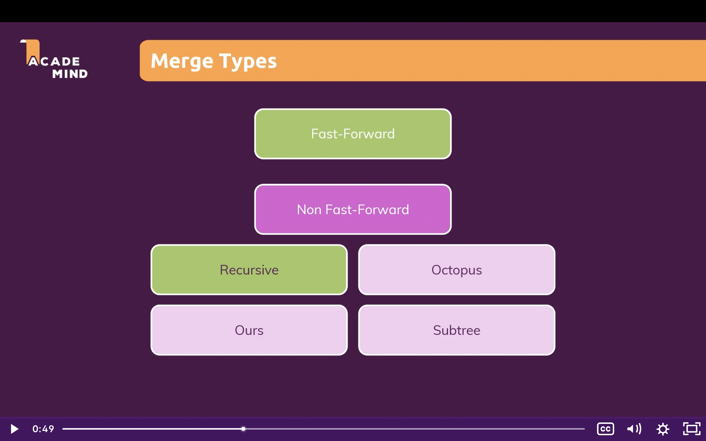

# Git course

## Section 1

Git stores key value pairs: hashes and the content of each document

#### Install git on Mac OS:

1. Install brew:

2. ````bash
   /bin/bash -c "$(curl -fsSL https://raw.githubusercontent.com/Homebrew/install/HEAD/install.sh)"
   ````

3. Add Homebre to my PATH:

4. ````bash
   echo 'eval $(/opt/homebrew/bin/brew shellenv)' >> /Users/estebanmunchjones/.zprofile
   ````

5. 

6. Install git:

7. ````
   brew install git
   ````

8. Other topic, Extra: to check a version of an installed npm package (not this git with brew):

9. ````bash
   bnpm view <package-name> version
   ````

10. Back to home brew. To check the git version installed:

11. ````bash
    git version
    ````

12. 

#### Terminal vs Shell

terminal is a GUI, and the shell is the name on top of the terminal, in my case is `szh`. The most common is `bash`.

Change the theme: terminal -> preferences -> Pro -> click default

Similar for font-size.


#### Shell commands

-Edit documents: `nano` opens an integrated editor inside the terminal.

-see each command manual: 

````bash
man <command>
````

-Autocompletion with `tab`,

```bash
Instead of:
cd Applications

use tab
cd App + tab
```


#### MacOs command line:

1. How to open the **root directory** on finder? Go -> Home or:

````
cmd + shift + H
````

this directory has `Users` folder, and then `estebanmunchjones` folder, with my docs and so on. This is my **home directory**.

When opening the terminal, the `~` sign tells us we're at the root level of the directory specified in the terminal:

````
estebanmunchjones@Estebans-MacBook-Air ~ %
````

by, default, the terminal opens at the `home` directory.

if we print the directory, with `pwd` it yields:

````bash
/Users/estebanmunchjones
````

**the first slash `/` means that we're at the root directory**

If a slash appears on the terminal, it means the root directory:

````
estebanmunchjones@Estebans-MacBook-Air /Users %
````

2. How to navigate to the home directory?

   ````
   instead of 
   cd ../..
   
   do
   
   cd or cd ~
   ````

   

3. How to navigate to the root directory?

   ````bash
   cd /
   ````

4. How to access folder with blank spaces:

   ````
   option 1: use `tab` to autocomplete name
   
   or
   
   cd my\ folder
   ````

   a back slash and a space represents the blank space

   

#### Relative vs absolute navigation

Navigating with `cd ..` we use relative paths.

Absolute path navigation:

````
cd /Users/estebanmunchjones/Documents/Coding
````

When creating bash scripts, use relative paths, because the abosolute will break when the project folder is moved.

Create a folder:

````bash
mkdir my-dir
````

Create a file: 

```bash
touch my-file.md
```

touch can also be used to change the date a file was modified.

Create multiple files:

````bash
touch file1 file2 etc
````

Delete a file permanently:

````
rm filename
````

Delete directory permanently:

````
rmdir dirname
````

The safety net: mkdir doesn't work when there files inside the folder! we'll get this error:

````
Directory not empty
````


How to remove the directory then?:

````
rm -r dirname
````


#### Adding flags to commands

To see the size of the files:

````
ls -s
````

check the manual to see all flags related to a command:

````
man ls
````


#### Copying and moving files

With the terminal opened at the parent folder of `data` and `copied` folders, run this:

````
cp data/index.html copied/
````

How to copy multiple files?:

````
cp -r data/ copied/
````

The above command copies the content of `data` and paste it inside `copied`.

**Important:** add the slashes! to refer to an existing folder


How to move a file?

````
mv data/index.html moved/
````

Can I move all the content of a folder? NO, but you can move a folder.

How to move entire folders?

````
mv data/more-data moved/
````

How to rename a file?

```
mv file file-renamed

e.g
mv script.js script-renamed.js
```


## Section 2. Version Managment with Git - The basics

Git doesn't save all the files when committing, just the ones that changed from the previous version.

Again:

**Git = tracking changes = doesn't store files again and again!**

When creating a new branch, a fresh copy of the working directory is available, where we can add new files, etc. So, there are 2 working directories: the one associated with the master branch, and the new one linked to the new branch.

What is the working directory/tree? The files I work on vscode

What is the Repository? The `.git` hidden file, with and `index` file (staging area) and an `object` folder (commits).

How to check git version?

````
git --version
````

How to open VS Code from terminal?

1. Open VS Code, go to command pallete with 

   ````
   cmd + shift + P
   ````

   and then select 

   ````
   Shell Command: Install code command in PATH
   ````

   

2. In the terminal, run:

   ````
   code .
   ````


How to see the state of the working directory?

````
git status
````

Untracked files are in the working directory but not part of the staging area. e.g:

````
Untracked files:
  (use "git add <file>..." to include in what will be committed)
        initial-commit.txt
````

Untracked files are in red.

How to initialize a repository?

```
git init
```


How to change the name of the branch?

````
git branch -m <name>
````


How to see hidden files on finder (toggle)?

```
cmd + shift + .
```


How to add files to the staging area?

```
git add .
```

Then, running git status again:

````
Changes to be committed:
  (use "git rm --cached <file>..." to unstage)
        new file:   initial-commit.txt
````

A user an email is linked to any commit, so it's not a mess.

This data is automatically picked up by git.


How to get my working tree of the first commit?

````
git checkout first-commit-id
````

Only copy and paste the first 6

Do I loose the latests commit when checking out? NO, but git log doesn't show them.

How to undo a commit checkout?

```
git checkout branch-name

e.g
git checkout master
```

Then, the working tree is restored to the last commit, and the git status log shows all the commits

How to check all the branches?

````
git branch
````

How to create a new branch?

````
git branch branch-name (whithout spaces)
````

How to checkout to that branch?

````
git checkout branch-name
````

The new branch has the same commits as the original branch, with the same ids

How to create a branch and checkout to it in a single command?

`````
git checkout -b branch-name
`````


What info does the commit have?

````
commit 9b3d84a6679a9c3db7631219a5d725d314edd729 (HEAD -> master, second-branch)
````

Here, it says that the comit 9b.. is the HEAD of the master AND the second-branch.

What is a branch? a container of snapshots (commits).

How to merge a branch?

````
git merge branch-name
````

E.g: located at the `master` branch, we can merge the content of `third-branch`:

````
git merge third-branch
````


What is HEAD? By default, is the latest commit in a branch

What is detached HEAD. A HEAD that doesn't belong to any branch. It's a good playground, without affecting branches:

Example: switching to `second-branch` and checking out to the last commit, it yields this:

````
estebanmunchjones@Estebans-MacBook-Air Git-basics % git checkout 9b3d84a6679a9c3db7631219a5d725d314edd729
Note: switching to '9b3d84a6679a9c3db7631219a5d725d314edd729'.

You are in 'detached HEAD' state. You can look around, make experimental
changes and commit them, and you can discard any commits you make in this
state without impacting any branches by switching back to a branch.

If you want to create a new branch to retain commits you create, you may
do so (now or later) by using -c with the switch command. Example:

  git switch -c <new-branch-name>

Or undo this operation with:

  git switch -

Turn off this advice by setting config variable advice.detachedHead to false

HEAD is now at 9b3d84a added second .txt file
````

Is it possible to be not on any branch? YES, when on a detached head. 

````
* (HEAD detached at 9b3d84a)
  master
  second-branch
  third-branch
estebanmunchjones@Estebans-MacBook-Air Git-basics % 
````


When checking out to a previous commit, we're in detached mode, because **we checked out from a branch to the middle of nowhere.**

New commands from version 2.23 > 

instead of checking out a branch:

````
git switch branch-name

same as

git checkout branch-name
````

````
git switch -c branch-name

same as

git checkout -b branch-name
````


#### Deleting data

##### Deleting a tracked file on the working directory

Deleting files on the working tree

How to see which files are in the staging area?

```
git ls-files
```

If I delete a file, it's still on the staging area.

This is the ouptut of `git status`:

````
estebanmunchjones@Estebans-MacBook-Air Git-basics % git status
On branch master
Changes not staged for commit:
  (use "git add/rm <file>..." to update what will be committed)
  (use "git restore <file>..." to discard changes in working directory)
        deleted:    second-commit.txt

no changes added to commit (use "git add" and/or "git commit -a")
````

So, `second-commit.txt` was deleted from the working tree, but still present on the staging area, that's why it's in red, because they defer.

Important! The deleted file should alse be removed from the staging area.

How to remove the deleted working tree file from the staging area?

````
git rm deleted-file-name
````

Oops! I deleted a file i wann restore, how?

````
git restore deteled-file-name
````


##### Undoing changes on unstaged files

git status shows me what thing are ready to commit, and what differences are between the working tree and the staging area.

The staging area, if nothing is added or removed, contains the same snapshot as the HEAD (usualy the last commit).

**I changed a tracked file on the working tree, and screwed it up, and I haven't staged it**. How to get the original file? in other words: **undoing unstaged changes**

````
git checkout -- (optional --) file-name

e.g
git checkout second-commit.txt

or new command

git restore file-name
````

the optional `--`  refers to `no specific branch`. 

How to revert changes on tracked files but not staged yet?

```
git checkout .

or

git restore .
```


##### How to deleted all not tracked unstaged files and folders?(e.g when you create them and want to get rid of them right away)

How to delete an unstaged file?

```
git clean -dn
Would remove not-useful.txt
```

d for delete and n for entries, to list them

To actually delete it

````
git clean -df
````


##### **How to undo staged changes?**

````
git restore --staged file-name or git reset file-name
git checkout file-name
````

Running this from the beginning doesn't work:

````
git checkout initial-commit.txt
Updated 0 paths from the index
````

Why? because the staging area and the working tree are the same, nothing is updated when checking out.

How to do it then?

1) Replace the staging area with the HEAD:

````
git reset file-name or git restore --staged file-name
````

So, now, the staging area

Do the normal checkout:

````
git checkout file-name
````

E.g

````
git checkout initial-commit.txt
Updated 1 path from the index
````

Updating path means that the working tree was changed!


#### How to undo commits?

1)How to reset just the HEAD?

````
git reset --soft HEAD~1
````

it means, reset the the previous commit (~1).

BUT, the working tree and the staging area aren't changed at ALL. The HEAD is what changed.


2)How to reset the HEAD and the staging area?

````
git reset HEAD~1
````

BUT, the working tree remains untouched.


3) How to reset the HEAD, the staging area AND the working tree?

````
git reset --hard HEAD~1
````

If you just messed up everything, and want to get back to the last commit,

````
git reset --hard HEAD
````


#### Deleting branches

Delete a merged branch:

````
git branch -d branch-name
````

Delete not merged branch:

````
git branch -D branch-name
````

How to delete multiple branches:

````
git branch -D branch-name-1 branch-name-2
````


##### Working with a detached HEAD

If we wanna go to a previous snapshot (commit) of the project, make some changes, and merge it with 

````
git checkout commit-id
````

Then, the `git branch` yields this:

````
* (HEAD detached from eb04ac5)
  master
````

We can add a file and commit it.

Then, the `git log` yields this: (pay attention to the HEAD standalone, not linked to any branch)

````
commit 255404bc5ef7089f13469e0c70be5a6bb6aa8fa2 (HEAD)
Author: Esteban Munch Jones <estebanmunchjones@Estebans-MacBook-Air.local>
Date:   Thu Feb 25 14:01:45 2021 +0000

    added detached.txt from detached head
````

We can now checkout to the master branch:

````
git checkout master
Warning: you are leaving 1 commit behind, not connected to
any of your branches:

  255404b added detached.txt from detached head

If you want to keep it by creating a new branch, this may be a good time
to do so with:

 git branch <new-branch-name> 255404b
````

In order to keep or merge changes, the last commit done on the detached must be added to a branch, that must be created:

````
git branch detached-branch commit-id-done-on-detached-head

or 

git switch -c detached-branch
(this command above automatically adds the last commit done to the detached head)
````

The just merge to the master branch

````
git checkout master
git merge detached-branch

Will be asked to write a message. Steps:

press "i" (i for insert)
write your merge message
press "esc" (escape)
write ":wq" (write & quit)
then press enter
````


#### Ignoring files

Just create a `.gitignore` manually on the root of the working tree, then commit it.

The files names or folders written inside the `.gitignore` file are ignored by git and can't be staged.

There are 3 types of files on a working tree: untracked, tracked, and ignored.

How to ignore multiple files ending with `.log`, for example:

````
///.gitignore

*.log
````

How to add exceptions to the * rule?

````
//.gitignore

*.log
!test3.log
````

How to ignore folders?

````
//.gitignore

/node_modules
````


When doing `git clean -df`, the ignored files are not deleted!


## Advanced Git

#### The stash

Are snapshots of the working tree, in memory, for unstaged changes.

Use case: after the last commit, I've done some changes I'm not sure about, not staged. So I go back to the last commit, but stashing the Working tree state before that, and see that initital state, and start over again. If the new version is rubbish, I just go back the the stashed working tree snapshot.

useful when working on a new feature in the master branch, with unstaged changes. Keep the working tree state of unstaged files or unstaged changes in memory, while going back to the HEAD in the working directory and staging area. 

So the `git stash` command saves the current working tree state and checks us out to the original working tree state (the last commit).

````
git stash
Saved working directory and index state WIP on master: 68bcc26 file1 added
````

````
git stash apply
On branch master
Changes not staged for commit:
  (use "git add <file>..." to update what will be committed)
  (use "git restore <file>..." to discard changes in working directory)
        modified:   file1.txt

no changes added to commit (use "git add" and/or "git commit -a")
````

`git stash apply` lets us jump forward to the saved working tree state in memory

This cycle of adding stashes can be done many times, and there will be many state snapshots saved. `git stash apply` always takes us forward to the last saved snapshot. 

How to see all the snapshots saved?

````
git stash list
stash@{0}: WIP on master: 68bcc26 file1 added (this is the latest)
stash@{1}: WIP on master: 68bcc26 file1 added
stash@{2}: WIP on master: 68bcc26 file1 added
````

Every time we hit `git stash`, a new snapshot is saved in memory.

What if I wanna go to the oldest snapshot, of index `2`?

````
git stash apply 2
error: Your local changes to the following files would be overwritten by merge:
        file1.txt
Please commit your changes or stash them before you merge.
Aborting
````

We need to convert this old snapshot to the latest one:

````
git stash
````

Then, we're gonna have this:

````
stash@{0}: WIP on master: 68bcc26 file1 added
stash@{1}: WIP on master: 68bcc26 file1 added
stash@{2}: WIP on master: 68bcc26 file1 added
stash@{3}: WIP on master: 68bcc26 file1 added
````

Now, we can access the original `2` index with the `3` index whitout any errors.

being on the first stash snapshot, namely the `3`, what if I wanna go back to the latest snapshot, namely `0`. We need to stash again and git stash apply 1. It's getting confusing!

Note: why do we need these extra stashes to jump to different snapshots? It's the same as when checking out branches with no commited changes. they need to be commited before changing branches. 

The index stuff is super messy, so messages are added to each stash.

How to add messages to the stashes?

````
git stash push -m "third feature added"
Saved working directory and index state On master: third feature added
````

```
git stash list
stash@{0}: On master: third feature added
stash@{1}: WIP on master: 68bcc26 file1 added
stash@{2}: WIP on master: 68bcc26 file1 added
stash@{3}: WIP on master: 68bcc26 file1 added
stash@{4}: WIP on master: 68bcc26 file1 added
stash@{5}: WIP on master: 68bcc26 file1 added
```

How to commit a stashed snapshot?

````
git stash pop 3
On branch master
Changes not staged for commit:
  (use "git add <file>..." to update what will be committed)
  (use "git restore <file>..." to discard changes in working directory)
        modified:   file1.txt

no changes added to commit (use "git add" and/or "git commit -a")
Dropped refs/stash@{3} (4c9d352a7375dfc93261e6007a04a73ffb405e4f)
````

Then just `git add .` , `git commit -m 'message-here'`

How to delete stashes?

`git stash pop stash-id` autmatically deletes the stash. 

```
git stash drop stash-id

or

git stash clear
```


#### How to recover deleted branches and commits

How to delete a commit? By doing a reset of the HEAD, e.g:

`````
git reset --hard HEAD~1
`````

If we do a git log, the last commit was deleted.

How to see a history of the HEADs?

````
git reflog
0f717c6 (HEAD -> master) HEAD@{0}: reset: moving to HEAD~1
98e7274 HEAD@{1}: commit: file2 added
0f717c6 (HEAD -> master) HEAD@{2}: reset: moving to HEAD
0f717c6 (HEAD -> master) HEAD@{3}: commit: added third feature
68bcc26 HEAD@{4}: reset: moving to HEAD
68bcc26 HEAD@{5}: reset: moving to HEAD
68bcc26 HEAD@{6}: reset: moving to HEAD
68bcc26 HEAD@{7}: reset: moving to HEAD
68bcc26 HEAD@{8}: reset: moving to HEAD
68bcc26 HEAD@{9}: reset: moving to HEAD
68bcc26 HEAD@{10}: reset: moving to HEAD
68bcc26 HEAD@{11}: reset: moving to HEAD
68bcc26 HEAD@{12}: reset: moving to HEAD
68bcc26 HEAD@{13}: commit (initial): file1 added
````

We can store up to 30 days history. The hashes (ids, like 98e7274) are used to back track then.

How to get back the lost commit then?

````
git reset --hard lost-commit-hash

git reset --hard 98e7274
````

that's it!

How to recover a deleted branch? 

1) 

````
git reflog
````

2) 

````
git checkout last-commit-id-on-deleted-branch
````

````
git switch -c any-branch-name
````


## Merging branches

The `master` branch is the main one, and a `feature` branch can be created. We can keep working on the two brances at the same time, and then merge `feature` to the master or viceversa.



#### Fast Forward merge (with optional squash)

When you create a feature branch and work on it not commiting (or working on) the master branch anymore.


Fast forward doesn't create a new commit when merging, but just moves the HEAD, of course, bringing the commits done in the `feature` branch.

````
git merge feature
Updating 033f8f3..8872eca
Fast-forward
 feature/f1.txt | 0
 feature/f2.txt | 0
 2 files changed, 0 insertions(+), 0 deletions(-)
 create mode 100644 feature/f1.txt
 create mode 100644 feature/f2.txt
````

still on `master`:

````
git log
commit 8872eca66205e5df80ece51988315ff9a3112c9c (HEAD -> master, feature)
Author: Esteban Munch Jones <esteban.munch.jones@gmail.com>
Date:   Sat Feb 27 15:25:48 2021 +0000

    f2

commit c8c8fcc338ed0bf9c4cba3d1b3d99fc560f9eef3
Author: Esteban Munch Jones <esteban.munch.jones@gmail.com>
Date:   Sat Feb 27 15:25:32 2021 +0000

    f1

commit 033f8f31fe7fdc93c8c62a731fd057e2c792cacb
Author: Esteban Munch Jones <esteban.munch.jones@gmail.com>
Date:   Sat Feb 27 15:24:31 2021 +0000

    m2

commit 9da0885bfee78154199783d34bfd09a07765bad1
Author: Esteban Munch Jones <esteban.munch.jones@gmail.com>
:

m1
````

There's a continious flow of commits, whithout a `merge commit`.

Interesting fact: the `f2` commit is now the HEAD of both branches.

how to merge just the last commit of the `feature` branch? 

````
git merge --squash feature
Updating 033f8f3..8872eca
Fast-forward
Squash commit -- not updating HEAD
 feature/f1.txt | 0
 feature/f2.txt | 0
 2 files changed, 0 insertions(+), 0 deletions(-)
 create mode 100644 feature/f1.txt
 create mode 100644 feature/f2.txt
````

still on `master` let's now check the commits log:

````
git log
commit 033f8f31fe7fdc93c8c62a731fd057e2c792cacb (HEAD -> master)
Author: Esteban Munch Jones <esteban.munch.jones@gmail.com>
Date:   Sat Feb 27 15:24:31 2021 +0000

    m2

commit 9da0885bfee78154199783d34bfd09a07765bad1
Author: Esteban Munch Jones <esteban.munch.jones@gmail.com>
Date:   Sat Feb 27 15:24:13 2021 +0000

    m1
````

Hang on...no commit was added. Yep, we need to do it manually. Let's check the status:

```
git status
On branch master
Changes to be committed:
  (use "git restore --staged <file>..." to unstage)
        new file:   feature/f1.txt
        new file:   feature/f2.txt
```

So, the changes are already staged, so, let's commit it now:

````
git commit -m 'merge-feature-branch'
````

`````
git log
commit 9c2d902de56b09a76f3c8336f4087580c6a8cde7 (HEAD -> master)
Author: Esteban Munch Jones <esteban.munch.jones@gmail.com>
Date:   Sat Feb 27 16:45:13 2021 +0000

    merge feature-branch

commit 033f8f31fe7fdc93c8c62a731fd057e2c792cacb
Author: Esteban Munch Jones <esteban.munch.jones@gmail.com>
Date:   Sat Feb 27 15:24:31 2021 +0000

    m2

commit 9da0885bfee78154199783d34bfd09a07765bad1
Author: Esteban Munch Jones <esteban.munch.jones@gmail.com>
Date:   Sat Feb 27 15:24:13 2021 +0000

    m1
`````

Much cleaner now, we don't have the unnecessary `f1` commit done on `feature` branch.

Interesting fact: the manuall commit when mergin is now the HEAD of just the master branch, not the `feature` branch.


#### Non fast forward: recursive

Is useful when both, the `master` and the `feature` branches have new commits.


````
git merge --no-ff feature
Merge made by the 'recursive' strategy.
 feature/f1.txt | 0
 feature/f2.txt | 0
 2 files changed, 0 insertions(+), 0 deletions(-)
 create mode 100644 feature/f1.txt
 create mode 100644 feature/f2.txt
````

We're gonna be prompted to add a message to the extra commit autmatically created when merging:

````
1) pres I
2)write the comment in a new line
3)press Esc
4) :qw and press enter
````


`````
git log
commit c6e70e705d815cb3a31df9de2c8980706fcb68bc (HEAD -> master)
Merge: 033f8f3 8872eca
Author: Esteban Munch Jones <esteban.munch.jones@gmail.com>
Date:   Sat Feb 27 17:12:43 2021 +0000

    Merge branch 'feature'
    Just merging non recursevely

commit 8872eca66205e5df80ece51988315ff9a3112c9c (feature)
Author: Esteban Munch Jones <esteban.munch.jones@gmail.com>
Date:   Sat Feb 27 15:25:48 2021 +0000

    f2

commit c8c8fcc338ed0bf9c4cba3d1b3d99fc560f9eef3
Author: Esteban Munch Jones <esteban.munch.jones@gmail.com>
Date:   Sat Feb 27 15:25:32 2021 +0000

    f1
    ...
    m1
    ...
    m2
    ...
`````

So, the aumatic merging commit is now the HEAD of only the `master` branch.

How to backtrack commits on the already merge `master` branch recursively:

ATTENTION!! the commits we see in the log of the `master` that were done on the `feature` branch doesn't count for the HEAD~number, they're invisible when picking this number of steps to go back.

So, to get back to the `m1` commit, just go back 1 step.

When `master` and `feature` have new commits, then the recursive merging is done by default:

`````
git merge feature
Merge made by the 'recursive' strategy.
 feature/f1.txt | 0
 feature/f2.txt | 0
 2 files changed, 0 insertions(+), 0 deletions(-)
 create mode 100644 feature/f1.txt
 create mode 100644 feature/f2.txt
`````

````
git log
commit 40f2eaa950d78281ede07a231ff9f1df1a56c746 (HEAD -> master)
Merge: e267940 8872eca
Author: Esteban Munch Jones <esteban.munch.jones@gmail.com>
Date:   Sat Feb 27 17:30:53 2021 +0000

    Merge branch 'feature'
    merging feature into master that has a new commit

commit e267940291dfcb47294b6017049aee3f73dda5dd
Author: Esteban Munch Jones <esteban.munch.jones@gmail.com>
Date:   Sat Feb 27 17:30:47 2021 +0000

    m3

commit 8872eca66205e5df80ece51988315ff9a3112c9c (feature)
Author: Esteban Munch Jones <esteban.munch.jones@gmail.com>
Date:   Sat Feb 27 15:25:48 2021 +0000

    f2
    ....
````


#### Rebasing

Rebasing is used when new commits have been added to bot the `master` and the `feature` branches. 


It's useful for bringing new commits done on `master` to the `feature` branch and keep working on `feature`. It's a way of updating `feature` branch.

The rebase brings the new commit on the `master` branch a use it a the new base for the commits we already made on the `feature` branch. Then a fast-forward merge is done. 


Advantage:  no mergin commits needed (like when doing recursive)

BUT: the commits done in the `feature` branch are now based on another commit (the latest on `master`) and they have a new hash.

IT'S NOT SUITABLE FOR WORKING WITH OTHER PEOPLE, JUST OWN REPO!

Example:

on `feature` branch:

````
git log
commit 8872eca66205e5df80ece51988315ff9a3112c9c (HEAD -> feature)
Author: Esteban Munch Jones <esteban.munch.jones@gmail.com>
Date:   Sat Feb 27 15:25:48 2021 +0000

    f2

commit c8c8fcc338ed0bf9c4cba3d1b3d99fc560f9eef3
Author: Esteban Munch Jones <esteban.munch.jones@gmail.com>
Date:   Sat Feb 27 15:25:32 2021 +0000

    f1

commit 033f8f31fe7fdc93c8c62a731fd057e2c792cacb
Author: Esteban Munch Jones <esteban.munch.jones@gmail.com>
Date:   Sat Feb 27 15:24:31 2021 +0000

    m2
    ...
````

Time to rebase now:

````
git rebase master
Successfully rebased and updated refs/heads/feature.
````

````
git log
commit 2145597a9823631803c68a54b0921f255cadeae6 (HEAD -> feature)
Author: Esteban Munch Jones <esteban.munch.jones@gmail.com>
Date:   Sat Feb 27 15:25:48 2021 +0000

    f2

commit d6a95313530dc4fe811fc146ac8d781d4b1188b7
Author: Esteban Munch Jones <esteban.munch.jones@gmail.com>
Date:   Sat Feb 27 15:25:32 2021 +0000

    f1

commit e267940291dfcb47294b6017049aee3f73dda5dd (master)
Author: Esteban Munch Jones <esteban.munch.jones@gmail.com>
Date:   Sat Feb 27 17:30:47 2021 +0000

    m3
    ....
````

The `f1` and `f2` commits have new hashes and are based on the `m3` commit.

Time to do a normal fast forward merge now:

````
git switch master
git merge feature
````


#### Merging conflicts

When do they occur? when to people worked on the same file and same line (e.g: on `master` & `feature`).

While on `master`:

`````
git merge feature
Auto-merging feature/f1.txt
CONFLICT (content): Merge conflict in feature/f1.txt
Automatic merge failed; fix conflicts and then commit the result.
`````


The current change is the one green, which the one belonging to the current branch.

The best feature is `Compare changes`


The differences are higlighted on darker red or green colours.

`Accept both changes` will add the 2 lines, in 2 separate lines.

If we chose the option above, we can got back to the menu with `ctrl + c`

How to get more info about the conflict?

````
git status
You have unmerged paths.
  (fix conflicts and run "git commit")
  (use "git merge --abort" to abort the merge)

Unmerged paths:
  (use "git add <file>..." to mark resolution)
        both modified:   feature/f1.txt

no changes added to commit (use "git add" and/or "git commit -a")
````

Wanna abort the merging?

````
git merge --abort
````

How to log the commit to be merged?

````
git log --merge
commit 965c4683ba5583c00537cc34f26f0ebc6cca1063 (feature)
Author: Esteban Munch Jones <esteban.munch.jones@gmail.com>
Date:   Mon Mar 1 17:31:11 2021 +0000

    updated f1 on feature

commit fc1bfb63a2292f2896b33fd0569543bfcd4e7c4d (HEAD -> master)
Author: Esteban Munch Jones <esteban.munch.jones@gmail.com>
Date:   Mon Mar 1 17:29:37 2021 +0000

    updated f1 on master
````

How to see the differences on the terminal?

````
git diff
diff --cc feature/f1.txt
index b39a5e7,1addf16..0000000
--- a/feature/f1.txt
+++ b/feature/f1.txt
@@@ -1,1 -1,1 +1,5 @@@
- added this on master
 -added this on feature
++<<<<<<< HEAD
++added this on master
++=======
++added this on feature
++>>>>>>> feature
````


#### Steps for resolving the conflict

````
choose the resolution option
git add .
git commit -m 'merge feature branch to master'

git log
commit 152c9fe775be28f880d7871363cbb58ce084685c (HEAD -> master)
Merge: fc1bfb6 965c468
Author: Esteban Munch Jones <esteban.munch.jones@gmail.com>
Date:   Mon Mar 1 18:17:56 2021 +0000

    merge feature branch to master

commit 965c4683ba5583c00537cc34f26f0ebc6cca1063 (feature)
Author: Esteban Munch Jones <esteban.munch.jones@gmail.com>
Date:   Mon Mar 1 17:31:11 2021 +0000

    updated f1 on feature

commit fc1bfb63a2292f2896b33fd0569543bfcd4e7c4d
Author: Esteban Munch Jones <esteban.munch.jones@gmail.com>
Date:   Mon Mar 1 17:29:37 2021 +0000

    updated f1 on master
````


#### Cherry-pick

When you want to fix something of the master branch while working the new feature. We don't want to merge all the commits of the `feature` branch, just the commit fixing a thing on the `master`.

````
 git cherry-pick 3401fed871b60a35612e0cfbcea8990241a59997
 
[master 25e36c5] fixed m1 typo from new-feature branch
 Date: Mon Mar 1 18:49:07 2021 +0000
 2 files changed, 1 insertion(+), 1 deletion(-)
 create mode 100644 new-feature/new-feature.txt
 
 
estebanmunchjones@Estebans-MacBook-Air branches % git log

commit 25e36c57b9a5ff8dd09a1edfbd4489cc15c8b920 (HEAD -> master)
Author: Esteban Munch Jones <esteban.munch.jones@gmail.com>
Date:   Mon Mar 1 18:49:07 2021 +0000

    fixed m1 typo from new-feature branch

commit b820d5961ea26bce2d30dd9d82a658b48fae327b
Author: Esteban Munch Jones <esteban.munch.jones@gmail.com>
Date:   Mon Mar 1 18:39:25 2021 +0000

    modified m1 on master

commit 152c9fe775be28f880d7871363cbb58ce084685c
Merge: fc1bfb6 965c468
Author: Esteban Munch Jones <esteban.munch.jones@gmail.com>
Date:   Mon Mar 1 18:17:56 2021 +0000

    merge feature branch to master

commit 965c4683ba5583c00537cc34f26f0ebc6cca1063 (feature)
:
````

The picked commit changes hash, so the commit history of `new-feature` and `master` are different now.

Don't add all the files of the features you'r working on. If you spot an error coming from master:

````
fix the error
add just that file and commit it
then cherry-pick the above commit while on master
switch back to master and keep working on the features

````


#### Tagging commits

