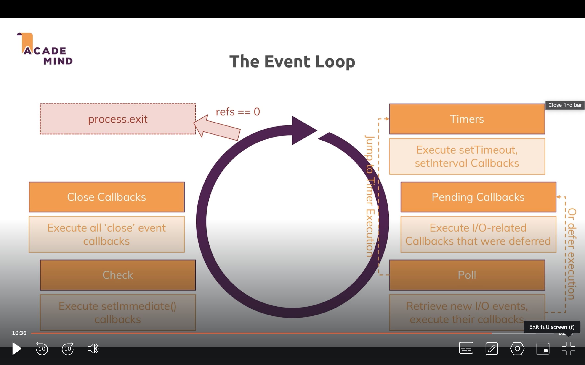
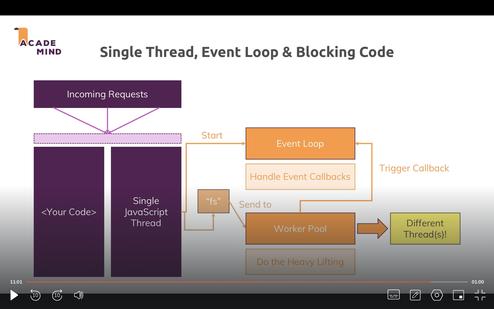
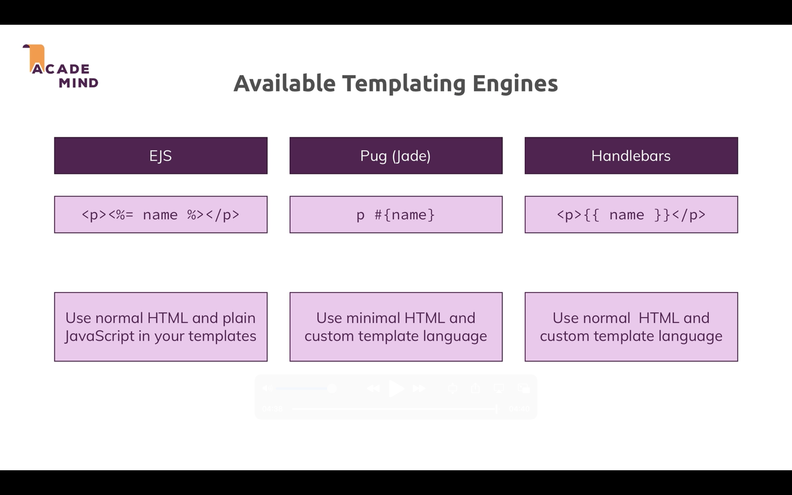

# Max's NodeJS course

## Getting started

REPL mode, not very useful

```bash
node
Welcome to Node.js v18.13.0.
Type ".help" for more information.
> 
```

Read, and Evaluate the input, Print the output, and Loop to wait for new inputs


### Basics

The event loop keeps the process (loop) running until there are no event listeners registered

JS runs on a single thread, althoug it can use multiple threads on the OS to perform tasks.

```js
const http = require('http');

cont server = http.createServer((req,res)=>{
	console.log(req);
	process.exit(); // this will stop the loop
})

server.listen(3000);
```


Remember to redirect the user to a different route after they submitted a POST request, otherwise there's an infinite loop of POST requests, as when the same url loads, and there had been a POST request, a new POST request is triggered automatically!

the `data` coming on a request comes in chunks, so we can start doing things with them as they come, and not wait till completion to, e.g save data to a file

Buffer construct helps us gather the chunk/s and get something usable

```js
const http = require('http');
const fs = require('fs');

const server = http.createServer((req, res) => {
  const url = req.url;
  const method = req.method;
  if (url === '/') {
    res.write('<html>');
    res.write('<head><title>Enter Message</title><head>');
    res.write('<body><form action="/message" method="POST"><input type="text" name="message"><button type="submit">Send</button></form></body>');
    res.write('</html>');
    // let's return to stop the fn execution
    return res.end();
  }
  // it gets messy with vanilla NODE and if checks, express is cleaner ❌
  if (url === '/message' && method === 'POST') {
    const body = [];
    // data event callback
    req.on('data', (chunk) => {
      console.log(chunk);
      body.push(chunk);
    });
    // end event callback
    // ⚠️ let's return so we don't try to set the headers first down there 1️⃣
    return req.on('end', () => {
      // I used .toString() because I know the body is text
      // I'd use other method for images, etc
      const parsedBody = Buffer.concat(body).toString();
      const message = parsedBody.split('=')[1];
      // this is a synchronous (blocking) fn
      fs.writeFileSync('message.txt', message);
      // res.setHeader(302, 'Location', '/'); // also works
    	res.statusCode = 302;
    	// let's redirect to avoid an infinite POST requests loop
    	res.setHeader('Location', '/');
    	// let's return to stop the fn execution
    	return res.end();
    });
  }
  // try to set the headers here1️⃣! 
  res.setHeader('Content-Type', 'text/html');
  res.write('<html>');
  res.write('<head><title>My First Page</title><head>');
  res.write('<body><h1>Hello from my Node.js Server!</h1></body>');
  res.write('</html>');
  res.end();
});

server.listen(3000); // start the process (Node will start to listen to http requests from now on)
```






The event loop is where Node goes through a cycle of checking if timers have expired, events have been fired, new callbacks need to be registered, and of course, run the callbacks!

Node.js is the world of callbacks. Callbacks don't block the single thread, they'r in memory waiting for the loop to execute them. Callbacks are easy jobs, they'r done really quickly

On the other hand, heavy duty tasks are performerd on the OS threads, and they emit an event when they'r done, so the loop runs the callbacks.

the loop stops when there are no more references to callbacks or process.exit() is called manually from withing the code.

setImmediate() fn executes the fn faster than using setTimeOut(1000).

let's not block the thread witn synchronous tasks! code writen below won't run for the user that requested that, until that task is finished. An other users making requests to the server won't manage to get their callbacks run till that sync task is finished!! 😮

sync tasks are like stopping for drinking mate tea in the middle of the motorway. Let's do it in the car park instead!

````js
req.on('end', () => {
      const parsedBody = Buffer.concat(body).toString();
      const message = parsedBody.split('=')[1];
      
      // this is a synchronous (blocking) fn ❌
      // this could block other users from getting their files written an getting the responses in the end 😦
      fs.writeFileSync('message.txt', message);
    	res.statusCode = 302;
    	res.setHeader('Location', '/');
    	return res.end();
});
````

```js
// let's fix it!
req.on('end', () => {
      const parsedBody = Buffer.concat(body).toString();
      const message = parsedBody.split('=')[1];
      fs.writeFile('message.txt', message, (error) =>{
        if (error){
          // handler error
        }
        res.statusCode = 302;
    	  res.setHeader('Location', '/');
    	  return res.end();
      });	
});
```

So, we'r registering a callback for the 'end' event coming from the request, and when we run the callback, that callback registers another callback that will run when the file has been written. Kind of nested callbacks.


### Let's export things

1. let's export single things

   ````js
   // routes.js
   
   const routes = (req, res) => {
   	if (req.url === '/'){ 
   	}
   	// etc
   }
   
   👉 module.exports = routes;
   ````

   `module` is a global node object, that has an exports prop and can be set to anything (string, object, function reference, etc)

   when we import things, node will check what's the key of that object and return it

   ````js
   // app.js
   const routes = require('./routes');
   ````

2. Let's export things in an object:

   ````js
   // routes.js
   👉 module.exports = {
   	routes,
   	message: 'hello world'
   }
   ````

   ```js
   // app.js
   const { routes, message} = require('./routes');
   ```

3. Let's export things in an object, second way:

   ````js
   // routes.js
   👉 module.exports.routes = routes;
   👉 module.exports.message = 'hello world'
   ````

4. Let's export things in an object, third way:

   we'r just omitting the `module` word.

   ````js
   // routes.js
   👉 export.routes = routes;
   👉 export.message = 'hello world'
   ````

### Assignment - Basics

````js
res.write('welcome!'); // rendered as <body><pre>welcome<pre></body>
res.end();
````

````js
res.writeHead(200, {'Content-type': 'text/html'}); 
res.write('welcome!'); // rendered as <body>welcome</body>
res.end();
````

#### If statements

we catch exact matches (express catches all routes that start with `/` if we do app.use('/') )

```js
const routes = (req, res) => {
    const url = req.url;
    const method = req.method;
  
  // e.g I enter `/users` second block runs
  // e.g I enter '/' first block runs, even removing first return. So it's an exact match👇

    if (url ===👉 '/' && method === 'GET'){ // 👈exact match here
        res.writeHead(200, {'Content-type': 'text/html'});
      // no need for a button in the form, we just press enter after filling the input
        res.write(`
            <h1>welcome!</h1>
            <form method="POST" action="/create-user">
                <input name="userName"/>
            </form>
        `);
        return res.end(); // even if I don't have a return, the next if block doesn't match the '/' route and doesn't run
    }
    if (url === '/users' && method === 'GET'){
        res.writeHead(200, {'Content-type': 'text/html'});
      	// better way, as 200 is the default already
      	// 💡 res.setHeader('Content-type', 'text/html')
        res.write('<ul><li>John</li></ul>');
        return res.end();
    }
    if (url === '/create-user' && method === 'POST'){
        const chunks = [];

        req.on('data', (chunk) => {
          	// each chunk is a buffer
            chunks.push(chunk);
        })

        req.on('end', ()=> {
            // I do .toString because I know the input value is a string
            const parsedBody = Buffer.concat(chunks).toString();
            console.log(parsedBody.split('=')[1]);
        })
        res.writeHead(302, {'Location': '/'}); // redirect to avoid infinite POST req loop
    		// OR more verbose way
      	// res.statusCode = 200;
      	// res.setHeader('Location', '/');
    
        return res.end();
    }
    res.writeHead(404, {'Content-type': 'text/html'});
    res.write('<h1>page not found');
    return res.end();
    
}

module.exports = routes;
```


### Improved dev workflow and debuging

````json
// package.json

{
  "name": "barebones-graphql",
  "version": "1.0.0",
  "description": "",
  "main": "index.js",
  "scripts": {
    "test": "echo \"Error: no test specified\" && exit 1",
    "start": "nodemon app.js", // 😮runs with npm start OR npm run start
    "start-app": "nodemon app.js" // runs with npm run start-app
  },
  "author": "",
  "license": "ISC",
  "dependencies": {
    "express": "^4.18.2",
    "express-graphql": "^0.12.0",
    "graphql": "^15.8.0"
  }
}
````

make sure `nodemon` is installed as part of the app, not just globally, as the app needs to contain all the necessary packages to run.

### Dev and prod dependecies

```
npm i nodemon --save-dev // dev dependency
npm i express--save OR npm i // prod dependency
```

No needed to separate the dependancies, it's just nice to see what's used in prod and dev

e.g Nodemon won't be used in prod, as we don't want the server to start and we won't be making changes to the code

````bash
// npm i nodemon OR npm i nodemon --save-dev + NOT having nodemon installed:

nodemon app.js // throws error, because nodemon is not installed globally, hence, not a command we can run from the terminal🚨
````

but, we can run it with an npm script, e.g `npm start`

````js
npm start // will look for nodemon LOCALLY
````


### Node debugger VSCode

the next fn button won't stop on some code lines, because fns are registered as middlewares, callbacks, and they'r gonna be executed in the future.

Install nodemon globally for the next step (debugger will use nodemon to restart the debugger after a change in a file, same as the server).

How to restart the debugger? VSCode -> Debug icon -> Create a launch.json file:

````json
{
    // Use IntelliSense to learn about possible attributes.
    // Hover to view descriptions of existing attributes.
    // For more information, visit: https://go.microsoft.com/fwlink/?linkid=830387
    // Please run npm i -g nodemon
    "version": "0.2.0",
    "configurations": [
        {
            "type": "node",
            "request": "launch",
            "name": "Launch Program",
            "skipFiles": [
                "<node_internals>/**"
            ],
            "program": "${workspaceFolder}/index.js",
            "outFiles": [
                "${workspaceFolder}/**/*.js"
            ],
            "restart": true,
            "runtimeExecutable": "nodemon", 
            // "console": "integratedTerminal" // not needed, as the red square button kills nodemon
        }
    ]
}
````

💡When using the debugger, we don't need to have the server running using `npm start` or ` nodemon app.js`, the debugger will start the server for us with nodemon!

💡Don't forget to click green arrow `Launch` in order to get the debugger running

💡use the Debug console to access variables and test some methods on them. To change the value of variables, just use the Variables section of the debugger and double click and edit the values


### Express.js

framework for funeling requests into middlewares, with clean and elegant code.

`````js
// basic setup

const express = require('express');

const app = express()

const server = http.createServer(app); // we can pass app as a middleware

server.listen(3000);
`````

````js
// improved setup
const express = require('express');

const app = express();

// much cleaner
// here we don't pass the app as a middleware, but we can create and start the server instead
app.listen(3000)

// the browser gets an error cannot GET, as there are no middlewares registered at all
````


#### Express under the hood

from node_modules:

```js
/**
 * Creates an Express application. The express() function is a top-level function exported by the express module.
 */
declare function e(): core.Express;
```


````js
export interface Application<
    LocalsObj extends Record<string, any> = Record<string, any>
> extends EventEmitter, IRouter, Express.Application {
    /**
     * Express instance itself is a request handler, which could be invoked without
     * third argument.
     */
    (req: Request | http.IncomingMessage, res: Response | http.ServerResponse): any;

       /**
     * Listen for connections.
     *
     * A node `http.Server` is returned, with this
     * application (which is a `Function`) as its
     * callback. If you wish to create both an HTTP
     * and HTTPS server you may do so with the "http"
     * and "https" modules as shown here:
     *
     *    var http = require('http')
     *      , https = require('https')
     *      , express = require('express')
     *      , app = express();
     *
     *    http.createServer(app).listen(80);
     *    https.createServer({ ... }, app).listen(443);
     */
    listen(port: number, hostname: string, backlog: number, callback?: () => void): http.Server;
````

from GitHub:

````js
// https://github.com/expressjs/express/blob/master/lib/application.js
app.listen = function listen() {
  var server = http.createServer(this);
  return server.listen.apply(server, arguments);
};

````

````js
// how send() will set the `Content-type` header automatically for us! 💡
res.send = function send(body) {
	...
	switch (typeof chunk) {
    // string defaulting to html
    case 'string':
      if (!this.get('Content-Type')) {
        👉this.type('html');
      }

````


#### Let's start logging things on node

```js
const http = require('http');

const express = require('express');

const app = express()

app.use((req, res) => { // registering the first middleware
    const url = req.url;
    const method = req.method;
    console.log(url, method); // / GET
  	// the browser keeps loading, never gets a response
})

app.listen(3000)
```


#### Sending our first response!

````js
app.use((req, res) => {
    const url = req.url;
    const method = req.method;
    console.log(url, method);
    res.send('hello from middleware #1')
})
````


#### Adding one more middleware

`````js
app.use((req, res, next) => {
    const url = req.url;
    const method = req.method;
    console.log(url, method);
    res.send('hello from middleware #1')
  // no next() here ❌
})

// this middleware will never run ❌ (in this case they both target the same path)
// middlewares run from top to bottom in the file
// in other words, the order of registration matters
app.use((req, res) => {
    const url = req.url;
    const method = req.method;
    console.log(url, method);
    res.send('hello from middleware #2')
})
`````


```js
app.use((req, res, next) => {
    const url = req.url;
    const method = req.method;
    console.log(url, method);
    console.log('hello from middleware #1')
    next(); // ✅
})

app.use((req, res) => {
    const url = req.url;
    const method = req.method;
    console.log(url, method);
    console.log('hello from middleware #2')
    res.send('request handled')
})

// node logs
// there are 2 requests one for the page and another one for the favicon
/ GET
hello from middleware #1
/ GET
hello from middleware #2

/favicon.ico GET
hello from middleware #1
/favicon.ico GET
hello from middleware #2
```


### Don't send the response and execute next()

````js
app.use((req, res, next) => {
    const url = req.url;
    const method = req.method;
    console.log(url, method);
    console.log('hello from middleware #1')
    res.send('request handled')
    next(); // ❌
})

app.use((req, res) => {
    const url = req.url;
    const method = req.method;
    console.log(url, method);
    console.log('hello from middleware #2')
    res.send('request handled')
})

// node error
// Error [ERR_HTTP_HEADERS_SENT]: Cannot set headers after they are sent to the client
// the error doesn't crash the app though
````


```js
// let's set some headers, so the content type is not set by express automatically

    👉res.header('Content-type', 'application/json');
    res.send('request handled')

// the browser gets pitch black and prints that JSON, and the response headers confirm that (application/json)
```


#### Overload ??

hovering over `app.use()` , VSCode says (+8 overloads) , which means that there are 8 +1 ways to use this fn passing optional params and combinations


#### Handling different routes

````js
app.use((req, res) => {})
// same as
app.use('/', (req, res) => {})

// requests to `/` or `/posts` will trigger it. Mnemotechnique: all paths that start with `/`, in other words, all paths
````


```js
// more narrowed down paths first
app.use('/posts',(req, res) => { // runs just for paths starting with`/posts`. eg:
  // `/posts` , `/posts/1`, etc
    res.send('list of posts here');
})

// fallbacks or less restrictive paths at the botton
// app.use((req, res) => {}) or the code below is the same
app.use('/',(req, res) => { // runs for all routes `/`, `/banana`, but not `/posts`,
  	// as a I didn't call `next()`` on the first middleware (it would have thrown an error anyway)
    res.send('Welcome to my site!')
})

app.listen(3000)
```


#### Assigment: Express.js

⚠️Make sure you install `nodemon` locally (as a dependency), as when the app is deployed, we don't manually need to install nodemon globally manually separately in the deployment server. All that the express app needs has to be listed in package.json (e.g test libraries and so on, which are dev dependencies etc, so things not necessarily used when the app is handling requests in prod)

⚠️ when publishing a new npm package, don't name it the same as an internal node module (e.g 'fs')! users won't be able to use the package at all when they require it! 😅


#### Redirection made easy

````js
res.status(302);
res.header('Location', '/success')
res.send();

// or
res.redirect('/success'); ✅
````


#### Req.body is undefined!!

what a problem!

we need to register a parser as a middleware, so it populates that field 😉

Body-parser was included to express and then removed, then re-included.

So it's better to install it as a dependency, to future proof our code

```bash
npm i body-parser
```

````js
const bodyParser = require('body-parser');

// enough to parse input fields passed to the BE
app.use(bodyParser.urlencoded({extended: false}));

// let's just react to POST requests
app.post('/product', (req, res) => {
    console.log(req.body?.productName); // 'jumper'
    res.redirect('/success');
})
````


#### App router

let's not clutter app.js file with all the middlewares

let's move the middlewares to different folders:

````js
// routes/admin.js
const express = require('express')

const router = express.Router()

router.get('/add-product',(req, res) => {
    res.send('<form action="/product" method="POST"><input name="productName"/></form>');
})

router.post('/product', (req, res) => {
    console.log(req.body?.productName);
    res.redirect('/');
})


module.exports = router;
````

```js
// routes/shop.js

const express = require('express')

const router = express.Router()

router.get('/', (req, res) => { 💡// having exact matches is so convenient, no accidental handling of routes starting with (as app.use does)
    res.send('Welcome to my site!')
})

module.exports = router;
```

```js
const bodyParser = require('body-parser');

const adminRouter = require('./routes/admin')
const shopRouter = require('./routes/shop')

const app = express()

app.use(bodyParser.urlencoded({extended: false}));

// the order of the routers matter
👉app.use(adminRouter, shopRouter);

// as I'm not using app.use in the routes, I can change the order of the routers as they handle different routes and are specific
// this would also work
// 👉app.use(shopRouter, adminRouter);

app.listen(3000)
```

The usage of router is cleaner than creating the app with all the middlewares inside a `routes.js` file. We can now separate the routes into blocks that makes sense semantically as well.

👉Important!! app.get('/something'), app.post(), app.patch(), app.delete() paths are EXACT MATCH e.g (only runs for `/something`, and NOT `/something/2`)

App.use('/something') are START WITH (runs for `/something`, and  `/something/2` , etc)👈


#### 404 page

````js
app.use(shopRouter, adminRouter);

app.use((req, res) => {
    👉res.status(404).send('<h1>Page not found</h1>')
})

app.listen(3000)
````


#### Filtering paths

```js
// app.js

// let's funnel `/admin` routes here
app.use('/admin', adminRouter);
```

```js
// routes/admin.js

// /admin/add-product
router.get('/add-product',(req, res) => {
    res.send('<form action="/admin/add-product" method="POST"><input name="productName"/></form>');
})

// /admin/add-product
router.post('/add-product', (req, res) => {
    console.log(req.body?.productName);
    res.redirect('/');
})

```


#### Returning html from files

this won't work:

```
// routes/shop.js
res.sendFile('/views/shop.html'); ❌// absolute path (there's no such views folder at the roor of the OS)

res.sendFile('./views/shop.html'); ❌// relative path (paths must be absolute)
// 💡also, a relative path would be relative to the file requiring and calling this code, e.g (app.js)
```

we need an apit that tells express were the project is in respect of the OS root folder

__dirname_ is global node variable

Path.join() creates paths that work on any OS (/users/esteban, \users\esteban, etc)

```js
// routes/admin.js
// /admin/add-product
router.get('/add-product',(req, res) => {
    // __dirname has the path to this admin.js file
    // I need to go up with ..
    // no useage of `/`, .join() takes care of it for each OS
    res.sendFile(path.join(__dirname, '..', 'views', 'admin.html'))
})
```


#### A better way to return a path to files

the above example uses `path.join(__dirname, 👉'..', 'views', 'admin.html')`, because I had to see the way to get from the file that has this line of code, to where the file I want to send is located. Such a pain. And I need to keep it up to date if I move the `consumer` file (e.g routes/admin.js) around later in time.

Let's find the root directory, so I don't need to find the way from the `consumer` file to the asset.

```js
// utils/path.js
const path = require('path')

module.exports = path.dirname(require.main.filename);
```

```js
const rootDir = require('../utils/path')

router.get('/add-product',(req, res) => {
    res.sendFile(path.join(👉rootDir, 'views', 'admin.html')); // no more need of `..`
})
```

#### Serving CSS and other static assets

this could be css, js, images, etc

I'm not gonna have a route like this:

```
app.use('/public'); // ❌
```

I want to serve assets like CSS, that are not handled by the current middlewares, e.g (<link href="/css/shop.css")

Convention: add static assets that are served to any user (unauthenticated, authenticated, doesn't matter) into a `public` folder (could be name whatever)

by default, node doesn't let users the read files from the system.

I'd like express to say: OK, for public assets, I'll allow the users to get static assets, and I'll looke them up inside the public folder. Users don't need to have html with `<script src="/public/main.js"` ❌ as express already goes into the public folder when requested any static assets. <script src="/main.js" ✅

we can give `Read` access to that public folder when the browser requests some of the static assets there

````html
// views/shop.html

<!DOCTYPE html>
<html lang="en">
<head>
    <meta charset="UTF-8">
    <meta http-equiv="X-UA-Compatible" content="IE=edge">
    <meta name="viewport" content="width=device-width, initial-scale=1.0">
    <title>Document</title>
    <link href="👉/css/shop.css" rel="stylesheet"> //🚨 don't add /public in front!
</head>
<body>
    <h1>Welcome to my shop</h1>
</body>
</html>
````


````js
// routes/shop.js
const rootDir = require('../utils/path')

router.get('/', (req, res) => {
    👉res.sendFile(path.join(rootDir, 'views', 'shop.html'));
})
````

```js
// app.js
const app = express()

// Ok express, all static assets requested in the browser should be looked inside the `public` folder. Please browser, don't add the `/public` in front of the asset path, I take care of that.
app.use(express.static('public'));
```

```css
// public/css/shop.css

* {
    color: red;
}
```


### Understanding validation

```js
const { check, validationResult } = require('express-validator')

// /admin/add-product
router.post('/add-product', check('productName').notEmpty().withMessage('Hey, this field can\'t be empty'),(req, res) => {
    const {errors} = validationResult(req);
    if (errors.length > 0){
        console.log(errors[0]);
    }   
    console.log(req.body?.productName);
    res.redirect('/');
})

module.exports = router;
```

Custom messages can be added with `withMessage`

💡`Check()` looks for email values in the headers, cookies and body

#### Custom validators

````js
// /admin/add-product
router.post('/add-product', check('productName').notEmpty().withMessage('Hey, this field can\'t be empty').👉custom(( value, {req}) => {
    if (value === 'bananas'){
        👉throw new Error('bananas are not allowed to be added, sorry')
    }
    👉return true;
}),(req, res) => {
    const {errors} = validationResult(req);
    if (errors.length > 0){
        console.log(errors[0]);
    }   
    console.log(req.body?.productName);
    res.redirect('/');
})
````

💡We an use `body()` to tell the library to just check inside the body

```
	body('password') // default message for validator1 and 2
	.validator1().withMessage('Password is invalid') // ❌
	.validator2().withMessage('Password is invalid') // Dont repeat yourself!❌
```

use this second argument of body() or check() or etc to set up a global message for all validators used inside body or check

````
[ // 💡I can use an array for all the fields checked, neater
	body('password', 👉'Password is invalid') // default message for validator1 and 2
	.validator1()
	.validator2(),
	
	body('user')
	.validator3()
]
````


TODO:

show example of matching password (e.g matching product etc)

````js
// matching password example
[ 
	body('password', 👉'Password is invalid') // default message for validator1 and 2
	.validator1()
	.validator2(),
	
	body('confirmPassword')
	.custom((value, { req}) => {
    if(value !== req.body.password) {
      throw new Error('Passwords need to match!')
    }
    return true;
  })
]
````


### Keeping user input

Max keeps the form state by retrieving the body inside the POST request, and then populating the EJS templates with those values in the form.

````js
// controller
res.render('auth/signup', {
	errorMessage: errors.array()[0].msg
	oldInput: {
		email,
		password
	}
})
````

```js
// signup.ejs
<input value="<%= oldInput.email %>"
```


### adding conditional classes (red border for failed fields)

```js
// controller
res.render('auth/signup', {
	errorMessage: errors.array()[0].msg
	oldInput: {
		email,
		password
	},
	validationErrors: errors.array()
})
```

```js
// signup.ejs
<input class👉="<% validationErrors.find(e => e.param === 'email') ? 'invalid' : '' %>" value="<%= oldInput.email %>"
```

### Async validation

is the email already taken?

```js
[
	check('email')
	.custom((value, {req}) => {
		// I'm returning a promise here
		// every then block return a promise implicitly
		👉return User.findOne({ email: value}).then(userDoc => {
			if(userDoc){
				return Promise.reject('email already taken')
			}
			// no need to return true or resolve, express-validator will treat it as valid
		})
	})
]
```


#### another example, now using async/await

```js
const productFindOne = async (productName) => {
    // I could use productName in a call to a db using await
  // const userDoc = await callToDB(productName);
  // return userDoc
  return {
    id: '123456'
  }
}

// /admin/add-product
router.post('/add-product', [
    check('productName')
    .notEmpty()
    .withMessage('Hey, this field can\'t be empty').custom(( value, {req}) => {
        if (value === 'bananas'){
            throw new Error('bananas are not allowed to be added, sorry')
        }
        return true;
    })
    👉.custom(async (value, {req}) => {
  			// I don't return a promise, I just await and throw the error or true myself
        const userDoc = await productFindOne(value);
  			if(userDoc){
					throw new Error('this product already exists, please add a brand new one')
				}
  			return true;
    })
],(req, res) => {
    const {errors} = validationResult(req);
    if (errors.length > 0){
        console.log(errors[0]);
    }   
    console.log(req.body?.productName);
    res.redirect('/');
})
```


That way, if the form had errors, the user has the error message and the form keeps the state

Important: check for all instances of the form served, as it will need empty strings as initial state when served for the first time.

### Sanitizing inputs server side

https://github.com/validatorjs/validator.js (look for sanitize)

we can remove empty spaces, to uppercase, in other words, normalize data by changing the req.body fields values!

`trim` and `normalizeEmail` validators

💡We'r actualing modifying req.body.email and so on!

````js
body('productName')
.trim(); // changes req.body.producName by removing white spacing!
````


### error handling

Express-validate catches thrown errors (like inside the custom validator)

we'll set in place an outer error catching at the express level (?)

````js

// /admin/add-product //validation middleware
router.post('/add-product', check('productName').notEmpty().withMessage('Hey, this field can\'t be empty').👉custom(( value, {req}) => {
    if (value === 'bananas'){
        👉throw new Error('bananas are not allowed to be added, sorry')
        
 // resolver       
// this is the right hand side of the slide (directly handle error)
const {errors} = validationResult(req);
    if (errors.length > 0){
        res.json('some error here');
    }   
````

**errors bubble up** and should be catch by the express handler. 

👉In the case of express-validator, errors thrown by that library were caught by their own try and catch blocks.👈

For sync code: **there are try and catch blocks inside the express-validator library**, that populates the req object when catching them, adding them to an array or something like that

for async code (reading files, sending requests):

```js
asyncFn.then().catch(error => // catch error here)

try {
	await asyncFn
} catch(error){
	// catch the error here
  console.log(error); // ❌ not very useful
}
```

console.loging things is not that useful when things go wrong (e.g technical issue: connection to a db)

#### Throw error instead of console.log on catch blocks!

it's better to throw errors and let the express error handling middlaware do its magic!

````js
connectToDB.then().catch(error){console.log(error)} // ❌
connectToDB.then().catch(error){next(new Error(error))} // ✅ at the top level of a middleware
connectToDB.then().catch(error){throw new Error(error)} // ✅ if we have a catch block somewhere up e.g express-validator custom validator
connectToDB.then().catch(error){res.redirect('/500')}// ✅ redirect the user
````

when setting up props inside `req` or `res`, make sure to check the added value is not `undefined`!!

#### 👉Make sure to not set req.something to `undefined`, please do the proper checks before doing that👈

````js
if (!user){
	return next();
}
req.user = user;
next();
````


### handling errors option #1

````js
// controller
.catch(error => {
  // a technical error was caught here, e.g lost internet connection
	res.redirect('/500');
})

// top level app
app.use('/500', render500pageFn);

// render500pageFn
(req, res) => res.render('500', {//some variables for the template if needed})
````


### handling errors option #2 error middleware

having a lot of `res.redirect('/500')` is repeating ourselves!

````js
// controller
// async code
.catch(err => {
  // a technical error was caught here, e.g lost internet connection
	const error = new Error(err);
	error.httpStatusCode = 500;
	next(error);
})

// 🚨 express will skip all middlewares in the chain till it reaches an error handling middleware
````

````js
app.use((error, req, res, next) => {
	// we can have more complex logic here
  // like adding a client facing message depending on the status code, etc
	res.status(error.httpStatusCode).send(error.message)
})
````


````js
// 👉in these 2 cases the express error handler middleware is executed!

// async code
.catch(error){
 // I need to use next()
 next(error); // ✅ 
}

// sync code
throw new Error(error) // ✅
````


concrete example:

````js
// middleware
(req, res, next) => {
    const {errors} = validationResult(req);
    if (errors.length > 0){
        const error = Error('Validation error here!')
        error.httpStatusCode = 400;
        error.validationErrors = errors;
        // throw error;  ✅ // this is sync code, this will also trigger the error handling middleware!
        return 👉 next(error); // ✅ // this works i
    }   
    console.log(req.body?.productName);
    res.redirect('/');
````

```js
app.use((req, res) => {
    res.status(404).sendFile(path.join(__dirname, 'views', '404.html'))
})

// 🎩 express error handling middleware
👉app.use((👉error, req, res, next) => {
    res.status(error.httpStatusCode).json(error);
})
```

#### To recap, inside express-validator validators, we want to throw a new error inside custom validators, but then, in the middleware (controller), we want to call next(error); not throw it!


### Dynamic content and templates

example of products array in memory for all users!

```js
// some JS file
const products = [];

module.exports = products
```

that array is shared across all users and requests! really dangerous

It's rarely used. I'd use it to hit a paid api and keep the reponse in memory with the weather for Glasgow, for instance.

Let's explore these 3 templating engines



When adding npm packages: do ctrl + c process before instaling more npm packages

```bash
npm i ejs pug express-handlebars
```

Configuring the rendering engine:

````js
app.set('view engine', 'ejs')
````

configuring the location of the views

````js
app.set('views', 'views') // this is the default, the second param is the folder name containing the views
````

editing the template files doesn't make nodemon to restart the app, they template files get picked up on the flight on each new request

we can also set custom variables available app wide and pick them up

we could read values with app.get('someKey')

Rendering a view

```
res.render('viewFileName', {
	param1: 'someValue' // this can be referenced inside the template
})
```

#### PUG:

really nasty syntax, don't recommend.

Interesting:

pug layouts 

```js
// magic keywords

block // keyword to define placeholders in the layout, and for passing data in the consumer template

extends // to use the layout
```


Making a link active depending on the page. The anchor is inside a layout, re-used in many pages. 

Solution: easy, we pass a path to the view:

```js
res.render('shop', { path: '/'})
```

````js
// html
a(href="/", class=(path==='/' ? 'active' : ''))
````


### Handlebars

pug was a built in engine in express, but handlebars is not, so we need:
```js
const handleBars = require('express-handlebars')

app.engine('handlebars👈', handlebars()); // first arg could be any name, be sure not to clash with built it engines names

app.set('view engine', 'handlebars'👈)
```

````
// someView.handlebars👈

// the extension of the file matches our chosen name for the engine!
````


I had to do:

```js
{{ #if product.length > 0}} //❌ doesn't work, booooo

// solution
app.render('shop', { hasProducts: product.length > 0})


// template, only accepts true/false values inside the if block
{{ #if hasProducts }} // ✅ advantage: keeps the template lean, logic moved to the node js files
```

Layouts:

it needs some extra config, re-view the videos again if needed


### EJS

the best option. Doesn't support layouts but there's a work around, called `partials`

````js
<%= someVariable %>
<%  some JS logic here %>

<%  if(a >b ) {%>
// some html
<% } %>

// like PHP alternative syntax
````


Partials workaround:

this feature is also supported by Pug and Handlebars

we put repeated HTML into separate handlebars files and then we include them in the templates

identical to PHP


### MVC

Model (data): class to create a single Product, and some methods to save it, remove it, update it, etc, same as the PHP course with the Post class

View (templates)

Controller(middlewares that interact with data (DB) and render views with some data)

Examples:

````js
// controllers/product.js // all middlewares related to the product model
const Product = require('../models/product')

exports.getAddProduct = (req, res, next) => {
	res.render('add-product', { //some data})
}

exports.postAddProduct = (req, res, next) => {
	const product = new Product(req.body.title)
	product.save();
	res.redirect('/')
}

exports.getProducts = (req, res, next) => {
	const products = Product.fetchAll();
	res.render('shop', { products, etc})
}
````


````
// views/xxx.ejs
<h1>Some Html in ejs format in this file<h1>
````

```js
// model
const products = [];

class Product {
	constructor(title){
		this.title = title
	}
	
	save(){
		products.push(this)
	}
	
	fetchAll(){
		return products;
	}
}
```

```js
// routes/shop.js
const { getProducts } = require('./controllers/product')

router.get('/', getProducts)

```


### Using a JSON file as storage!

````js
fs.writeFile
fs.readFile

are not promised based, they just register a callback to be executed when done
callback hell alert!
the code looks ugly 🤢
````

```js
// /models/product.js

const fs = require('fs');
const path = require('path');

const p = path.join(
  path.dirname(process.mainModule.filename),
  'data',
  'products.json'
);

const getProductsFromFile = cb => {
  fs.readFile(p, (err, fileContent) => { // callback based API 🚨
    if (err) {
      cb([]);
    } else {
      cb(JSON.parse(fileContent));
    }
  });
};

module.exports = class Product {
  constructor(t) {
    this.title = t;
  }

  save() {
    getProductsFromFile(products => {
      products.push(this);
      fs.writeFile(p, JSON.stringify(products), err => {
        console.log(err);
      });
    });
  }

  static fetchAll(cb) {
    getProductsFromFile(cb);
  }
};
```

```js
// controllers/product.js
exports.getProducts = (req, res, next) => {
  Product.fetchAll(products => { // I pass a callback when calling the fetchAll method
    res.render('shop', {
      prods: products,
      pageTitle: 'Shop',
      path: '/',
      hasProducts: products.length > 0,
      activeShop: true,
      productCSS: true
    });
  });
};
```

````js
// // /models/product.js async/await with fsPromises 🤙
const path = require('path');
const fsPromises = require('fs').promises;

const p = path.join(
  path.dirname(process.mainModule.filename),
  'data',
  'products.json'
);

const getProductsFromFile = async () => {
  const result = await fsPromises.readFile(p);
  if (result){
    return JSON.parse(result);
  }
  return [];
};

module.exports = class Product {
  constructor(t) {
    this.title = t;
  }

  async save () {
    const products = await getProductsFromFile();
    products.push(this);
    await fsPromises.writeFile(p, JSON.stringify(products));
  };


  static async fetchAll(cb) {
    const products = await getProductsFromFile();
    return products;
  }
};
````

`````js
// controllers/product.js
exports.getProducts = async (req, res, next) => {
  const products = await Product.fetchAll()
  res.render('shop', {
    prods: products,
    pageTitle: 'Shop',
    path: '/',
    hasProducts: products.length > 0,
    activeShop: true,
    productCSS: true
  });
};
`````


### Dynamic routes and advanced models

Takeaway: routes and controllers where separate by who's is using them: clients and admin (`shop` and `admin`)

// paste code of Cart model 

````
const fs = require('fs');
const path = require('path');

const p = path.join(
  path.dirname(process.mainModule.filename),
  'data',
  'cart.json'
);

module.exports = class Cart {
	// 💡(no need to instantiate it, as we'r not pushing carts to somewhere, we have only one cart at the moment, living in a json file)
	
  👉static addProduct(id, productPrice) {
    // Fetch the previous cart
    fs.readFile(p, (err, fileContent) => {
      let cart = { products: [], totalPrice: 0 };
      if (!err) {
        cart = JSON.parse(fileContent);
      }
      // Analyze the cart => Find existing product
      const existingProductIndex = cart.products.findIndex(
        prod => prod.id === id
      );
      const existingProduct = cart.products[existingProductIndex];
      let updatedProduct;
      // Add new product/ increase quantity
      if (existingProduct) {
        updatedProduct = { ...existingProduct };
        updatedProduct.qty = updatedProduct.qty + 1;
        cart.products = [...cart.products];
        cart.products[existingProductIndex] = updatedProduct;
      } else {
        updatedProduct = { id: id, qty: 1 };
        cart.products = [...cart.products, updatedProduct];
      }
      cart.totalPrice = cart.totalPrice + +productPrice;
      fs.writeFile(p, JSON.stringify(cart), err => {
        console.log(err);
      });
    });
  }
};
````

#### 💡look at the pattern of `let` + `if` blocks 👆

// paste code of edit product route and controller

`````
// controllers/shop.js
exports.postCart = (req, res, next) => {
  const prodId = req.body.productId;
  Product.findById(prodId, product => {
    Cart.addProduct(prodId, product.price);
  });
  res.redirect('/cart');
};
`````

````
// routes/shop.js
router.post('/cart', shopController.postCart);
````

Caveat: variables inside loops EJS are not passed to template parts, they need to be passed in the include part as an object:
````
<% if (prods.length > 0) { %>
  <div class="card__actions">
    <a href="/products/<%= product.id %>" class="btn">Details</a>
    <%- include('../includes/add-to-cart.ejs', 👉{product: product}) %>
  </div>
````

Picking up dynamic segments:

````
// routes/shop.js
// we define the name of the param here:
router.get('/products/👉:productId', shopController.getProduct);


// we just access it in the controller
exports.getProduct = (req, res, next) => {
  const prodId = req.params.👉productId;
  Product.findById(prodId, product => {
    res.render('shop/product-detail', {
      product: product,
      pageTitle: product.title,
      path: '/products'
    });
  });
};
````

// paste how to pick up query params (after ?), called optional data, useful for tracking users and filter state

```
// routes/admin.js
router.get('/edit-product/:productId', adminController.getEditProduct);
```

````
// controllers/admin.js

// I'm expecting to have 👉 `?editMode=true` in the url

exports.getEditProduct = (req, res, next) => {
  const editMode = req.👉query.edit;
  if (!editMode) {
    return res.redirect('/');
  }
  const prodId = req.params.productId;
  Product.findById(prodId, product => {
    if (!product) {
      return res.redirect('/');
    }
    res.render('admin/edit-product', {
      pageTitle: 'Edit Product',
      path: '/admin/edit-product',
      editing: editMode,
      product: product
    });
  });
};
````

👆this is a dummy example, as the route already looks at /edit-product, so there's no need for a query param check to verify I want to render the edit product form in editing mode (the form is reused for adding a new product)

⚠️ callbacks approach is not good. Use async await instead an another node API that use promises

🛠 to improve: redirect to /cart after removing a product in the cart should be after an await statement 

````js
exports.postDeleteProduct = (req, res, next) => {
  const prodId = req.body.productId;
  Product.deleteById(prodId);
  res.redirect('/admin/products'); // ❌ this should happen after an await
};
````

💡 interesting approach of passing null as the id for new product and checking that on the save mode to actually save the new product or update an existing one (with an this.id value set already)

````js
Class Product {
	  save() {
    getProductsFromFile(products => {
      if (this.id) { // update product in the DB
        const existingProductIndex = products.findIndex(
          prod => prod.id === this.id
        );
        const updatedProducts = [...products];
        updatedProducts[existingProductIndex] = this;
        fs.writeFile(p, JSON.stringify(updatedProducts), err => {
          console.log(err);
        });
      } else { // add new product to the DB
        this.id = Math.random().toString();
        products.push(this);
        fs.writeFile(p, JSON.stringify(products), err => {
          console.log(err);
        });
      }
    });
  }
}
````


### SQL vs NoSQL

Disadvantages:
SQL:

-  handling a lot of reads at the same time.
- horizontal scaling is more difficult

NoSQL:

- only a few relationships preferred, to keep query perfomance
- Data is copied (nested) in many places, so we might want to keep that all in sync (if it's important for the app)

Advantages:

SQL: 

- Schema (all records have the same shape)
- no data repetition
- we can add a lot of relationships

NoSQL:

- Schemaless (we have the freedom to not have some fields in each document (of a collection))
- performant under heavy load
- scales horizontally much more easier

We can have an app with both DBs, to make use of their strong points


### Installing mysql

we need the `Community server` and the `Workbench` installed on the laptop 

Installing the server:

1. choose legacy auth when installing the server
2. Choose a password for the root user

Go to `Systems preferences` -> `MySql` and then check that the server is running

Installing the workbench

1. After installing and opening it, there should be `localhost instance 3306` message; that means that the sql db server is running
2. Add a schema
3. add a table
4. add records to the table
5.  Steps 2 to 4 can be done in JS, when the app boots or when we want to seed the db

When creating the products table:

1. UN (Unsigned) means a field that doesn't hold negative values
2. Double is used for 19.99 (price)

So, we need **software in the laptop** that receives SQL queries and then interacts with the DB, which is a `MySql` **databaser server.**

We also need an **npm package to connect to the the server** as well, so we can pass the queries from JS land:

````
npm i mysql2
````

There are two ways to connect to the server:

1. We have one connection open at a time and we close it when done. INEFICIENT ❌
2. Create a connection Pool (pool of connections). BEST ✅


Each query needs its own connection, that is one from the pool, so we can run multiple queries at the same time (e.g 2 users signing up at the same time).

The pool finished when the app shuts down (a rest server never shuts down, unless there's an uncaught JS error or maintenaince)

Inside the workbench, the schemas represent databases

````js
// util/database.js

const mysql = require('mysql2')

const pool = mysql.createPool({
	host: 'localhost',
	user: 'root',
	database: 'node-complete' // this is a `schema` in the workbench
	password: 'nodecomplete'
})

module.exports = pool.promise(); // I export the pool with promise based apis
````


👉Promises are JS objects that can resolve or reject, or have a pending state. We can await the the resolved value and catch the rejected value

```js
try {
	const result = await someFnReturningAPromise();
	// we can react to the resolve value
} catch(error){
	// we can react to the reject value
}

// OR
someFnReturningAPromise().then(data => {}).catch(error => {})
```


📣I gave up working with MySqlWorkbench 😞 as the course is outdated and don't want to spend time reading the docs 🤓

```js
// /models/product.js
class Product {
  static async fetchAll(){ // talks to a real DB, not the FS anymore ✅
    try {
      // array destructuring of the first array item below
      const [rows] = await db.execute('SELECT * FROM products')
      return rows;
    } catch(error){
      // let's log the error so we can see things in the server logs
      console.log(error)
      // return empty array if we couldn't connect to the DB
      // this might not be the best approach ⚠️, re-asess this in the future🔎
      return [];
    }
  }
}


```

```js
// /controllers/shop.js
export.getIndex = async (req, res) => {
	const products = await Product.fetchAll()
	res.render('shop/index', {
		products,
		pageTitle: 'Shop',
		path: '/'
	})
}
```

#### How to safely save records to the DB

use the ? Marks, so the mysql2 package escapes any hidden SQL commands hidden in the input fields

Nice UI thing: redirect after awaiting saving to the DB

````js
// /models/product.js

class Product {
   async save() {
    try {
			const result = await db.execute(
			'INSERT INTO products (title, price, description, imageUrl) VALUES (?, ?, ?, ?)', 
			[this.title, this.price, this.description, this.imageUrl])
			return result;
    } catch(error){
      // let's log the error so we can see things in the server logs
      console.log(error)
      // let's not return anything, and the fn will return undefined by default
      // this might not be the best approach ⚠️, re-asess this in the future🔎
    }
  }
}
````

```js
// controllers/admin.js

exports.postAddProduct = async(req, res, next) => {
  const title = req.body.title;
  const imageUrl = req.body.imageUrl;
  const price = req.body.price;
  const description = req.body.description;
  const product = new Product(null, title, imageUrl, description, price);
  const result = await product.save();
  if(result){
    res.redirect('/');
  } else {
    // maybe serve an error page, sending html quick and dirty here for demo purposes
    res.status(500).send('<h1>The item was not saved!!</h1>')
  }
};
```


### GraphQL

### REST API limitations

what if the FE needs different fields of a post in different pages?

#### Solution 1: create more endpoints /posts-slim

Disadvantage: a lot of work in the BE! unflexible endpoints

#### Solution 2: use query params `?slim=true`. 

Needs a lot of documentation for the FE engineers to figure out which query params they can use. Messy code

#### Solution 3: GraphQl

query what you want, no need to update the BE. Easy to know what you can query from the BE

It's like SQL in the FE!

How does GraphQL works?

it's a single endpoint POST request to `backendUrl/qraphql` endpoint (/graphql is just a convention, can be named anything, or just be the root of the server), because the **query expression** (String converted to JSON) is added to the body of the request.

Parts of the query expression:

````
{
	query {
		users {
			name,
			phone
		}
	}
}
````

#### Operation types:

- `query`: like when doing GET requests in REST endpoints
- `mutation`: like when doing POST, PUT, PATCH, DELETE requests in REST endpoints
- `subscription`:  set up real time connections via web sockets!

#### Operation "endpoints":

- users/ posts/ user/post, etc

#### Requested Fields:

- name/phone


### Backend structure

- Type Definition (Posts, Comments)
- Query Definitions
- Mutation Definitions
- Subscription Definitions
- Resolvers (e.g logic to look for the a post in the db)

**Query + Mutation + Subs** Definitions are like **routes** in REST endpoints, they'r called **Schemas**, they define what's possible in our server in terms of operations

**Resolvers** are like **controllers**  in REST endpoints


### Convert REST server into GraphQL server

1) get rid of express routes. From now on, there will be a single endpoint /graphql

2) Install graphql packages:

   ```bash
   npm i graphql express-graphql
   ```

   Note: express-graphql has been deprecated, please use this instead:
   https://github.com/graphql/graphql-http#migrating-express-grpahql

Express-graphql is more vanilla. **Apollo server** is a more robust solution that hides the details of this module away

3. Create a this structure

````
/graphql (or any name)
	resolvers.js (logic)
	schema.js (endpoints, what can be queried, mutated, or subscribed to)
````

4. Schema.js

   ````js
   const {buildSchema} = require('graphql');
   
   // backticks are used to write multiline a multiline string
   module.exports = buildSchema(`
   	// type name can be anything (this is like TS)
   	type RootQuery {
   		greetingMessage: String!
   	}
   	schema { //👈
   		query:👈 RootQuery
   	}
   `);
   
   // OR
   
   module.exports = buildSchema(`
     type News {
       title: String!,
       body: String
   
     }
     type Query👈 { // Query is a special type understood by graphql
       hello: String,
       news: News
     }
   `);
   ````

   Bang operator makes a field of the the type required (not null). e.g String!

5. Resolvers.js

   ````js
   module.exports = {
     	// the fn name should match the field
       greetingMessage() {
           return 'Hello world!';
       }
   }
   ````

6. Let's expose the Graphql server to the world!

   Make sure imports are not named imports! (I spent hours debugging this)

   ````js
   const express = require('express');
   const { graphqlHTTP } = require('express-graphql');
   const schema = require('./graphql/schema');
   const root = require('./graphql/resolvers')
   
   
   
   const app = express();
   app.use('/graphql', graphqlHTTP({
     schema: schema,
     rootValue: root,
     graphiql: true, // enables interactive FE
   }));
   app.listen(4000);
   console.log('Running a GraphQL API server at http://localhost:4000/graphql');
   
   
   
   // OR using the new package
   var express = require('express');
   // var { graphqlHTTP } = require('express-graphql');
   const { createHandler } = require('graphql-http/lib/use/express')
   const schema = require('./graphql/schema');
   const root = require('./graphql/resolvers')
   
   
   
   var app = express();
   app.all('/graphql', createHandler({
     schema,
     rootValue: root, // 😢 no graphiql FE available
   }));
   app.listen(4000);
   console.log('Running a GraphQL API server at http://localhost:4000/graphql');
   ````

7. Then query `news` like this:

   Using Postman:

   ```json
   // POST request to /graphql
   // body as raw JSON
   {
   	"query" {
   		news {
   			title
   		}
   	}
   }
   
   // OR
   {
   	"query" {
   		hello
   	}
   }
   ```

   OR just use the graphiql FE!

   ```json
   { news 
   	{ title }
   }
   
   // OR
   { hello }
   ```

   

#### 💡Pro tip: using await inside a fn, makes that fn return a promise under the hood!

### Mutations

Let's do any of the PATCH, PUT, DELETE  REST api classic things:

```js
const { buildSchema } = require('graphql');

// Construct a schema, using GraphQL schema language
module.exports = buildSchema(`
  type News {
    title: String!,
    body: String
  }
  type Query {
    hello: String,
    news: News
  }

  type Post {
    id: ID!,
    title: String,
    body: String,
    tags: [String]
    }

    input PostInput {
        title: String,
        body: String,
        tags: [String]
    }
    
  type Mutation {
    addPost(post👈: PostInput): Post
  }
`);
```

````js
module.exports = {
    hello: () => {
      return 'Hello world!';
    },
    news: () => {
        return {
            title: 'title here',
            body: null
        }
    },
    addPost: ({post👈}, req) => { // the destructured variable needs to match `post`
        post.id = (Math.random()*10000).toFixed(0);
        posts.push(post);
        return post;
    }
 		// OR
  	addPost: (args, req) => {
      	const post = args.post;
      	// OR const {post} = args
        post.id = (Math.random()*10000).toFixed(0);
        posts.push(post);
        return post;
    }
  };
````


````json
// graphiql
mutation {
  addPost(post👈: { // input here
    title: "hello",
    body: "world",
    tags: ["sports", "fishing"]
  })
  { // expected output here
    id,
    title
  } 
}
````

in the Network tab, I've got:

````json
Request Payload:

query:
  // all the helper text from graphiql
  # Welcome to GraphiQL
  #
  # GraphiQL is an in-browser tool for writing, validating, and
  # testing GraphQL queries.
  #
  # Type queries into this side of the screen, and you will see intelligent
  # typeaheads aware of the current GraphQL type schema and live syntax and
  # validation errors highlighted within the text.
  #
  # GraphQL queries typically start with a "{" character. Lines that start
  # with a # are ignored.
  #
  # An example GraphQL query might look like:
  #
  #     {
  #       field(arg: "value") {
  #         subField
  #       }
  #     }
  #
  # Keyboard shortcuts:
  #
  #  Prettify Query:  Shift-Ctrl-P (or press the prettify button above)
  #
  #     Merge Query:  Shift-Ctrl-M (or press the merge button above)
  #
  #       Run Query:  Ctrl-Enter (or press the play button above)
  #
  #   Auto Complete:  Ctrl-Space (or just start typing)
  #

  // the mutation!👈
  mutation {
    addPost(post: {
      title: "hello",
      body: "world",
      tags: ["sports", "fishing"]
    })
    {
      id,
      title
    } 
  }

variables:null
````

```json
// Request reponse

{"data":{"addPost":{"id":"6003","title":"hello"}}}
```


### Validation

with a rest server we used express-validator npm package. This package has `validator` package as a dependency.

But I don't want to have the same validation for all requests that come via my /graphql route, I want more control.

the resolvers get the mutation input values,  so we can check values there:

````bash
npm i validator
````

​	

💡 I can safely throw Errors as there's a try and catch block provided by graphqlHTTP middleware 

````js
addPost: ({post}, req) => {
    const errors = [];
    if (!validator.isLength(post.title, {min: 4})){
      	// I could have pushed just strings to the array
        errors.push({message: 'title too short'})
    }
    if (!validator.isLength(post.body, {max: 10})){
        errors.push({message: 'body too long'});
    }
    if (errors.length > 0){
        let errorString = '';
        errors.forEach(error => errorString = errorString + `${error.message} || `);
        const error = new Error(errorString);
        throw error;
    }
    post.id = (Math.random()*10000).toFixed(0);
    posts.push(post);
    return post;
}
````

Simpler code here:

```js
addPost: ({post}, req) => {
    const errors = [];
    if (!validator.isLength(post.title, {min: 4})){
        errors.push('title too short')
    }
    if (!validator.isLength(post.body, {max: 10})){
        errors.push('body too long');
    }
    if (errors.length > 0){
        const error = new Error(errors.join(' || '));
        throw error;
    }
    post.id = (Math.random()*10000).toFixed(0);
    posts.push(post);
    return post;
}
```

### what the response look like?

````json
// res body:
{
  "errors": [
    {
      "message": "title too short || body too long",
      "locations": [
        {
          "line": 33,
          "column": 12
        }
      ],
      "path": [
        "addPost"
      ]
    }
  ],
  "data": {
    "addPost": null
  }
}
````

The status code is 200, and this is always the case for a graphql response.

````js
// resolvers.js
addPost: ({post}, req) => {
    const errors = [];
    if (!validator.isLength(post.title, {min: 4})){
        errors.push('title too short')
    }
    if (!validator.isLength(post.body, {max: 10})){
        errors.push('body too long');
    }
    if (errors.length > 0){
        const error = new Error('Oops, invalid input'); // just pass a string when creating the error
        error.code = 422; // then add all the fields you want to the error object
        error.data = errors; // let's add the array of error messages!
        throw error;

    }
    post.id = (Math.random()*10000).toFixed(0);
    posts.push(post);
    return post;
}

// version using errors as objects
    addPost: ({post}, req) => {
        const errors = [];
        if (!validator.isLength(post.title, {min: 4})){
            errors.push(👉{message: 'title too short'})
        }
        if (!validator.isLength(post.body, {max: 10})){
            errors.push(👉{message: 'body too long'});
        }
        if (errors.length > 0){
            const error = new Error('Oops, invalid input');
            error.code = 422;
            // error.data = errors.join(', ');
            error.data = errors;
            throw error;

        }
        post.id = (Math.random()*10000).toFixed(0);
        posts.push(post);
        return post;
    }
````

````js
// index.js
app.all('/graphql', graphqlHTTP({
  schema,
  rootValue: root,
  graphiql: true,
  👉customFormatErrorFn(error){
    // e.g if error was syntax in code
    if (!error.originalError) error;

    // if it was my own thrown error
    return { 
      message: error.message || 'Oops, something went wrong', 
      status: error.originalError.code, 
      data: error.originalError.data
    }
  }
}));
````


```json
// response, WOW!
{
  "errors": [
    {
      "message": "Oops, invalid input",
      "status": 422,
      "data": [
        "title too short",
        "body too long"
      ]
    }
  ],
  "data": {
    "addPost": null
  }
}

// response using the errors as objects version
{
  "errors": [
    {
      "message": "Oops, invalid input",
      "status": 422,
      "data": [
        {
          "message": "title too short"
        },
        {
          "message": "body too long"
        }
      ]
    }
  ],
  "data": {
    "addPost": null
  }
}
```


### Connecting the FE to BE

we can use fetch to make queries to the backend, no need for a special library so far.

Response codes from a graphql server are 200 or 500

````js
// FE
(async()=> {
    try {
        const res = await fetch('http://localhost:4000/graphql', {
            method: 'POST',
            headers: {
                'Content-type': 'application/json'
            },
          	// 💡 body is just and object { query: `some query here`}
            body: JSON.stringify({
                query: `
                    mutation { addPost(post: 
                        {
                        title: "title here",
                        body: "body here "
                        }
                    )
                    {
                        title
                    }
                    }
                `
            })
        });
        const data = await res.json();
      	// responses are always 200, so we need to throw our errors
      	// fetch doesn't even throw error on its own when codes are not 200
      	// that's why axios is handier
        if (data.errors && data.errors[0].status === 422){
            throw new Error(data.errors[0].data[0].message);
        }
        if (data.errors){
            throw new Error('Post creation failed');
        }
        console.log(data);
    } catch(error){
        console.log(error.message);
    }
})()
````


This didn't happen on my project:

Error: method not allowed. How to fix it?

`graphqlHTTP` middleware rejects other methods than GET and POST.

let's make OPTIONS request to bypass the `graphqlHTTP` middlaware

````js
// Max's fix
app.use('*', (req, res, next) => {
	// sends the response with a 200 status code to the FE
	if (req.method === 'OPTIONS') res.status(200);
});

// graphqlHTTP code here
````


### Login using graphql

I'm not persisting, deleting or changing data on databases, so I need to use a query with args (not a mutation):

````js
//schema.js
var { buildSchema } = require('graphql');

// Construct a schema, using GraphQL schema language
module.exports = buildSchema(`
	input LoginData {
    email: String!,
    password: String!
  }

  type Query {
    hello: String,
    news: News,
    login(loginData: LoginData): AuthData
  }
`)
````

````js
// resolvers.js
   login: async({loginData}) => {
        const data = await getTokenAndID(loginData.email, loginData.password);
        return data;
    }
````

````json
// query in the FE
{ login ( loginData: { email: "a@a.com", password: "123456"}) 
  {
    token,
    id
  } 
}

// res
{
  "data": {
    "login": {
      "token": "ragergergiuahegiuaehg",
      "id": "345239857"
    }
  }
}
````


### Let's add a post when the user is authenticated

````js
// auth.js
const jwtVerify = (token)=>{
    if (token === 'asdfghjkl'){
        return {
            userId: '54789'
        }
    } else {
        throw new Error('invalid token');
    }
}

module.exports = (req, res, next) => {
    // keep working on this
    if (!req.headers.authorization){
        req.isAuth = false;
        👉 return next(); // make sure to return, so the next blocks don't run
    }
    const token = req.headers.authorization.split(' ')[1];
    let decodedToken;
    try {
        decodedToken = jwtVerify(token);
    } catch(error){
        req.isAuth = false;
        return next();
    }
    if (!decodedToken){
        req.isAuth = false;
        return next();
    }

    req.isAuth = true;
    req.userId = decodedToken.userId;
    next();

    // req has token in the headers
    // get the token from req
    // if the token matches a hardcoded string, req.isAuth = true
    // else req.isAuth = false
}
````

```js
// index.js
app.use(auth);

app.all('/graphql', graphqlHTTP({...
```

```js
//resolvers.js
addPost: ({post}, req) => {
        // all logged in users can add posts to the array in memory
        if (!req.isAuth){
            const error = new Error('Oops, you are not authenticated');
            error.code = 401;
            throw error;
        }
        const errors = [];
  			...
```

```js
// call from postman
// Autorization headers with 'Bearer asdfghjkl'

body -> graphql (not raw JSON)
mutation {
  addPost(post: {
    title: "hello",
    body: "wow"
  })
  {
    id,
    title
  }
}

//res
{
    "data": {
        "addPost": {
            "id": "4084",
            "title": "hello"
        }
    }
}
```


### Getting posts with pagination

```js
//resolvers.js

posts: ({page, perPage}, req) => {
     // all logged in users can add posts to the array in memory
     if (!req.isAuth){
        const error = new Error('Oops, you are not authenticated');
        error.code = 401;
        throw error;
    }
    const totalPosts = posts.length;
    const paginatedPosts = posts.slice(((page - 1) * perPage), ((page - 1) * perPage) + perPage);
    return {posts: paginatedPosts, totalPosts};
},
```

````js
// schemas.js
`type PostData {
    posts: [Post]!,
    totalPosts: Int!
  }

  type Query {
    hello: String,
    news: News,
    login(loginData: LoginData): AuthData,
    👉 posts(page: Int!, perPage: Int!): PostData
  }
`
````

````js
// Postman
body -> graphql option selected

{
    posts(page: 2, perPage: 2) {
        posts {
            title
        }
        totalPosts
    }
}

// response
{
    "data": {
        "posts": {
            "posts": [
                {
                    "title": "tuesday"
                },
                {
                    "title": "wednesday"
                }
            ],
            "totalPosts": 4
        }
    }
````


### Uploading images

graphql only accepts JSON, so uploading an image needs to be done via a REST endpoint, and the path of the stored file then needs to passed the graphql, so it's stored somewhere, etc

```js
// FE
// 1️⃣reach out to REST endpoint
const imageRes = await fetch('localhost:3000/post-image', {
  method: 'PUT',
  body: someFormDataHere
});
const imageResData = await imageRes.json();

// this constant is where the image has been stored
const imageUrl = imageResData.imageUrl;

// 2️⃣reach out to graphql endpoint
const savePostRes = await fetch('localhost:3000/graphql', {
  method: 'POST',
  body: {
    query: JSON.Stringify(`
		mutation { 
			savePost(postData: {
        title: 'hello',
        body: 'world',
        👉imageUrl,
      	}) {
        	_id
      	}
		}
	`)},
	headers: {
		'Content-type': 'application/json'
	}
})
```

````js
// BE

// I use multer upstream, to save the file to get the file from the req and save it to the fs

app.put('/post-image', (req, res, next) => {
	// happy path
	res.status(200).json({message: 'image saved!', imageUrl: req.file.path})
})

app.all('/graphql', ()...)
````

we can mix rest and graphql endpoints in our express server, as graphql is just one of the routes.

#### Pro tip: Returning and object with modified keys, e.g converting id object in mongoldb to a string

```js
return {
	...post
	_id: post._id.toISOString()
}
```


### Let's not interpolate variables inside the query string in the FE

````js
// FE
body: JSON.Stringify({
  query: `
  	mutation {
    addPost(post: {
      title: "${state.title}", // 👈❌
      body: "${state.body}"
    })
    {
      id,
      title
    }
  `,
})

````

````js

body: JSON.Stringify({
  query: `
  	mutation AddPost($title: String!, $body: String) {
    addPost(post: {
      title: $title, // 👈✅
      body: $body
    })
    {
      id,
      title
    }
  `,
  variables: {
  	title: "hello world",
  	body: "body here!"
  }
})
````


````js
body: JSON.Stringify({
  query: `
  	// AddPost could be name whatever
  	mutation AddPost($title: String!, $body: String) { // e.g String! types need to match the shema definition
    addPost(post: {
      title: $title, // 👈✅
      body: $body
    })
    {
      id,
      title
    }
  `,
   variables: {
  	title: "hello world",
  	body: "body here!"
  }
})
````

I tried Postman, and it worked as expected:
```JSON
// body raw JSON
{
        "query": "query FetchPosts($page: Int!, $perPage: Int!){ posts(page: $page, perPage: $perPage) { posts {title} } }",
        "variables": {
            "page": 1,
            "perPage": 2
      }
}
```

````JSON
// res
{
    "data": {
        "posts": {
            "posts": [
                {
                    "title": "heyy"
                },
                {
                    "title": "monday"
                }
            ]
        }
    }
}
````

#### How to send the variables using the `graphql` instead of  `raw JSON`??

Easy, there's a separate input for that https://learning.postman.com/docs/sending-requests/graphql/graphql/#:~:text=Sending%20GraphQL%20queries%20in%20the%20request%20body,-Open%20a%20new&text=Select%20POST%20from%20the%20request,both%20queries%20and%20variables%20separately.

````javascript
// query box
query Posts($page: Int!, $perPage: Int!) {
    posts(page: $page, perPage: $perPage) {
        posts {
            title
        }
        totalPosts
    }
}
````

```js
// graphql variables box
  {
      "page": 1,
      "perPage": 2
  }
```


How to send the variables using graphiql?

````js
// localhost:4000/graphql -> shows the the graphiql interface
same as Postman!
````

There's a `Query variables` box!

